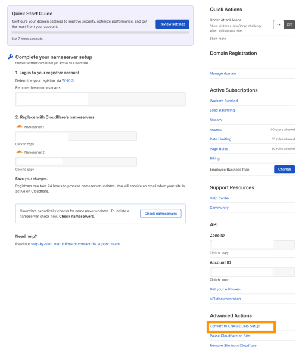

# Partial (CNAME) setup

With a partial (CNAME) setup, you can use Cloudflare DNS while maintaining authoritative DNS outside of Cloudflare.

Use this option to migrate individual subdomains onto Cloudflare or when you cannot update your authoritative DNS.


## Set up a partial domain

---

### Prerequisites

A partial (CNAME) setup is only available to customers on a Business or Enterprise plan.

---

### Add your domain to Cloudflare

1. Create a Cloudflare account and [add your domain](https://support.cloudflare.com/hc/articles/201720164).
1. For your **Plan**, choose **Business** or **Enterprise**.
1. Add your domain to Cloudflare. You should land on the **Overview** page.
1. Ignore the instructions to change your nameservers.
1. For **Advanced Actions**, click **Convert to CNAME DNS Setup**.

    

1. Click **Convert**.
1. Save the information from the **Verification TXT Record**. If you lose the information, you can also access it by going to **DNS** > **Verification TXT Record**.

---

### Verify your domain at authoritative DNS

Once you [add your domain to Cloudflare](#add-your-domain-to-cloudflare), add the **Verification TXT Record** at your authoritative DNS provider. After a few hours, Cloudflare will verify the TXT record and send a confirmation email.

That record must remain in place for as long as your are using Cloudflare.

---

### Provision an SSL certificate (optional)

To provision a Universal SSL certificate through Cloudflare, follow [these instructions](https://developers.cloudflare.com/ssl/edge-certificates/universal-ssl/enable-universal-ssl#non-authoritative-partial-domains).

---

### Add DNS records

1. In Cloudflare, [add an **A** or **CNAME** record](/manage-dns-records#create-dns-records).
1. At your authoritative DNS provider:
    
    1. Remove any existing **A** records for your domain.
    1. Add a **CNAME** record for `{your-hostname}.cdn.cloudflare.net`.
        
        <details>
        <summary>Example</summary>
        <div>
        
        The CNAME record for `www.example.com` would be:

        ```txt
        www.example.com CNAME www.example.com.cdn.cloudflare.net
        ```
        
        </div>
        </details>

    1. Repeat this process for each subdomain proxied to Cloudflare.

---

## Limitations

Since a partial (CNAME) setup involves only a subdomain, your root domain (`example.com`) cannot use Cloudflare services (DDoS protection, caching, etc.) without additional setup.

To enable protection on your root domain, redirect its traffic — for example, with an `.htaccess` file — to a subdomain proxied to Cloudflare.