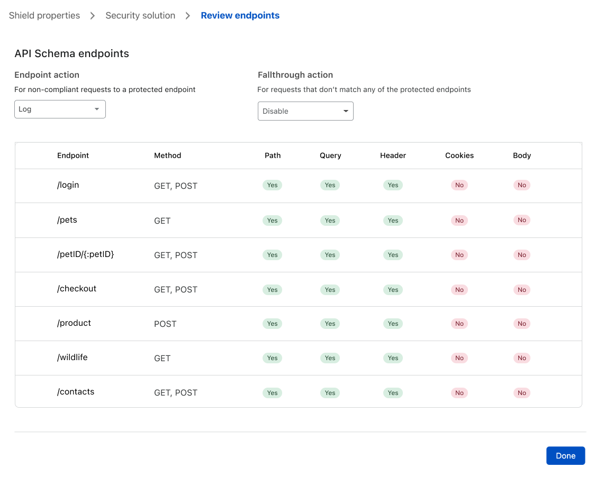

# Configure Schema Validation

<Aside type='warning'>

This feature is only available for customers in the Enterprise plan.

</Aside>

Use the **API Shield** interface to configure API Schema Validation which validates requests according to the API Schema you provide.

Before you can configure Schema Validation for an API, you must obtain its API Schema file. API Shield supports API Schemas using OpenAPI Specification v3. The accepted file formats are YAML (files with a `.yml` or `.yaml` file extension) and JSON (files with a `.json` file extension).

## Use the API Shield interface

To configure Schema Validation in the Cloudflare dashboard, follow these steps:

1. Log in to your Cloudflare account Home page and click the zone containing the host you want to protect with mTLS.

1. Click the **Firewall** app.

    The Firewall **Overview** displays.

    

1. Click the **API Shield** tab.

    The **API Shield** card displays.

    

1. Click **Deploy API Shield**.

    The API Shield creation wizard displays.

    

1. Enter a descriptive name for the API Shield in the **Shield name** input. 

1. Configure the expression for the API Shield using the available request fields.

    For example, if your API is available at `http://api.example.com/v1`, the expression must include a check for the _hostname_ field (which must be equal to `api.example.com`) and a check for the _URI path_ field (which must be equal to `/v1`).

    <Aside type='warning' header='Important'>

    To validate the hostname, you must include the _hostname_ field explicitly in the rule, even if the hostname value is in the schema file. Any hostname value present in the schema file will be ignored.

    </Aside>

1. Click **Next**.

    The **Security solution** step displays.

    

1. Enable the toggle in the **Schema Validation** card.

1. Upload the API Schema file in **Upload API Schema** by selecting a file or dragging a file to the file upload area (dashed rectangle). 

1. Click **Deploy** to validate the content of the schema file and deploy the Schema Validation rule.

    <Aside type='note'>

    If you get a validation error, make sure you are using one of the supported file formats.

    </Aside>

1. After deploying your API Shield rule, Cloudflare displays a summary of all API endpoints organized by their protection level and what will be the action taken for non-compliant and unprotected requests.

    

    The API Shield rule will validate all incoming requests addressed at the endpoints listed in the **Protected** section. The several columns in the table list the validations deployed for each endpoint, according to the information described in the API Schema file. The **Action** column indicates the action taken by API Shield for incoming requests that fail Schema Validation.

    The **Unprotected** section lists endpoints that API Shield will not protect. This list includes any endpoints with API Schema definitions that API Shield does not support. There’s an additional validation for handling requests addressed to any other endpoints or URLs other than the ones described in the schema file. The **Action** column indicates the action taken by API Shield for all incoming requests addressed at these unprotected API endpoints.

    <Aside type='warning'>
    
    Currently, request body validations are not supported. Additionally, the only available action is _Log_.

    </Aside>

1. Click **Done**. 

The API Shield wizard closes and the **API Shield** card displays with your new API Shield in the list.
