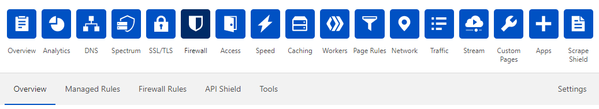
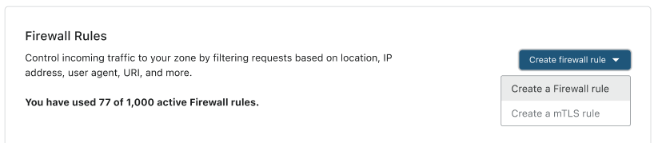
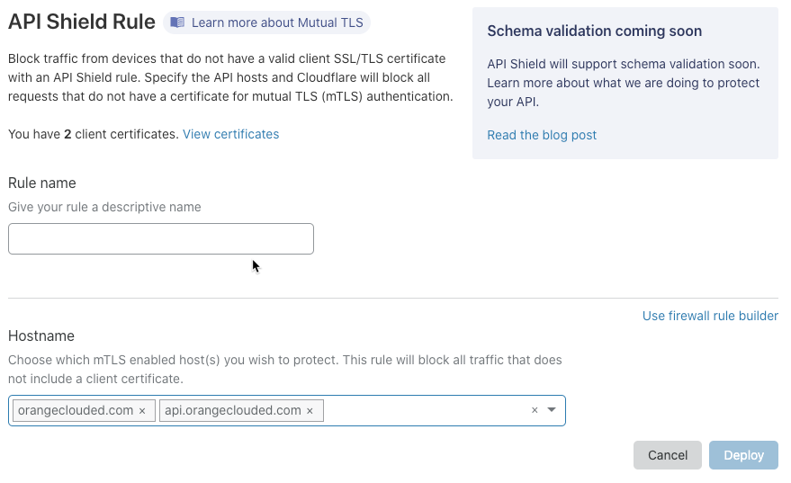
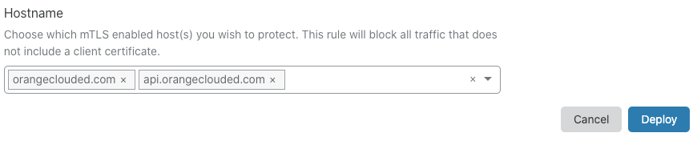
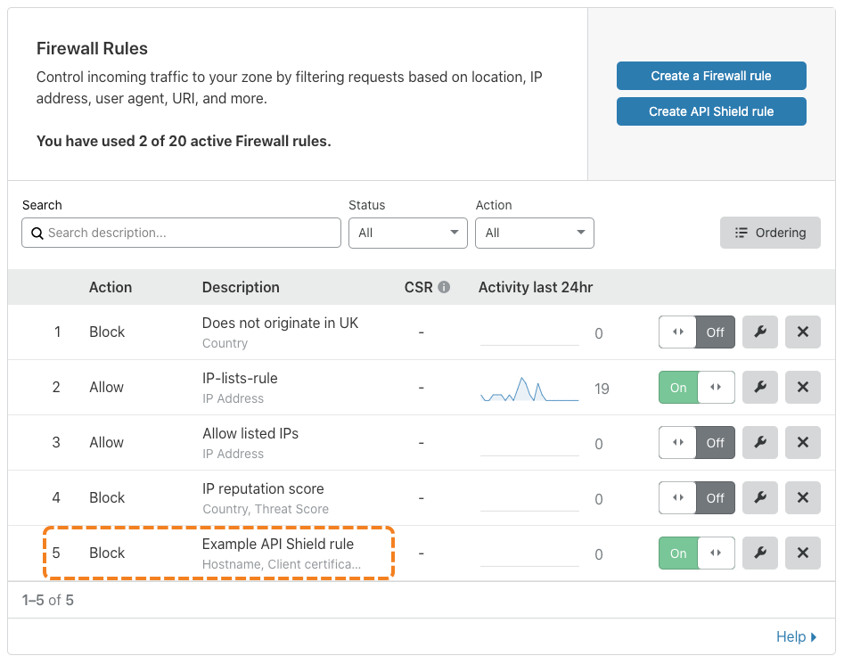
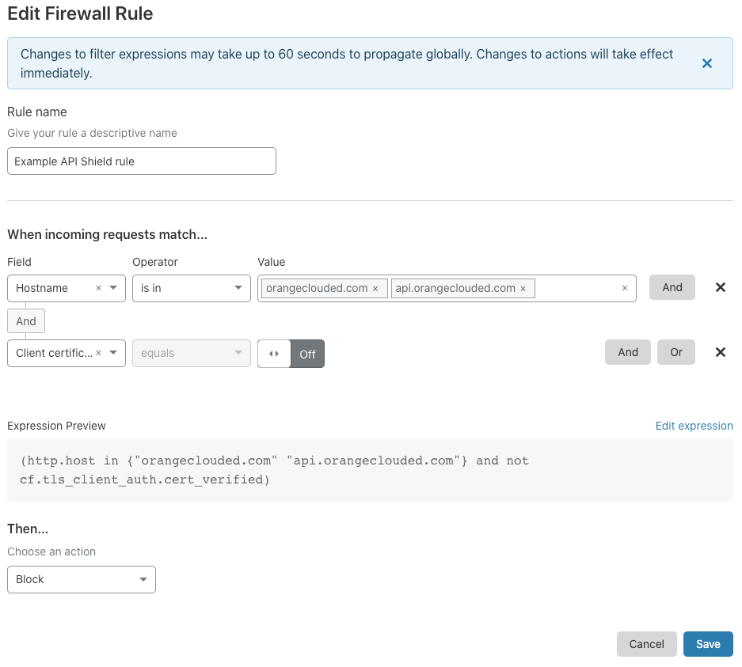

# Create an API Shield™ rule

Use the [API Shield](/cf-firewall-rules/api-shield) interface in the Cloudflare dashboard to create a firewall rule that requires requests to your API or web application to present a valid client certificate.

Before you can create an API Shield rule, you must do the following:

- [Enable mutual Transport Layer Security (mTLS) for a host](https://developers.cloudflare.com/ssl/client-certificates/enable-mtls) in your zone.
- [Create a client certificate](https://developers.cloudflare.com/ssl/client-certificates/create-a-client-certificate).

<Aside type='warning' header='Important'>

You can only use API Shield with a certificate authority (CA) that is fully managed by Cloudflare. Cloudflare generates a unique CA for each zone.

If you need to use a different CA, contact a Cloudflare customer success manager.

</Aside>

After you have created your API Shield rule, [configure your mobile app or IoT device](https://developers.cloudflare.com/ssl/client-certificates/configure-your-mobile-app-or-iot-device) to use your Cloudflare-issued client certificate.

## Use the API Shield Rule interface

To create an API Shield rule in the Cloudflare dashboard, follow these steps:

1. Log in to your Cloudflare account Home page and click the zone containing the host you want to protect with API Shield.

    The Cloudflare dashboard displays.

1. Click the **Firewall** app.

    The Firewall **Overview** displays.

    

1. Click the **Firewall Rules** tab.

    The **Firewall Rules** card displays.

    

1. Click **Create API Shield rule**.

    The **API Shield Rule** dialog displays.

    

1. Enter a descriptive identifier for your API Shield rule in the **Rule name** input.

1. To select the hosts you want protect with you API Shield rule, use the **Hostname** input. By default, all available hosts are listed. Only hosts in the zone you selected in Step 1 and for which you [enable mTLS](https://developers.cloudflare.com/ssl/client-certificates/enable-mtls) are available. To remove a host from the rule, click the associated **X** icon.

    

1. To create your rule and make it active, click **Deploy**.

    The **API Shield Rule** dialog closes and the **Firewall Rules** card displays with your new rule in the list.

    

Once you have deployed your API Shield rule, [configure your mobile app or IoT device](https://developers.cloudflare.com/ssl/client-certificates/configure-your-mobile-app-or-iot-device) to use your Cloudflare-issued client certificate.

## Review your rule in the Expression Builder

To review your API Shield rule in the Firewall Rules Expression Builder, click the wrench icon associated with your rule.

The **Edit Firewall Rule** dialog displays, and the Expression Builder's visual interface renders your API Shield rule:

Note **Expression Preview**. Your API Shield rule includes a [compound expression](/cf-firewall-rules/fields-and-expressions/#compound-expressions) formed from two [simple expressions](/cf-firewall-rules/fields-and-expressions/#simple-expressions) joined by the `and` operator.

The first expression uses the `http.host` field, combined with the `in` operator, to capture the hosts your API Shield rule applies to.

The second expression—`not cf.tls_client_auth.cert_verified`—returns `true` when a request to access your API or web application does _not_ present a valid client certificate.

Because the [action](/cf-firewall-rules/actions) for your rule is _Block_, only requests that present a valid client certificate can access the specified hosts.
