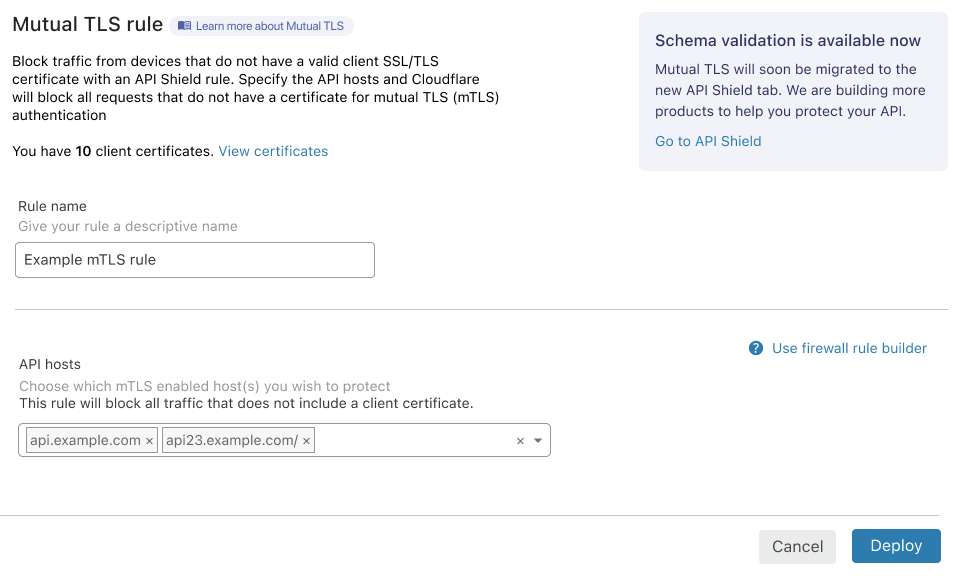

# Create a mTLS rule

Use the [Mutual TLS](/cf-firewall-rules/api-shield#mutual-tls-mtls) Rule interface in the Cloudflare dashboard to create a mTLS rule that requires requests to your API or web application to present a valid client certificate.

Before you can create a mTLS rule, you must do the following:

- [Create a client certificate](https://developers.cloudflare.com/ssl/client-certificates/create-a-client-certificate).
- [Configure your mobile app or IoT device](https://developers.cloudflare.com/ssl/client-certificates/configure-your-mobile-app-or-iot-device) to use your Cloudflare-issued client certificate.
- [Enable mutual Transport Layer Security (mTLS) for a host](https://developers.cloudflare.com/ssl/client-certificates/enable-mtls) in your zone.

<Aside type='warning' header='Important'>

You can only use mTLS with a certificate authority (CA) that is fully managed by Cloudflare. Cloudflare generates a unique CA for each zone.

If you need to use a different CA, contact a Cloudflare Customer Success Manager.

</Aside>

## Use the Mutual TLS Rule interface

To create a mTLS rule in the Cloudflare dashboard, follow these steps:

1. Log in to your Cloudflare account Home page and click the zone containing the host you want to protect with mTLS.

1. Click the **Firewall** app.

    The Firewall **Overview** displays.

    

1. Click the **Firewall Rules** tab.

    The **Firewall Rules** card displays.

    

1. Click **Create a mTLS rule**.

    The **Mutual TLS Rule** dialog displays.

    

1. Enter a descriptive identifier for your mTLS rule in the **Rule name** input.

1. Enter the hosts you want to protect with your mTLS rule in the **API hosts** input. By default, all available hosts are listed. Only hosts in the zone you selected in Step 1 and for which you [enable mTLS](https://developers.cloudflare.com/ssl/client-certificates/enable-mtls) are available. To remove a host from the rule, click the associated **X** icon.

1. To create your rule and make it active, click **Deploy**.

The **Mutual TLS Rule** dialog closes and the **Firewall Rules** card displays with your new rule in the list.

Once you have deployed your mTLS rule, [configure your mobile app or IoT device](https://developers.cloudflare.com/ssl/client-certificates/configure-your-mobile-app-or-iot-device) to use your Cloudflare-issued client certificate.

## Review your rule in the Expression Builder

To review your mTLS rule in the Firewall Rules Expression Builder, click the wrench icon associated with your rule.

The **Edit Firewall Rule** dialog displays, and the Expression Builder's visual interface renders your mTLS rule:


Note **Expression Preview**. Your mTLS rule includes a [compound expression](/cf-firewall-rules/fields-and-expressions/#compound-expressions) formed from two [simple expressions](/cf-firewall-rules/fields-and-expressions/#simple-expressions) joined by the `and` operator.

The first expression uses the `http.host` field, combined with the `in` operator, to capture the hosts your mTLS rule applies to.

The second expression — `not cf.tls_client_auth.cert_verified` — returns `true` when a request to access your API or web application does _not_ present a valid client certificate.

Because the [action](/cf-firewall-rules/actions) for your rule is _Block_, only requests that present a valid client certificate can access the specified hosts.

## Check for revoked certificates

Since you can [revoke client certificates](https://developers.cloudflare.com/ssl/client-certificates/revoke-client-certificate), you can add a mTLS rule that checks if the certificate included in the request has been revoked. To create such a rule you must use the Expression Editor.

When a request includes a revoked certificate, the `cf.tls_client_auth.cert_revoked` field is set to `true`. You can create a rule using this field to block requests that include a revoked certificate.

For example, the following Firewall rule blocks incoming requests that include a revoked certificate:

* **Rule expression**: `cf.tls_client_auth.cert_revoked`
* **Action**: _Block_

You can also use a single mTLS rule to block requests that do not include a valid client certificate or that include a revoked certificate. You must also use the Expression Editor to enter this rule expression.

For example, you could define a rule expression similar to the following:

```sql
http.host == "example.com" and (not cf.tls_client_auth.cert_verified or cf.tls_client_auth.cert_revoked)
```
