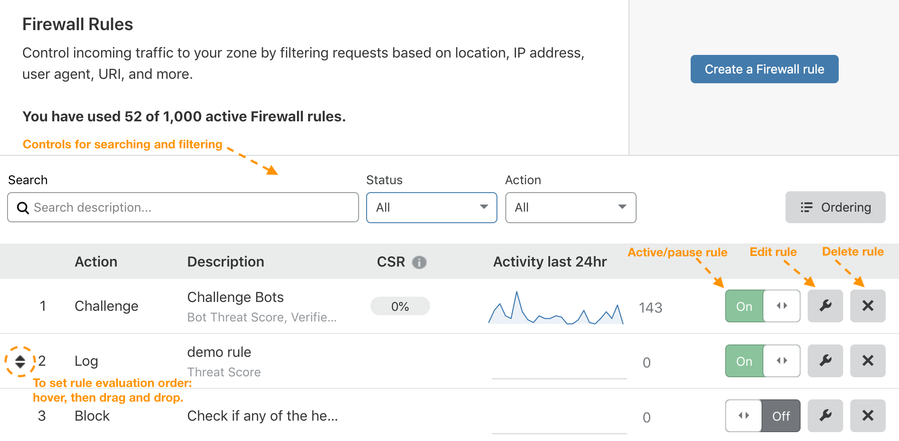

# Manage Firewall Rules in the Cloudflare dashboard

Firewall Rules is a feature of the **Firewall** app in the Cloudflare UI (dashboard).

As depicted in the image below, the **Firewall Rules** dashboard interface lets you:

- [Create](/cf-dashboard/create-edit-delete-rules/#create-a-firewall-rule) new rules.
- Search and filter the list of existing rules.
- See a list of existing rules (both active and paused).
- Activate or pause rules (turn on or off).
- [Edit](/cf-dashboard/create-edit-delete-rules/#edit-rules) rules.
- [Delete](/cf-dashboard/create-edit-delete-rules/#delete-rules) rules.

