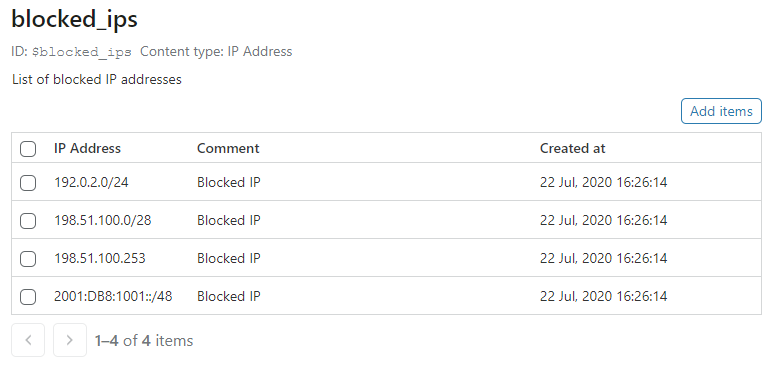
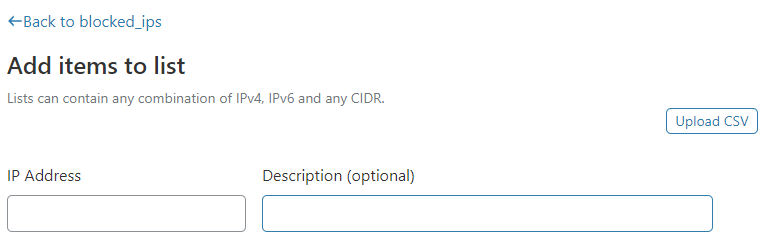
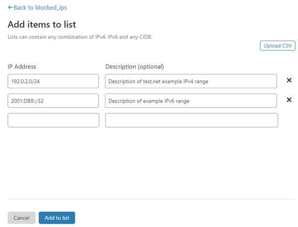
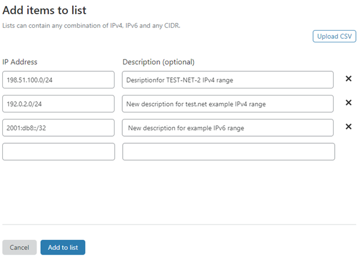
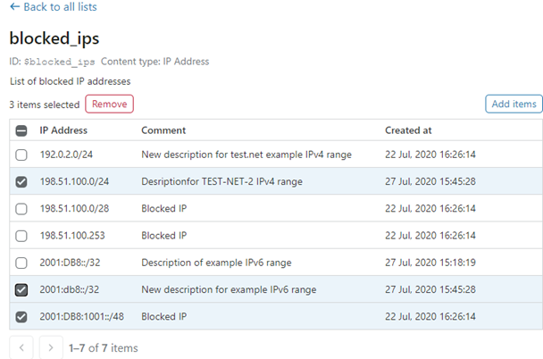

# Manage list items (IP addresses)

## View items in a Firewall Rules list

To view the items in a Firewall Rules list, follow these steps:

1. [Access the Lists interface](/cf-dashboard/rules-lists/) in the **Configurations > Lists** page of your Cloudflare account.

1. To view items in a list, click the **Edit** link associated with the list you want to view.

The list of items displays sorted by IP address, ascending:



<Aside type='note' header='Note'>

You cannot download a list in CSV format from the dashboard. If you need to download the contents of a list to your device, use the [Get Lists](https://api.cloudflare.com/#rules-lists-list-lists) operation to fetch them.

</Aside>

## Add items to a list

Rules Lists support IPv4 and IPv6 addresses as well as CIDR ranges, and you can combine them in the same list.

You can use uppercase or lowercase characters for IPv6 addresses in lists. However, when you save the list, uppercase characters are converted to lowercase.

To add items to a Firewall Rules list, follow these steps:

1. [Access the Lists interface](https://developers.cloudflare.com/firewall/cf-dashboard/rules-lists/) in the **Configurations > Lists** page of your Cloudflare account.

1. Click the **Edit** button associated with the list that you want to edit.

   The list of IP items displays.

1. Click **Add items**.

   The **Add items to list** page displays:

   

1. To [add items to the list manually](#add-items-to-a-list-manually), use the text inputs in the Lists interface.

1. To [add items in CSV format](/cf-dashboard/rules-lists/manage-items/#add-items-in-csv-format), click **Upload CSV**.

### Add items to a list manually

1. In the **Add items to list** page, add an IP Address and an optional description in the text inputs.

   

1. As you enter information into a text input, a new row of inputs displays below the current one.

   To delete any of the IP addresses that you have entered, click **X**.

1. Click **Add to list** to add the new items.

   The updated list displays.

### Add items in CSV format

<Aside type='warning' header='Important'>

Importing a CSV file to a list only updates descriptions or adds items to the list. It does not delete items from a list.

If you need to replace the entire contents of a list, format the data as an array and use the Update Lists operation in the [Lists API](/api/cf-lists/endpoints).

</Aside>

#### Use valid CSV file format

When uploading a CSV file containing a list of IP addresses and optional descriptions, be sure that each item is on its own line, as in this example:

```txt
IP-address,description
IP-address
```

#### Upload a CSV file

To add items to a Firewall Rules list by uploading a CSV file, follow these steps:

1. In the **Add items to list** page, click **Upload CSV**.

   Your operating system's file browser dialog displays.

1. Browse to the location of the CSV file, select it, and click **Open**.

   The **Add items to list** page updates to include the items from the CSV file:

   

1. You can continue to edit the items in the list before adding them:

   - To delete any of the IP addresses that you have entered, click **X**.
   - To add extra IP addresses manually, enter the information in the text inputs.

1. Click **Add to list** to add the new items to your list.

   The updated list displays.

<Aside type='warning' header='Important'>

When uploading CSV data, keep in mind that duplicate data is treated as follows:

- IP addresses that were already in the list are updated with the description from the CSV file.
- IP addresses in the CSV file that were not already in the list are added to the list.

</Aside>

## Delete items from a list

To delete items from a Firewall Rules list, follow these steps:

1. [Access the Lists interface](/cf-dashboard/rules-lists/) in the **Configurations > Lists** page of your Cloudflare account.

1. Click the **Edit** link associated with list from which you want to delete.

1. Select the checkboxes next to the items that you want to delete. To select all of the items, use the checkbox in the column header:

   

1. Click **Remove** to delete the selected items from the list.

1. Click **Remove** in the confirmation dialog.

   The updated list displays.
