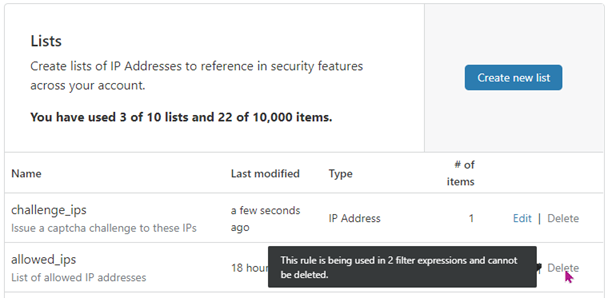

# Manage lists

## Create an IP list

To create an IP List, follow these steps:

1. In the **Lists** interface, click **Create new list**.

  The **Create new list** page displays.

  

1. Enter a name for your list, observing the following guidelines:

   - Use only lowercase letters, numbers and the underscore (`_`) character in the name. A valid name satisfies this regular expression:

     `^[a-z0-9_]+$`

   - The maximum length for a list name is 50 characters.
   - Use a descriptive name for your list so that the list is informative in the context of a Firewall Rule expression.

1. Enter a description (optional). The maximum length for the description is 500 characters. There are no character constraints for the description field.

1. Click **Create**.

The **Add items to list** page displays.

To populate your list, refer to [Use IP Lists: Add items to a list](/cf-dashboard/rules-lists/manage-items/#add-items-to-a-list).

## Delete a list

<Aside type='note' header='Note'>

You can only delete a list when there are no Firewall Rules (enabled or disabled) that reference the list.

</Aside>

To delete an IP List, follow these steps:

1. In the Cloudflare dashboard, navigate to **Configurations** > **Lists**.

1. Hover your pointer over the **Delete** button associated with the list you want to delete.

   - When the list is used in a Firewall Rule, a tooltip displays with notification that you cannot delete the list:

     

   - When the list is not used in a Firewall Rule, **Delete** link highlights, indicating you can delete the list.

1. Click **Delete**.

1. In the confirmation dialog, click **Delete** to confirm the operation.

The **Lists** card displays the updated collection of lists.

## Edit a list

You can add and remove items from a list, but you cannot change the list name or type.

For more information, refer to [Use IP Lists: Manage IP List items](/cf-dashboard/rules-lists/manage-items).
