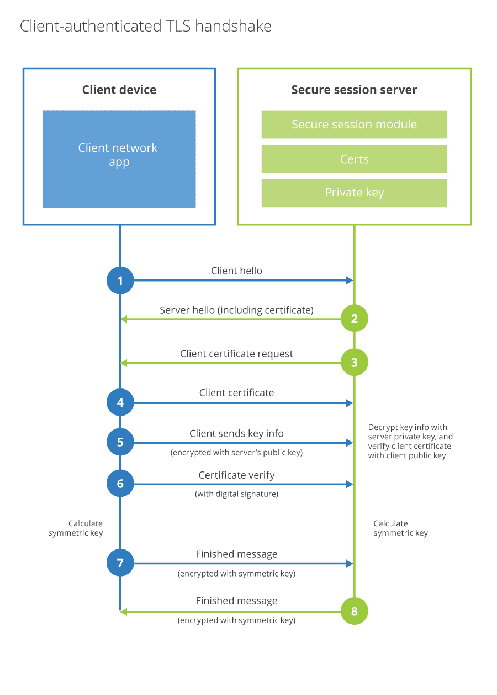

# API Shield™

Cloudflare API Shield allows you to secure your APIs using the following security solutions:

- **Mutual TLS (mTLS)** - Blocks traffic from devices that do not have a valid client SSL/TLS certificate with an API Shield rule.
- **Schema Validation (Beta)** - Protects your origin from invalid API requests or a malicious payload by matching each request with the provided schema.

## A positive security model for APIs

Implementing a positive security model for APIs is the most direct way to eliminate credential stuffing attacks and deny access to automated scanning tools. Unlike the security model followed by firewalls, in a positive security model you define the requirements and admissible behavior of incoming traffic. The only allowed requests are the ones that comply with the defined rules. 

Cloudflare API Shield follows a positive security model.

## Mutual TLS (mTLS)

<Aside type='note'>

Mutual TLS is available to all Cloudflare plans.

</Aside>

Mutual TLS (mTLS) authentication uses client certificates to ensure that traffic between client and server is bidirectionally secure and trusted. It also allows requests that do not authenticate via an identity provider, such as Internet-of-things (IoT) devices, to demonstrate they can reach a given resource.

Support includes [gRPC](https://grpc.io/docs/what-is-grpc/introduction/)-based APIs, which use binary formats such as protocol buffers rather than JSON.

Specify the API hosts and Cloudflare will block all requests that do not have a certificate for mutual TLS (mTLS) authentication.

### Configuring mTLS

To protect your application with mTLS authentication, use this workflow:

1. Use Cloudflare's fully hosted public key infrastructure (PKI) to [create a client certificate in the Cloudflare dashboard](https://developers.cloudflare.com/ssl/client-certificates/create-a-client-certificate).

1. [Configure your mobile app or IoT device](https://developers.cloudflare.com/ssl/client-certificates/configure-your-mobile-app-or-iot-device) to use your Cloudflare-issued client certificate.

1. [Enable mTLS](https://developers.cloudflare.com/ssl/client-certificates/enable-mtls) for the hosts you wish to protect.

1. Create Cloudflare firewall rules that [require API requests to present a valid client certificate](/recipes/require-valid-client-certificate). The **Firewall** app in the Cloudflare dashboard provides a dedicated interface where you can [create mTLS rules](/cf-dashboard/create-mtls-rule).

<Aside type='warning' header='Important'>

API Shield's Mutual TLS requires Cloudflare-issued certificates. You can use mTLS with any fully managed certificate authority (CA) where Cloudflare issues the client certificates.

If you need to use certificates issued by another (CA), please reach out to a Cloudflare Customer Success Manager.

When using Yubikeys, the browser may prompt for unlocking the key due to a problem in Yubikey's PKCS#11 library.

</Aside>

## Schema Validation - Beta

<Aside type='note'>

This feature is only available for customers in the Enterprise plan.

</Aside>

An API Schema defines which API requests are valid based on several request properties like target endpoint and HTTP method.

Schema Validation allows you to check if incoming traffic complies with a previously supplied API Schema. When you provide an API Schema, API Shield creates rules for incoming traffic from the schema definitions. These rules define which traffic is allowed and which traffic gets logged or blocked.

API Shield supports API Schemas using OpenAPI Specification v3. The accepted file formats are YAML (`.yml` or `.yaml` file extension) and JSON (`.json` file extension).

To configure Schema Validation for one or more hosts using the dashboard, check [Configure Schema Validation](/cf-dashboard/configure-schema-validation).

<Aside type='warning'>

**Notes about the current Beta:**

- The only available action for requests whose validations fail is _Log_.
- You cannot edit an API Shield. If you need to make changes, delete the existing shield and create a new one.
- API Shield cannot validate some features of API Schemas, including the following: request body validations, all responses, external references, non-basic path templating, or unique items.

</Aside>
