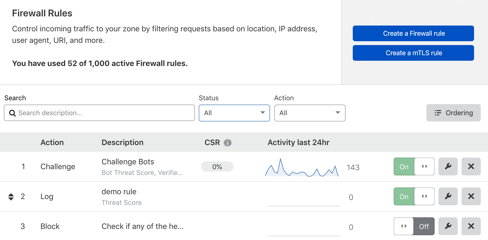
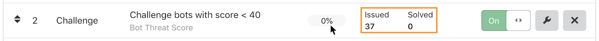
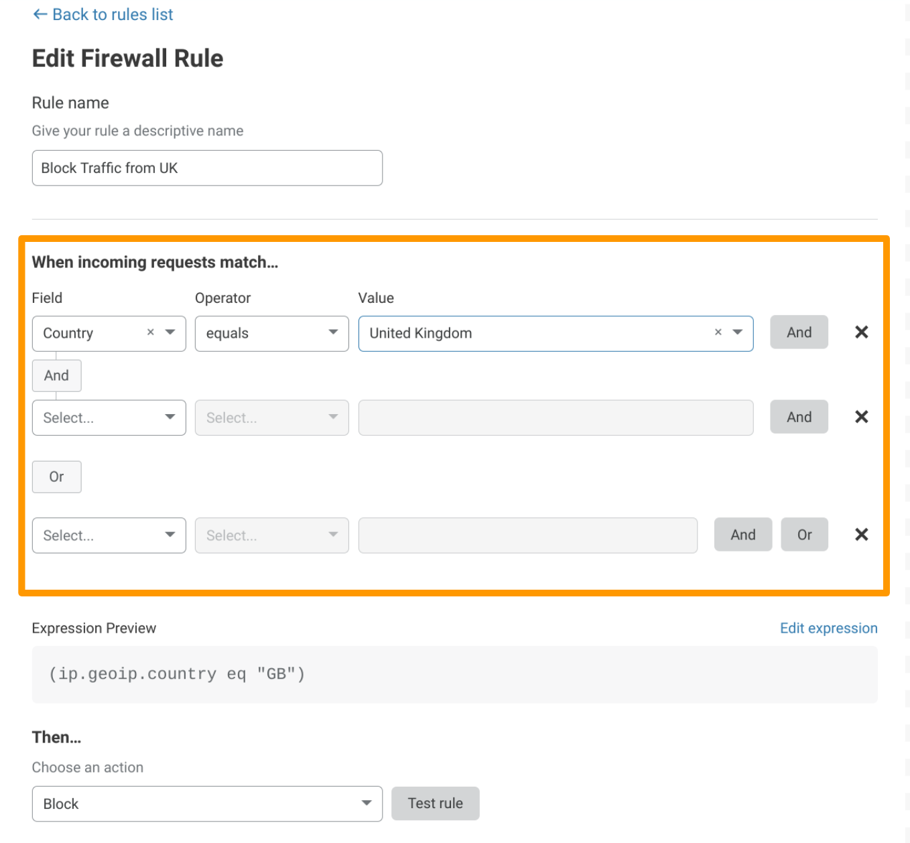
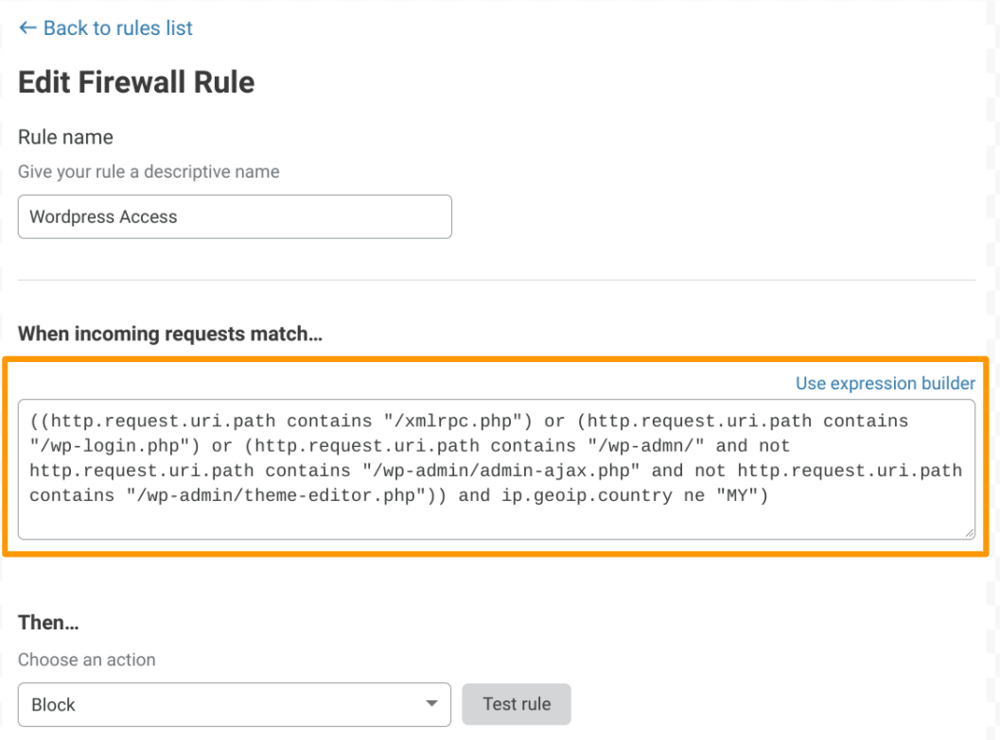

# About Cloudflare Firewall Rules

## Flexibility and control

**Cloudflare Firewall Rules** is a flexible and intuitive framework for filtering HTTP requests. It gives you fine-grained control over which requests reach your applications.

Firewall Rules allows you to create rules combining several conditions. For example, you can create a single Firewall Rule that blocks traffic to a URI when the request comes from a particular IP and the user-agent matches a specific string or a pattern. Once you are satisfied with the rule, you can deploy it yourself, immediately.

Fundamentally, Firewall Rules gives you the power to proactively inspect incoming site traffic and automatically respond to threats. You define **expressions** that tell Cloudflare what to look for and specify the appropriate **action** to take when those criteria are satisfied.

It is a simple concept, but like the Wireshark Display Filter language that inspired our own expression language, the [Rules language](https://developers.cloudflare.com/ruleset-engine/rules-language) is a powerful tool that allows organizations to rapidly adapt to a constantly evolving threat landscape.

To write Firewall Rule expressions, use the Firewall Rules language, a powerful expression language inspired in the Wireshark Display Filter language. Even though Cloudflare Firewall Rules is not based on the [Ruleset Engine](https://developers.cloudflare.com/ruleset-engine/), the Firewall Rules language follows the same syntax of the Cloudflare Rules language.

For more information on rule expressions and the available operators, fields, and functions, refer to [Rules language](https://developers.cloudflare.com/ruleset-engine/rules-language).

## Working with Firewall Rules

To configure Firewall Rules from the Cloudflare dashboard, use the **Firewall Rules** tab in the **Firewall** app. For more, refer to [Manage rules in the Cloudflare dashboard](/cf-dashboard).

To configure Firewall Rules with the Cloudflare API, use the Firewall Rules API. Use the Cloudflare Filters API to manage expressions. For more information, refer to [Manage rules via the APIs](/api).

You can also manage Firewall Rules through Terraform. For more, refer to [Getting Started with Terraform](https://blog.cloudflare.com/getting-started-with-terraform-and-cloudflare-part-1/).

### Firewall Rules tab

The **Rules List** gives you a snapshot of recent activity and allows you to manage firewall rules in a single convenient location.

#### Challenge Solve Rate (CSR)

The **Rules List** displays each rule's **CSR** (Challenge Solve Rate), which is the percentage of issued challenges that were solved. This metric applies to rules configured with _Challenge (Captcha)_ or _JS Challenge_ actions, and it is calculated as follows:

<var>CSR</var> = <var>number of challenges solved</var> / <var>number of challenges issued</var>

Hover over the CSR to reveal the number of issued and solved CAPTCHA challenges:

A low CSR means that Cloudflare is issuing a low number of CAPTCHA challenges to actual humans, since these are the solved challenges.

You should aim for a low Challenge Solve Rate. Review the CSR of your CAPTCHA rules periodically and adjust them if necessary:

* If the rate is higher than expected, for example regarding a Bot Management rule, consider relaxing the rule criteria so that you issue fewer challenges to human visitors.
* If the rate is 0%, no CAPTCHA challenges are being solved. This means that you have no human visitors whose requests match the rule filter. Consider changing the rule action to _Block_.

<Aside type="warning" header="Important">

Currently, Cloudflare does not calculate the CSR of Managed Challenges.

For customers on a Free plan, any rules configured with the _Challenge (Captcha)_ action now use Managed Challenges. For more information, see [Understanding Cloudflare Captchas and Challenge Passage](https://support.cloudflare.com/hc/articles/200170136#managed-challenge).

</Aside>

### Expression Builder

Both the **Create Firewall** and **Edit Firewall** panels include the visual **Expression Builder** (outlined below, in orange), which is an excellent tool to start with.

### Expression Editor

Advanced users will appreciate the **Expression Editor** (shown below), which trades the visual simplicity of the builder for the raw power of the [Cloudflare Rules language](https://developers.cloudflare.com/ruleset-engine/rules-language). The editor also supports advanced features, such as grouping symbols, for constructing highly sophisticated, targeted rules.

### Firewall Rules APIs

Power users, particularly those who develop large numbers of Firewall Rules, can use the Cloudflare API to programmatically manage Firewall Rules. Refer to [Manage rules via the API](/api) for more information.

## Entitlements

Cloudflare Firewall Rules is available to all customers. Keep in mind that the number of firewall rules you can have active on your account is based on your type of plan, as is support for the _Log_ action and support for regular expressions.

This table outlines the Firewall Rules features and entitlements available with each customer plan:

<TableWrap>
<table>
<thead>
<tr>
  <td></td>
  <td colspan="4" style="text-align:center"><strong>Cloudflare plan</strong></td>
</tr>
<tr>
  <td><strong>Feature</strong></td>
  <td><strong>Free</strong></td>
  <td><strong>Pro</strong></td>
  <td><strong>Business</strong></td>
  <td><strong>Enterprise</strong></td>
</tr>
</thead>
<tbody>
<tr>
  <td>Active rules</td>
  <td>5</td>
  <td>20</td>
  <td>100</td>
  <td>1000</td>
</tr>
<tr>
  <td>Supported actions</td>
  <td>All except <em>Log</em></td>
  <td>All except <em>Log</em></td>
  <td>All except <em>Log</em></td>
  <td>All</td>
</tr>
<tr>
  <td>Regular expression support</td>
  <td>No</td>
  <td>No</td>
  <td>Yes</td>
  <td>Yes</td>
</tr>
<tr>
  <td>Number of <a href='https://developers.cloudflare.com/firewall/cf-firewall-rules/rules-lists'>IP Lists</a></td>
  <td>1</td>
  <td>10</td>
  <td>10</td>
  <td>10</td>
</tr>
</tbody>
</table>
</TableWrap>

## Get started

Unless you are already an advanced user, refer to [Expressions](https://developers.cloudflare.com/ruleset-engine/rules-language/expressions) and [Actions](/cf-firewall-rules/actions) to learn more about the basic elements of Firewall Rules.

To get started building your own Firewall Rules, see [Manage Firewall Rules in the dashboard](/cf-dashboard/create-edit-delete-rules).

Those eager to dive straight into the technical details can refer to these topics:

* [Common use cases](https://developers.cloudflare.com/firewall/recipes)
* [Manage Firewall Rules via the APIs](https://developers.cloudflare.com/firewall/api)
* [Cloudflare Rules language](https://developers.cloudflare.com/ruleset-engine/rules-language)
