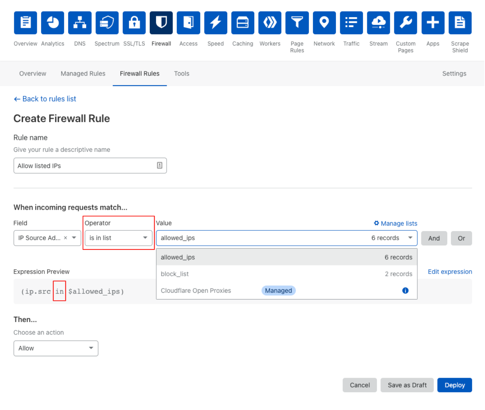

# Rules Lists

Use Rules Lists to refer to a group of IP addresses collectively, by name, in your firewall rule expressions. You can choose to create your own custom list of IP addresses or use a list managed by Cloudflare.

For example, use a list of known office IP addresses in a firewall rule that allows requests from the addresses on the list to bypass security features. Or you may want to block requests that don't come from the known office addresses.

When you update the content of a list, any rules that use the list are automatically updated, so you can make a single change to your Firewall Rules list rather than modify rules individually.

Cloudflare stores your lists at the account level and sends to the edge, so you can view, manage, and incorporate them into firewall rules for any of your zones.

## Advantages of Lists

Using Rules Lists has these advantages:

- When creating a firewall rule, using a Rules List is easier and less error-prone than adding a long list of IP addresses to a firewall rules expression.
- When updating a set of firewall rules that target the same group of IP addresses, using a Rules List is easier and less error prone than editing multiple firewall rules.
- Rules Lists are easier to read and more informative, particularly when you use descriptive names for your lists.

## Managed IP Lists: Open Proxies

Use Managed IP Lists to access Cloudflare's IP threat intelligence. 

Cloudflare scans public, open proxy lists for reachable, open proxies. After verifying the proxies, Cloudflare determines their exit IPs and creates a list of IPs you can use when writing rules via the dashboard or API. 

- To browse the managed lists, see [Use Rules Lists](/cf-dashboard/rules-lists).
- To use a list when writing a rule, use the **Operator** menu to select *is in list*. From **Value**, select the list. 

## Entitlements

The number of Rules Lists you can create depends on the Cloudflare plans associated with the zones in your account. Regardless of plan, you can store up to a total of 10,000 items, spread across all of your lists.

<TableWrap><table style="width: 100%">

  <thead>
    <tr>
      <td></td>
      <td colspan="4" style="text-align:center"><strong>Cloudflare plan</strong></td>
    </tr>
    <tr>
      <th></th>
      <th>Free</th>
      <th>Pro</th>
      <th>Business</th>
      <th>Enterprise</th>
    </tr>
  </thead>
  <tbody>
    <tr>
      <td><strong>Number of Rules Lists</strong></td>
      <td>1</td>
      <td>10</td>
      <td>10</td>
      <td>10</td>
    </tr>
  </tbody>
</table></TableWrap>

<Aside header="Important">
  Access to the Open Proxy List in the rule builder and <code>cf.open_proxies</code> requires a Cloudflare Enterprise plan.
</Aside>

## Managing lists

- To manage and edit lists from your Cloudflare account interface, see [_Use Rules Lists_](/cf-dashboard/rules-lists).
- To manage and edit lists using the Cloudflare API, see [_Rules Lists API_](/api/cf-lists/).

## Using lists in expressions

Both the Cloudflare dashboard and the Cloudflare API support Rules Lists.

To create a new rule via the API, use the `cf.open_proxies` list name.

To use Rules Lists in an expression from the Cloudflare dashboard, see [_Use lists in expressions_](/cf-dashboard/rules-lists/use-lists-in-expressions).

To refer to a rules list in a Cloudflare Filters API expression, see [_Values: Rules Lists_](/cf-firewall-language/values#rules-lists) in the Firewall Rules language reference.
