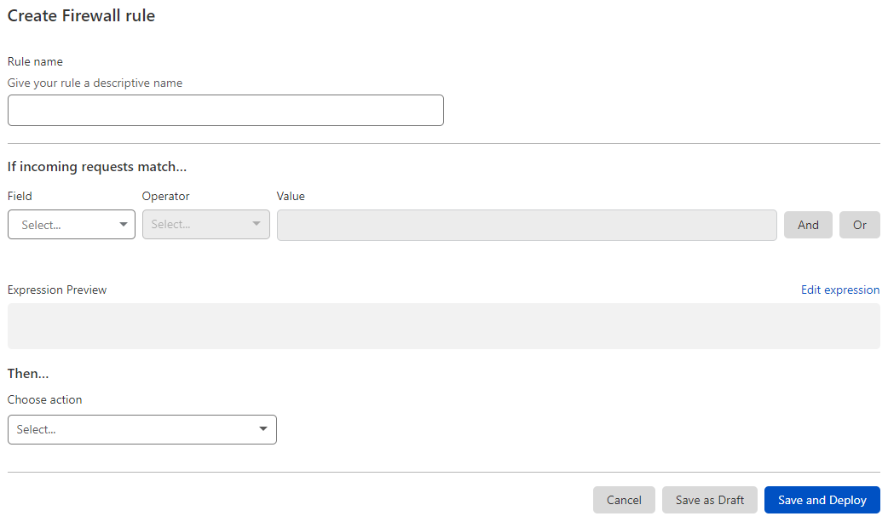

# Create Custom Firewall rules in the dashboard

Create Custom Firewall rules under the **Custom Rules** tab in the **Firewall** app.

<Aside type='warning' header='Important'>

This feature is only available for selected customers on an Enterprise plan.

</Aside>

## Create a Custom Firewall rule

To create a new Custom Firewall rule:

1. Log in to the Cloudflare dashboard.

1. Select the **Websites** tab and choose the site for which you want to create a rule.

1. Navigate to **Firewall** > **Custom Rules**.

1. Click **Create Custom rule** > **Firewall rule**.

1. In the page that displays, enter a descriptive name for the rule in **Rule name**.

    

1. Under **If incoming requests match...**, use the **Field** drop-down list to choose an HTTP property. For each request, the value of the property you choose for **Field** is compared to the value you specify for **Value** using the operator selected in **Operator**.

1. Select the rule action from the **Choose action** drop-down list. For example, selecting _Block_ tells Cloudflare to refuse requests that match the conditions you specified.

1. To save and deploy your rule, click **Save and Deploy**. If you are not ready to deploy your rule, click **Save as Draft**.
