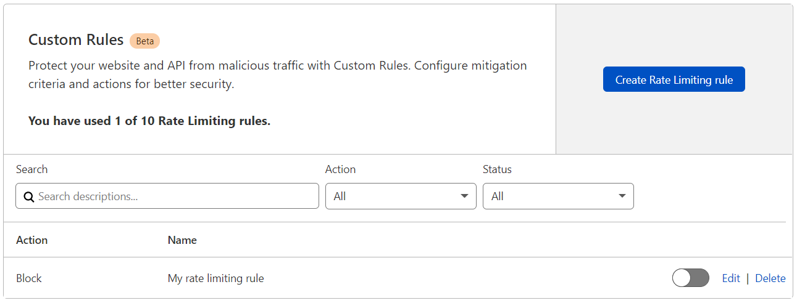

# Manage Rate Limiting Rules in the dashboard

<Aside type='warning' header='Important'>

This feature is only available for selected customers on an Enterprise plan.

</Aside>

You can manage Rate Limiting Rules under the **Custom Rules** tab in the **Firewall** app.

The Custom Rules interface allows you to:

* Browse and filter rules
* Create Rate Limiting Rules
* Edit and delete rules
* Enable or disable rules

## Create a Rate Limiting Rule

To create a new Rate Limiting Rule:

1. Log in to the Cloudflare dashboard.

1. Select the **Websites** tab and choose the site for which you want to create a rule.

1. Click the **Firewall** tile in the app bar, and then click the **Custom Rules** tab.

1. Click **Create Rate Limiting rule**.

1. In the **Create Firewall Rule** page that displays, enter a descriptive name for the rule in **Rule name**.

    

1. Under **If incoming requests match...**, use the **Field** drop-down list to choose an HTTP property. For each request, the value of the property you choose for **Field** is compared to the value you specify for **Value** using the operator selected in **Operator**.

1. Under **With the same...**, add one or more characteristics that will define the request counters for rate limiting purposes. Each value combination will have its own counter to determine the request rate. Check [Determining the request rate](/cf-rulesets/custom-rules/rate-limiting/request-rate) for more information.

1. Under **And rate exceeds...**, define the rate limit and the time period to consider when determining the request rate.

1. Select the rule action from the **Choose action** drop-down list. For example, selecting _Block_ tells Cloudflare to refuse requests in the conditions you specified when the request limit is reached.

1. Under **For...**, select the mitigation timeout. This is the time period during which Cloudflare applies the select action once the request rate is reached.

1. To  save and deploy your rule, click **Save and Deploy**. If you are not ready to deploy your rule, click **Save as Draft**.

## Manage Custom Rules

You can edit, delete, or enable/disable rules in the Custom Rules card.

### Enable or disable a rule

To enable/disable a rule, click the _On_/_Off_ toggle button on the right of the rule you want to change.

### Edit a rule

To edit a rule:

1. Click **Edit** on the right of the rule you want to change. 
1. Update the rule parameters.
1. Click **Save**.

### Delete a rule

To delete a rule, click **Delete** on the right of the rule you want to delete and confirm the operation.