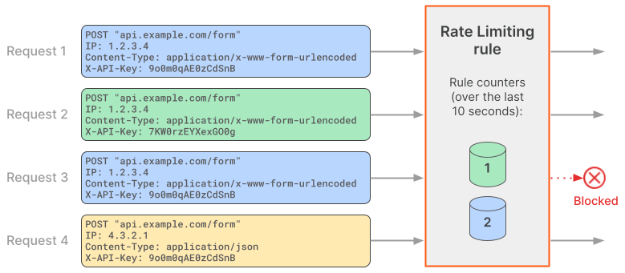

# Determining the request rate

<Aside type='warning' header='Important'>

This feature is only available for selected customers on an Enterprise plan.

</Aside>

Cloudflare keeps separate request counters for Rate Limiting Rules for each value combination of the rule characteristics.

For example, consider a rule configured with the following characteristics:

* IP address
* HTTP header `x-api-key`

In this case, two incoming requests with the **same** value for the HTTP header `X-API-Key` with **different** IP addresses are counted separately, since the value combination is different. Additionally, counters are not shared across data centers. 

<Aside type='warning' header='Important'>

The Cloudflare **data center ID** is a mandatory characteristic of every Rate Limiting Rule. This characteristic does not appear in the rule configuration in the dashboard, but you must include it when [creating Rate Limiting Rules via API](/cf-rulesets/custom-rules/rate-limiting/manage-api).

</Aside>

## Example

Consider the following configuration for a Rate Limiting Rule:

<Example>

Expression: 
`http.request.uri.path eq "/form" and any(http.request.headers["content-type"][*] eq "application/x-www-form-urlencoded")`

Action: _Block_

Characteristics: 
* _Data center ID_ (included by default when creating the rule in the dashboard)
* _IP Address_ 
* _HTTP Header_ > `x-api-key`

Period: _10 seconds_

Requests per period: `1`

Mitigation timeout: _10 minutes_

</Example>

The following diagram shows how Cloudflare handles four incoming requests in the context of the above Rate Limiting Rule.

Since request 1 matches the rule expression, the Rate Limiting Rule is evaluated. Cloudflare defines a request counter for the values of the characteristics in the context of the Rate Limiting Rule and sets the counter to `1`. Since the counter value is within the established limits in **Requests per period**, the request is allowed.

Request 2 matches the rule expression and therefore Cloudflare evaluates the Rate Limiting Rule. The values of the characteristics do not match any existing counter (the value of the `X-API-Key` header is different). Therefore, Cloudflare defines a separate counter in the context of this rule and sets it to `1`. The counter value is within the request limit established in **Requests per period**, and so this request is allowed.

Request 3 matches the rule expression and the same values for rule characteristics. Therefore, Cloudflare increases the value of the existing counter, setting it to `2`. The counter value is now above the limit defined in **Requests per period**, and so request 2 gets blocked.

Request 4 does not match the rule expression, since the value for the `Content-Type` header does not match the value in the expression. Therefore, Cloudflare does not create a new rule counter for this request. Request 4 is not evaluated in the context of this Rate Limiting Rule and is passed on to subsequent rules in the request evaluation workflow.
