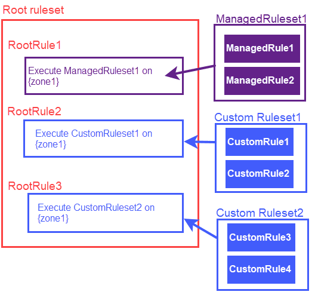

# Rulesets - Beta

<Aside type="warning" header="Important">

This feature is part of an early access experience for selected customers.

</Aside>

With rulesets, you can create and apply sets of rules to incoming traffic. Create and add your own rules to custom rulesets or use managed rulesets provided and maintained by Cloudflare.

You can also deploy managed and custom rulesets from the root ruleset for your account.

The following diagram shows how the rulesets interact with one another.

## Root Ruleset

Root rulesets contain an array of rules that execute managed and custom rulesets. Each rule in the root ruleset deploys a managed or custom ruleset, and the rules in the rulesets are executed in the order they appear.

Use the `rulesets` API to create and edit the root ruleset. You can only create one root ruleset for your account. While you cannot delete a root ruleset, you can remove rules from it. After you modify a root ruleset, a new version of the root ruleset is created.

Rules in the root ruleset only deploy other rulesets. As a result, the only allowable action for rules in the root ruleset is to execute. If you have configured a root ruleset for your account, it is executed automatically.

Your root ruleset is associated with your account, but you can execute the rules in any of your zones.

## Managed Rulesets

**Managed rulesets** are rulesets your account can deploy but does not own. The owner of a managed ruleset is the **ruleset issuer**. The issuer configures the default action and status for each rule in the ruleset. Only the issuer can modify the ruleset.

You can override the default behavior of managed rules when you deploy the managed ruleset on a zone from your account-level root ruleset.

Cloudflare provides the following managed rulesets:
* Cloudflare Managed Ruleset
* Cloudflare OWASP Core Ruleset

Refer to [work with managed rulesets](/cf-rulesets/managed-rulesets) for information on working with managed rulesets.

## Custom Rulesets

Custom rulesets are account-level rulesets that you create, manage, and deploy from the root ruleset. The number of custom rulesets that you can configure is limited. Cloudflare will provide more information about custom ruleset limits on product release.

Custom rulesets contain rules that you create, and the rules use the same syntax as firewall rules. The rules inspect incoming traffic and block, challenge, log, or allow specific requests. The rules in custom rulesets are executed in the order that they appear.

Use the `rulesets` API to create custom rulesets. Once you have created your custom rulesets, you can add rules to it. Custom rulesets do not run automatically, and you must create rules in your root ruleset to deploy them. Each rule in a root ruleset deploys only one custom ruleset.

Refer to [work with custom rulesets](/cf-rulesets/custom-rulesets) for more information on working with custom rulesets.

## Get started

To view your rulesets, see [view rulesets](/cf-rulesets/view-rulesets/).

To create the root ruleset for your account, see [configure the root ruleset for your account](/cf-rulesets/configure-root-ruleset/).

To deploy a ruleset from your root ruleset, see [deploy a ruleset](/cf-rulesets/deploy-rulesets/).