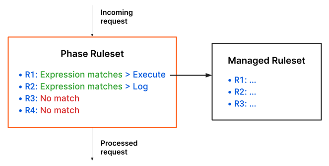

# Ruleset Engine (Beta)

The Cloudflare Ruleset Engine allows you to create and deploy rules and rulesets. The engine syntax, inspired by the Wireshark Display Filter language, is the same syntax used in custom Firewall Rules. Cloudflare uses the Ruleset Engine in different products, allowing you to configure several products using the same basic syntax.

There are several elements involved in the configuration and use of the Ruleset Engine. These elements are:

* **Phase** — Defines a stage in the life of a request where you can execute rulesets.
* **Ruleset** — Defines a versioned set of rules. You can execute rulesets in a phase.
* **Rule** — Defines a filter and an action to perform on incoming requests that match the filter expression. A rule with an “execute” action deploys a ruleset.

## Phases

A phase defines a stage or entry point in the life of a request where you can execute rulesets. Phases are defined by Cloudflare and you cannot modify them.

At a conceptual level, a phase is also a ruleset. You deploy rulesets to a phase by adding rules to the phase ruleset.

Phases exist at two levels: at the **account** level and at the **zone** level. For the same phase, rules defined at the account level run **before** the rules defined at the zone level.

<Aside type="warning" header="Important">

Currently, phases at the account level are only available in Enterprise plans.

</Aside>

The following diagram outlines the request handling process where requests go through the available phases:

Cloudflare products are specific to one or more phases, and they add support for different features. Check the documentation for each Cloudflare product for details on the applicable phases.

## Rulesets

A ruleset is a versioned set of rules. Cloudflare creates a new version of the ruleset each time you modify it. You execute rulesets by deploying them to a phase.

There are several types of rulesets. Cloudflare provides **Managed Rulesets** that you can deploy. Additionally, you can create and manage your own **custom rulesets**. Specific Cloudflare products may provide other types of rulesets.

<Aside type="note" header="Note">

Since phases behave just like rulesets, they also have a type. In the Rulesets API, you can check the ruleset type in the `kind` field. Account-level phases have a `root` ruleset type, while zone-level phases have a `zone` ruleset type.

</Aside>

Cloudflare creates a new version of the ruleset every time there is a change to that ruleset. You can have several versions of a ruleset in use at the same time. When you deploy a ruleset, the most recent version of the ruleset is selected by default.

### Managed Rulesets

Managed Rulesets are preconfigured rulesets provided by Cloudflare that you can deploy to a phase. Only Cloudflare can modify these rulesets.

The rules in a Managed Ruleset have a default action and status. However, you can define **overrides** that change these defaults.

There are several Cloudflare products that provide you with Managed Rulesets. Check each product’s documentation for details on the available Managed Rulesets.

For more information on deploying Managed Rulesets and defining overrides, check [Work with Managed Rulesets](/cf-rulesets/managed-rulesets).

### Custom rulesets

<Aside type="warning" header="Important">

Currently, custom rulesets are only supported by the Cloudflare WAF.

</Aside>

You can create custom rulesets at the account level where you can define your own set of rules. After creating a custom ruleset, you can deploy it to a phase.

For more information on creating and deploying custom rulesets, check [Work with custom rulesets](/cf-rulesets/custom-rulesets).

## Rules

A **rule** defines a filter and an action to perform on the incoming requests that match the filter. The rule filter **expression** defines the scope of the rule and the rule **action** defines what happens when there’s a match for the expression. Rule filter expressions use the same syntax as Firewall Rules.

For example, consider the following ruleset with four rules (R1, R2, R3, and R4). For a given incoming request, the expression of the first two rules matches the request properties. Therefore, the action for these rules runs (_Execute_ and _Log_). The action of the first rule executes a Managed Ruleset, which means that every rule in the Managed Ruleset is evaluated. The action of the second rule logs an event associated with the current phase. There is no match for the expressions of rules 3 and 4, so their actions do not run. Since no rule blocks the request, it proceeds to the next phase.

Rules can have additional features through specific Cloudflare products. You may have additional fields available for rule expressions, perform additional actions, or configure additional behavior in a given phase.

## Get started

To view existing rulesets and their properties, see [View rulesets](/cf-rulesets/view-rulesets).

For more information on deploying Managed Rulesets and defining overrides, check [Work with Managed Rulesets](/cf-rulesets/managed-rulesets).

For more information on creating and deploying custom rulesets, check [Work with custom rulesets](/cf-rulesets/custom-rulesets).
