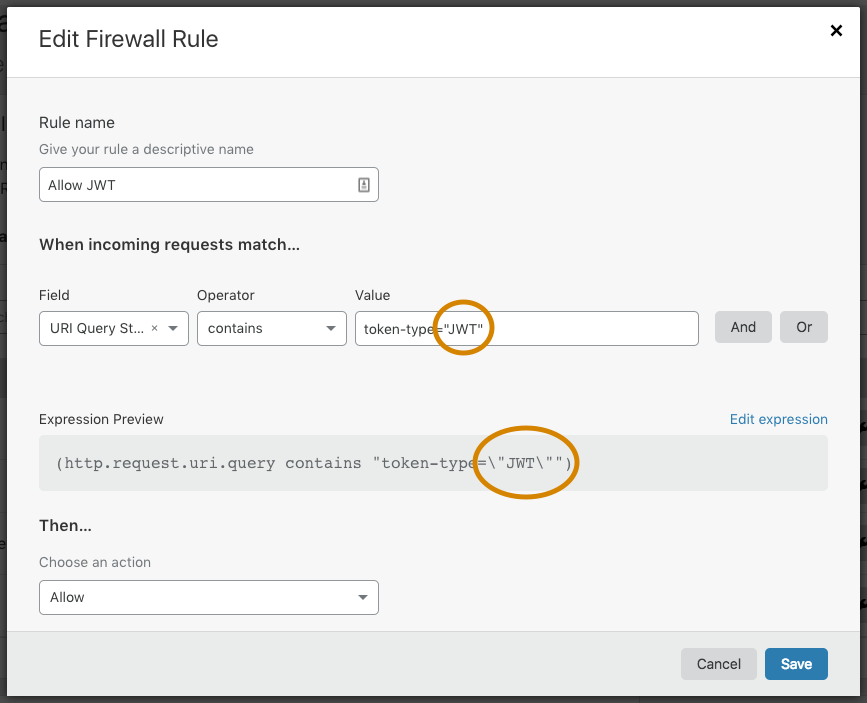

# Frequently asked questions (FAQ)

## How many rules can I have on my site?

You can create a large number of rules. However, the number of active rules at any given time is limited. See [_Entitlements_](/cf-firewall-rules/#entitlements) for details on what is allowed per customer plan.

## Can I purchase additional active rules?

No. The number of active rules is fixed based on customer plan. See [_Entitlements_](/cf-firewall-rules/#entitlements).

## How are certain special and escaped characters handled?

When used as literals in an expression, the backslash `\` and double quote `"` characters require proper escaping.

An expression built using the **Visual Expression Editor** in the **Firewall Rules** UI does not require you to manually escape those special characters. Conveniently, the **Expression Builder** takes care of any necessary escaping in the final expression by automatically prepending a backslash such that `\` and `"` become `\\` and `\"`, respectively.

The following image illustrates how double quotes are automatically escaped to `\"` once they appear in the plain text expression generated in the **Expression Editor**:

## Why isn't my regular expression pattern matching working?

If you are using a regular expression, we recommend you test it against a testing tool like [Regular Expressions 101](https://regex101.com/?flavor=golang) or [Rustexp](https://rustexp.lpil.uk).

Also, note that _http.request.method_ fields requires all-caps for method names.

## How can I use the Threat Score effectively?

The _Cloudflare Threat Score_ is a key item behind the **Security Level** functionality in the Cloudflare dashboard.

_Threat Score_ as configured by **Security Level** is based on:

- High - for scores greater than 0
- Medium - for scores greater than 14
- Low - for scores greater than 24
- Essentially off - for scores greater than 49

Enabling a high threat score for sensitive areas, like comment form pages or login forms, can add an effective level of protection. Integrating _Threat Score_ with Firewall Rules is advantageous because you can specify a Captcha vs. a JS Challenge, or even a block. You can also exclude IP addresses using _and not_ logic.

## How does Firewall Rules handle traffic from known bots?

### Caution about potentially blocking bots

When you create a Firewall rule with a _Block_, _Challenge (Captcha)_, or _JS Challenge_ action, you might unintentionally block traffic from known bots. Specifically, this might affect search engine optimization (SEO) and website monitoring when trying to enforce a mitigation action based on URI, path, host, ASN, or country.

See [_How do I create an exception to exclude certain requests from being blocked or challenged?_](#how-do-i-create-an-exception-to-exclude-certain-requests-from-being-blocked-or-challenged)

### Bots currently detected

The table below lists a **sample** of known bots that Firewall Rules currently detects. When traffic comes from these bots and others not listed, the _cf.client.bot_ field is set to true.

<TableWrap>
<table style="width: 100%">
    <thead>
        <tr>
            <th>Bot</th>
            <th>Description</th>
        </tr>
    </thead>
    <tbody>
        <tr>
            <td>
                
ahrefs

            </td>
            <td>
                
Ahrefs SEO bot

            </td>
        </tr>
        <tr>
            <td>
                
apple

            </td>
            <td>
                
Applebot is the web crawler for Apple, for products like Siri and Spotlight Suggestions

            </td>
        </tr>
        <tr>
            <td>
                
archive.org

            </td>
            <td>
                
Archive.org bots

            </td>
        </tr>
        <tr>
            <td>
                
baidu

            </td>
            <td>
                
Baidu search engine bots

            </td>
        </tr>
        <tr>
            <td>
                
better uptime

            </td>
            <td>
                
Bot for monitoring website uptime

            </td>
        </tr>
        <tr>
            <td>
                
bing

            </td>
            <td>
                
Bing search engine bots

            </td>
        </tr>
        <tr>
            <td>
                
feedbin

            </td>
            <td>
                
Feedbin.com bots

            </td>
        </tr>
        <tr>
            <td>
                
google

            </td>
            <td>
                
Google search engine bots

            </td>
        </tr>
        <tr>
            <td>
                
grapeshot

            </td>
            <td>
                
Grapeshot (Oracle) SEO bots

            </td>
        </tr>
        <tr>
            <td>
                
linkedin

            </td>
            <td>
                
LinkedIn bots

            </td>
        </tr>
        <tr>
            <td>
                
mail.ru

            </td>
            <td>
                
Mail.ru bots

            </td>
        </tr>
        <tr>
            <td>
                
naver

            </td>
            <td>
                
Naver (South Korean) search engine bots

            </td>
        </tr>
        <tr>
            <td>
                
pingdom

            </td>
            <td>
                
Pingdom.com monitoring bots

            </td>
        </tr>
        <tr>
            <td>
                
pinterest

            </td>
            <td>
                
Pinterest bots

            </td>
        </tr>
        <tr>
            <td>
                
seznam

            </td>
            <td>
                
Seznam search engine bots

            </td>
        </tr>
        <tr>
            <td>
                
sogou

            </td>
            <td>
                
Sogou search engine bots

            </td>
        </tr>
        <tr>
            <td>
                
uptimerobot

            </td>
            <td>
                
Uptime Robot monitoring bots

            </td>
        </tr>
        <tr>
            <td>
                
yahoo

            </td>
            <td>
                
Yahoo! search engine bots

            </td>
        </tr>
        <tr>
            <td>
                
yandex

            </td>
            <td>
                
Yandex search engine bots

            </td>
        </tr>
    </tbody>
</table>
</TableWrap>

## How do I create an exception to exclude certain requests from being blocked or challenged?

There may be situations in which you want to enforce a blocking or challenging action but make exceptions for specific types of requests.

Cloudflare supports two methods to permit requests through Firewall Rules expressions:

1. Exclude a type of request from being blocked or challenged, for example based on IP address, ASN, or country
2. Create an independent Firewall rule with an _Allow_ action

<Aside type='note' header='Note'>

Cloudflare Firewall Rules does not bypass security measures defined in other **Firewall** app features.

</Aside>

If you wish to permit certain exclusions, the examples below illustrate a few possible approaches.

### Example 1

Exclude multiple IP addresses from a blocking/challenging rule that assesses Threat Score

<TableWrap>
<table style="width: 100%">
  <tbody>
    <tr>
      <td colspan="2">
        <strong>Basic rule, with no <em>exclusion</em></strong>
      </td>
    </tr>
    <tr>
      <td>Action</td>
      <td><em>block (or challenge)</em></td>
    </tr>
    <tr>
      <td>Expression</td>
      <td><em>(http.host eq "example.com" and cf.threat_score &gt; 5)</em></td>
    </tr>
    <tr>
      <td colspan="2">
        <strong
          >Rule that excludes IP addresses from being blocked/challenged</strong
        >
      </td>
    </tr>
    <tr>
      <td>Action</td>
      <td><em>block (or challenge)</em></td>
    </tr>
    <tr>
      <td>Expression</td>
      <td>
        <em
          >(http.host eq "example.com" and cf.threat_score &gt; 5) and not
          (ip.src in {'{1.2.3.4 4.3.2.110.20.30.0/24}'})</em
        >
      </td>
    </tr>
    <tr>
      <td colspan="2">
        <strong>Two rules to allow exceptions and block the rest</strong>
      </td>
    </tr>
    <tr>
      <td>Rule 1</td>
      <td>
        Action: <em>allow</em> 
        Expression: <em>ip.src in {'{1.2.3.4 4.3.2.110.20.30.0/24}'}</em>
      </td>
    </tr>
    <tr>
      <td>Rule 2</td>
      <td>
        Action: <em>block (or challenge)</em> 
        <em>(http.host eq "example.com" and cf.threat_score &gt; 5)</em>
      </td>
    </tr>
  </tbody>
</table>

</TableWrap>

### Example 2

Block Amazon Web Services (AWS) and Google Cloud Platform (GCP) because of large volumes of undesired traffic, but allow Googlebot and other known bots that Cloudflare validates

<TableWrap>
<table style="width: 100%">
  <tbody>
    <tr>
      <td colspan="2">
        <strong>Basic rule, with no <em>exclusion</em></strong>
      </td>
    </tr>
    <tr>
      <td>Action</td>
      <td><em>block (or challenge)</em></td>
    </tr>
    <tr>
      <td>Expression</td>
      <td><em>(ip.geoip.asnum in {'{7224 15169}'})</em></td>
    </tr>
    <tr>
      <td colspan="2">
        <strong>Rule that excludes known bots that Cloudflare validates</strong>
      </td>
    </tr>
    <tr>
      <td>Action</td>
      <td><em>block (or challenge)</em></td>
    </tr>
    <tr>
      <td>Expression</td>
      <td>
        <em>(ip.geoip.asnum in {'{7224 15169}'}) and not cf.client.bot)</em>
      </td>
    </tr>
    <tr>
      <td colspan="2">
        <strong
          ><strong
            >Two rules to allow exceptions and block the rest</strong
          ></strong
        >
      </td>
    </tr>
    <tr>
      <td>Rule 1</td>
      <td>
        Action: <em>allow</em> 
        Expression: <em>cf.client.bot</em>
      </td>
    </tr>
    <tr>
      <td>Rule 2</td>
      <td>
        Action: <em>block (or challenge)</em> 
        Expression: <em>(ip.geoip.asnum in {'{7224 15169}'})</em>
      </td>
    </tr>
  </tbody>
</table>
</TableWrap>

## Why does a Firewall Event display a Cloudflare IP address even though other fields match the client details?

This happens when a request goes through a Cloudflare Worker.

In this case, Cloudflare considers the client details, including its IP address, for triggering security settings. However, the IP displayed in the Firewall Events will be a Cloudflare IP address.

## Do the Challenge actions support content types other than HTML (for example, AJAX or XHR requests)?

No. The _Challenge (Captcha)_ and _JS Challenge_ actions only support HTML requests.

Challenges presented to users display an intermediate page where they must prove they are not a bot. This concept does not work over XHR or AJAX.

When an XHR or AJAX request triggers one of the _Challenge_ actions, the resulting request will have the following status code:

* HTTP status code 403 for _Challenge (Captcha)_
* HTTP status code 503 for _JS Challenge_

Your application can use these status codes to handle unexpected challenges.

## Does the 'challengeFailed' action accurately represent challenges that users did not pass?

No. The `challengeFailed` and `jschallengeFailed` Firewall actions account for observed requests that, under special circumstances, did not pass a challenge. However, some failed challenges cannot be traced back to a Firewall rule. Additionally, the Firewall may not have a record of every request with a failed challenge.

Therefore, consider these actions with caution. A reliable indicator is the [CSR (Challenge Solve Rate)](/cf-firewall-rules#challenge-solve-rate-csr) displayed in **Firewall Rules**, which is calculated as follows: `number of challenges solved / number of challenges issued`.

## Why would I not see any failed challenges? Why is 'ChallengeIssued' not equal to 'ChallengeSolved' plus 'ChallengeFailed'?

Users do not complete all challenges. Cloudflare issues challenges that are never answered — only 2-3% of all served challenges are usually answered.

There are multiple reasons for this:

* Users give up on a challenge.
* Users try to solve a challenge but cannot provide an answer.
* Users keep refreshing the challenge but never submit an answer.
* Users keep retrying hCaptcha (CAPTCHA failures in hCaptcha are not registered as failed and represent interim failures).
* Cloudflare receives a malformed challenge answer.

## Why do I see matches for a Firewall Rule that was not supposed to match the request?

Make sure you are looking at the correct request.

Only requests that triggered a challenge will match the request parameters of the rule. Subsequent requests with a `[js]challengeSolved` or `[js]challengeFailed` action may not match the parameters of the rule — for example, the bot score may have changed because the user solved a CAPTCHA.

The "solved" and "failed" actions are informative actions about a previous request that matched a rule. These actions state that "previously a rule had matched a request with the action set to _Challenge (Captcha)_ or _JS Challenge_ and now that challenge was answered".
