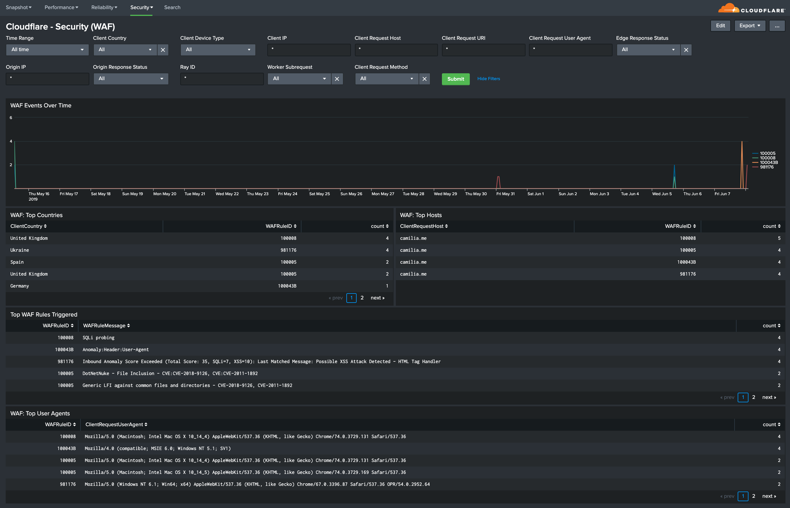
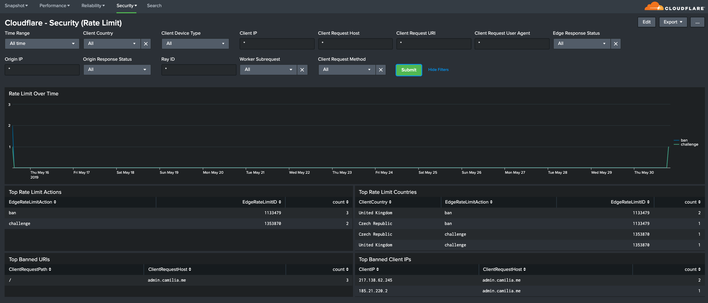
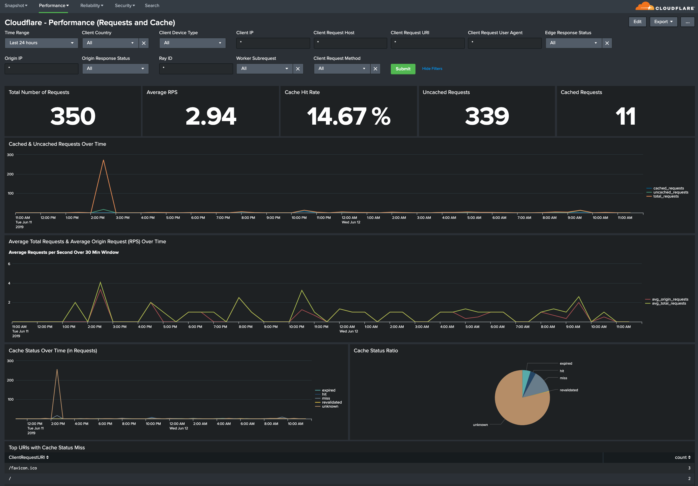
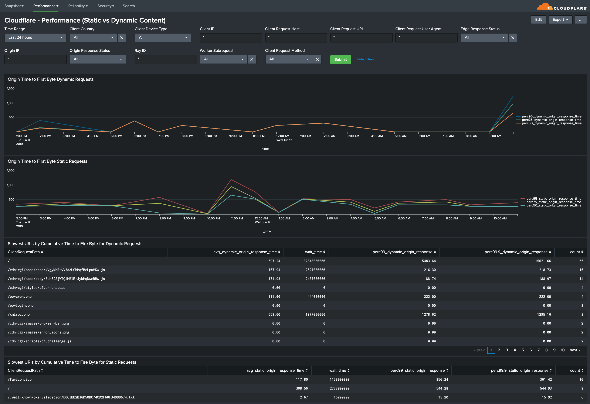

# Splunk

This tutorial explains how to analyze [Cloudflare Logs](https://www.cloudflare.com/products/cloudflare-logs/) using the [Cloudflare App for Splunk](https://splunkbase.splunk.com/app/4501/).


### Prerequisites

Before sending your Cloudflare log data to Splunk, ensure that you:

- Have an existing Splunk Enterprise or Cloud account
- Have a Cloudflare Enterprise account
- Consult the [Splunk documentation](https://splunkbase.splunk.com/app/4501/) for the Cloudflare App

## Task 1 - Install and Configure the Cloudflare App for Splunk

To install the [Cloudflare App for Splunk](https://splunkbase.splunk.com/app/4501/):

1. Log in to your Splunk instance.
2. Under **Apps** > **Find More Apps**, search for _Cloudflare App for Splunk._
3. Click **Install**.


4. Restart and reopen your Splunk instance.   
5. Edit the `cloudflare:json` source type in the Cloudflare App for Splunk. To edit the source type:
   1. Click the **Settings** dropdown and select **Source types**. 
   2. Uncheck **Show only popular** and search for *cloudflare*. 
   3. Click **Edit** and change the Regex expression to `([\r\n]+)`. 
   4. Save your edits.

6. Create an index on Splunk to store the HTTP Event logs. To create an index:
   1. Open the setup screen by clicking the **Settings** dropdown, then click **Indexes**.
   2. Select **New Index**. Note that the **Indexes** page also gives you the status of all your existing indexes so that you can see whether you're about to use up your licensed amount of space.
   3. Name the index **cloudflare**, which is the default index that the Cloudflare App will use. 

7. Set up the HTTP Event Collector (HEC) on Splunk. To create an HEC:
   1. Click the **Settings** dropdown and select **Data inputs**. 
   2. Click **+Add new** and follow the wizard. When prompted, submit the following responses:
      * Name: Cloudflare
      * Source Type: Select > "cloudflare:json"
      * App Context: Cloudflare App for Splunk (cloudflare)
      * Index: cloudflare
   3. At the end of the wizard you will see a **Token Value**. This token authorizes the Cloudflare Logpush job to send data to your Splunk instance. If you forget to copy it now, Splunk allows you to get the value at any time. 

8. Verify whether Splunk is using a self-signed certificate. You'll need this information when creating the Logpush job. 
9.  Determine the endpoint to use to send the data to. The endpoint should be:

```bash
"<protocol>://input-<host>:<port>/<endpoint>" or "<protocol>://http-inputs-<host>:<port>/<endpoint>"
```

Where:
* `protocol`: HTTP or HTTPS
* `input`: `input` or `http-inputs` based on whether you have a self-service or managed cloud plan
* `host`: The hostname of your Splunk instance. The easiest way to determine the hostname is to look at the URL you went to when you logged in to Splunk.
* `port`: 443 or 8088
* `endpoint`: services/collector/raw

For example: `https://prd-p-0qk3h.splunkcloud.com:8088/services/collector/raw`. Refer to the [Splunk Documentation](https://docs.splunk.com/Documentation/SplunkCloud/8.1.2011/Data/UsetheHTTPEventCollector) for more details and examples. 

**Post Installation Notes**

You can change the **Index Name** after initial configuration by accessing the app **Set up** page by clicking on the **Apps** dropdown and navigating to **Manage Apps** > **Cloudflare App for Splunk** > **Set up**.


You also can find the Index Name manually by visiting **Settings** > **Advanced search** > **Search macros**.


The Cloudflare App for Splunk comes with a custom Cloudflare Data Model that has an acceleration time frame of 1 day but is not accelerated by default. If you enable [Data Model acceleration](https://docs.splunk.com/Documentation/Splunk/7.2.6/Knowledge/Acceleratedatamodels), we recommend that the Data Model is only accelerated for 1 or 7 days to ensure there are no adverse effects within your Splunk environment.

Enable or disable acceleration after the initial configuration by accessing the app Set up page by clicking the **Apps** dropdown, then **Manage Apps** > **Cloudflare Set Up**.


You can also manually configure Data Models by going to **Settings** > **Data models**. Learn more about data model acceleration in the [Splunk documentation](https://docs.splunk.com/Documentation/Splunk/latest/Knowledge/Acceleratedatamodels).

## Task 2 - Make the API call to create the Logpush job

Create the Logpush job by following the instructions on [Enable Logpush to Splunk](https://developers.cloudflare.com/logs/get-started/enable-destinations/splunk). The API call creates a Logpush job but does not enable it.

Enable the Logpush job through the the Cloudflare dashboard or through the API by following the instructions on [Enable Logpush to Splunk](https://developers.cloudflare.com/logs/get-started/enable-destinations/splunk). To enable through the dashboard: 

1. Navigate to the Cloudflare dashboard and select **Analytics** > **Logs**. 
2. Click **Edit** and select the fields referenced in the Dashboard section below to fully populate all tables and graphs. 
3. Enable the Logpush job by toggling on the switch next to the Edit link. Data takes a few minutes to populate. 

To validate that you are receiving data, search `index=cloudflare` in Splunk.  

## Task 3 - View the Dashboards

You can analyze Cloudflare logs with the thirteen (13) dashboards listed below.

You can use filters within these dashboards to help narrow the analysis by date and time, device type, country, user agent, client IP, hostname, and more to further help with debugging and tracing.

### About the Dashboards

The following dashboards outlined below are available as part of the Cloudflare App for Splunk.

#### Cloudflare - Snapshot

_Web Traffic Overview_ and _Web Traffic Types_: Get an overview of the most important metrics from your websites and applications on the Cloudflare network.


#### Cloudflare - Reliability

_Summary_ and _Detailed_: Get insights on the availability of your websites and applications. Metrics include origin response error ratio, origin response status over time, percentage of 3xx/4xx/5xx errors over time, and more.


#### Cloudflare - Security

_Overview_: Get insights on threats to your websites and applications, including number of threats stopped, threats over time, top threat countries, and more.


_WAF_: Get insights on threat identification and mitigation by our Web Application Firewall, including events like SQL injections, XSS, and more. Use this data to fine tune the firewall to target obvious threats and prevent false positives.


_Rate Limiting_: Get insights on rate limiting protection against denial-of-service attacks, brute-force login attempts, and other types of abusive behavior targeted at your websites or applications.


_Bots Summary_ and _Bots Detailed_: Investigate bot activity on your website to prevent content scraping, checkout fraud, spam registration and other malicious activities.


#### Cloudflare - Performance

_Requests and Cache_ and _Bandwidth_: Identify and address performance issues and caching misconfigurations. Metrics include total vs. cached bandwidth, saved bandwidth, total requests, cache ratio, top uncached requests, and more.



_Hostname, Content Type, Request Methods, Connection Type_: Get insights into your most popular hostnames, most requested content types, breakdown of request methods, and connection type.


_Static vs. Dynamic Content_: Get insights into the performance of your static and dynamic content, including slowest URLs.


### Filters

All dashboard have a set of filters that you can apply to the entire dashboard, as shown in the following example. Filters are applied across the entire dashboard.


You can use filters to drill down and examine the data at a granular level. Filters include client country, client device type, client IP, client request host, client request URI, client request user agent, edge response status, origin IP, and origin response status.

The default time interval is set to 24 hours. Note that for correct calculations filter will need to exclude Worker subrequests (**WorkerSubrequest** = _false_) and purge requests (**ClientRequestMethod** is not _PURGE_).

Available Filters:

- Time Range (EdgeStartTimestamp)

- Client Country

- Client Device type

- Client IP

- Client Request Host

- Client Request URI

- Client Request User Agent

- Edge response status

- Origin IP

- Origin Response Status

- RayID

- Worker Subrequest

- Client Request Method

## Debugging tips

### Incomplete dashboards

The Splunk Cloudflare App relies on data from the Cloudflare Enterprise Logs fields outlined below. Depending on which fields you have enabled, certain dashboards might not populate fully.

If that is the case, verify and test the Cloudflare App filters below each dashboard (these filters are the same across all dashboards). You can delete any filters that you don’t need, even if such filters include data fields already contained in your logs.

Also, you could compare the list of fields you are getting in Cloudflare Logs with the fields listed in **Splunk** > **Settings** > **Data Model** > **Cloudflare**.

The available fields are:

- CacheCacheStatus

- CacheResponseBytes

- CacheResponseStatus

- ClientASN

- ClientCountry

- ClientDeviceType

- ClientIP

- ClientIPClass

- ClientRequestBytes

- ClientRequestHost

- ClientRequestMethod

- ClientRequestPath

- ClientRequestProtocol

- ClientRequestReferer

- ClientRequestURI

- ClientRequestUserAgent

- ClientSSLCipher

- ClientSSLProtocol

- ClientSrcPort

- EdgeColoCode

- EdgeColoID

- EdgeEndTimestamp

- EdgePathingOp

- EdgePathingSrc

- EdgePathingStatus

- EdgeRateLimitAction

- EdgeRateLimitID

- EdgeRequestHost

- EdgeResponseBytes

- EdgeResponseContentType

- EdgeResponseStatus

- EdgeServerIP

- EdgeStartTimestamp

- FirewallMatchesActions

- FirewallMatchesSources

- FirewallMatchesRuleIDs

- OriginIP

- OriginResponseStatus

- OriginResponseTime

- OriginSSLProtocol

- RayID

- WAFAction

- WAFFlags

- WAFMatchedVar

- WAFProfile

- WAFRuleID

- WAFRuleMessage

- WorkerSubrequest

- ZoneID
