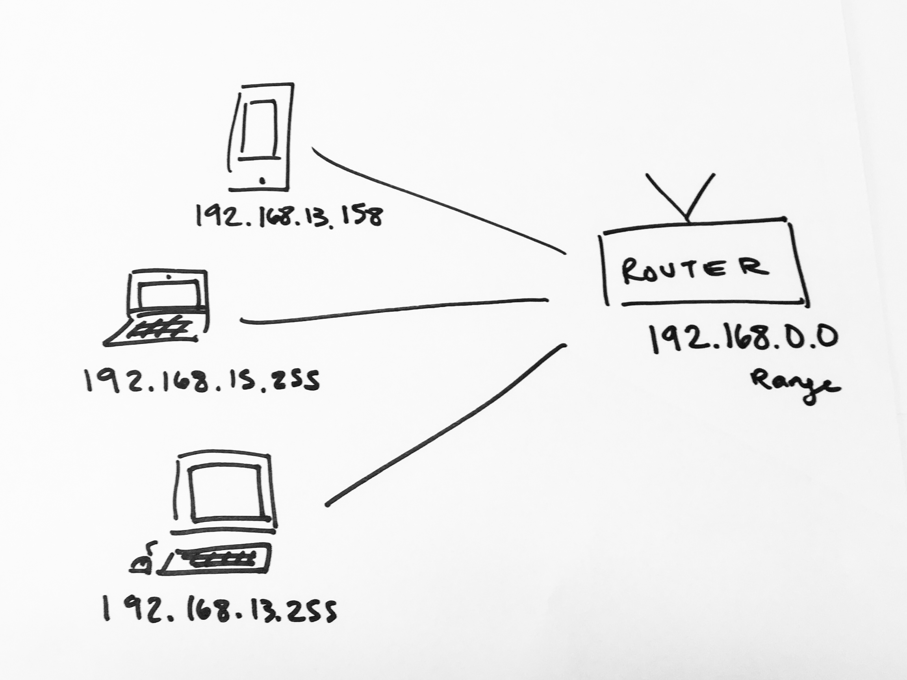

# Local networks

The local network described here is a home network, but this could apply to any local network, such as the network internal to a data center.

The router is responsible for dispatching messages to devices within the home network. To do this it needs to assign a local IP address to each device within the network. There are address ranges reserved for local networks so that the router can use these addresses within the network and there won’t be a colliding address somewhere else on the internet.

One critical job the router plays is keeping track of all the devices in the network and making sure packets get sent to the right device. The router keeps track of open connections by managing the port numbers each device connects to. Each device’s traffic within the home network runs over a different port number, so that even if two people within the house are going to spotify.com at once, their individual responses from Spotify’s servers get sent back to the right device.
