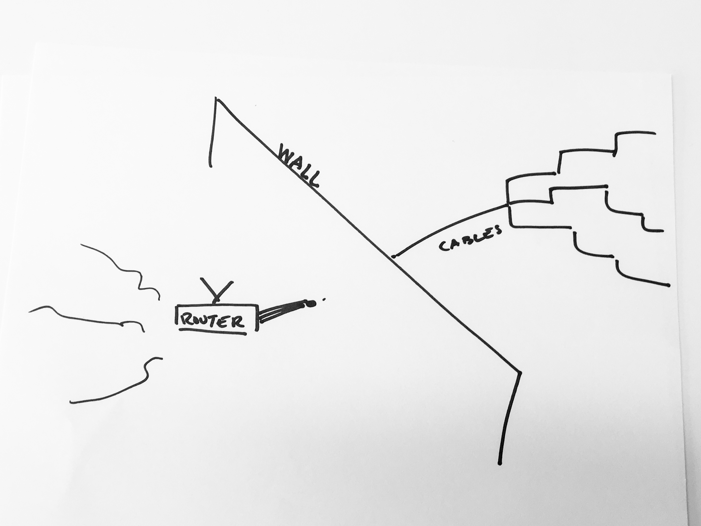

# Bridging from local to global

The router receives internet connection from the access point, which bridges the global internet to your home. Many home routers act as access points. The access point connects through the wall to a physical cable that is wired up to your building. That cable was put down by an Internet Service Provider that isn’t necessarily your Internet Service Provider. Many ISP’s share cables because it’s cheaper for the ISP. If there are several ISP’s sharing a cable, there may be more congestion on the cable because more packets need to get through, and internet may be slowed down.

