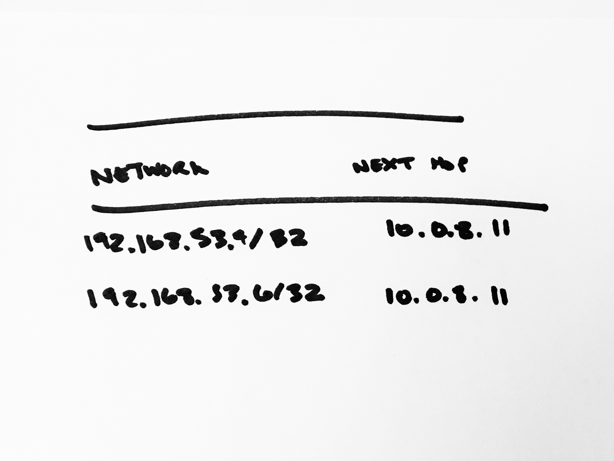
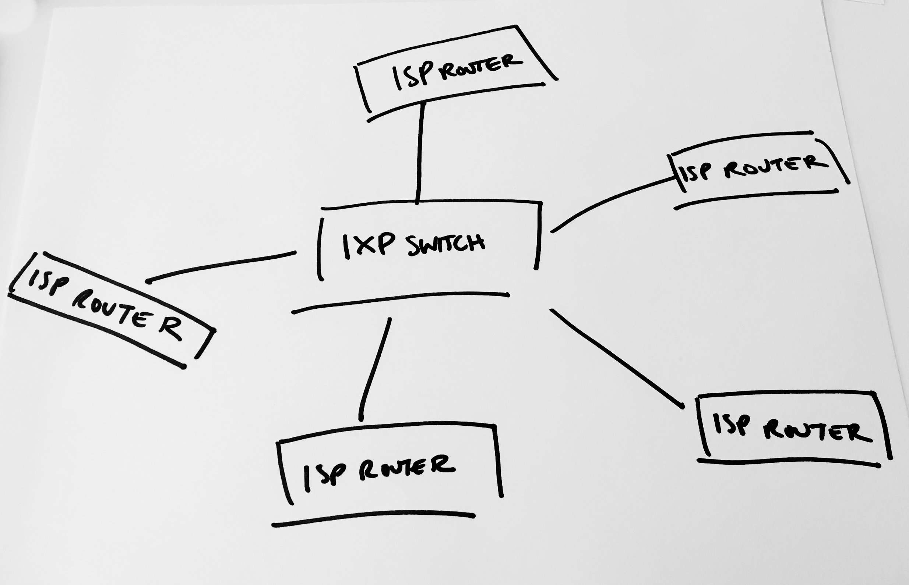

# Networks on top of cables

No one network connects the entire world, so messages must cross between multiple networks. The message is packaged according to the rules of a protocol called TCP which means the packet contains headers that indicate to what address the packet is heading.
When the message reaches a new network, it stops first at a router.

Routers contain a list of every block of IP’s (called a subnet) that it knows about (called a routing table). Routers on a network need to learn about other networks’ IP addresses. This process is extremely human. Humans from different networks sign contracts that agree that their network will share routing tables with another network.

These contracts are called peering agreements. Once the peering agreement is signed, the networks will exchange routing information from their network and information from all networks they peer with. This exchange of information is done through a standardized way called BGP. Networks with more “peers” know about more parts of the internet and can pass on messages directly to more parts of the internet and so they are faster networks to send a message through.

Not every network owns all of its cables and infrastructure. There are three types of networks:

  * Tier 1 networks own physical infrastructure and exchange traffic with all other tier 1 providers and thus can reach every other network without purchasing transit from another company. (There are also regional Tier 1 networks that can own the infrastructure in a region, but not globally). AT&T is a good example of a Tier 1 network, it operates 410,000 miles of fiber cable. Comcast is a good example of a regional Tier 1 network, it operates fiber in the US, but not globally.
  * Tier 2 networks buy the use of Tier 1 network cables or make agreements with Tier 1 networks to use the cables for free (aka peering).
  * Tier 3 networks are those that connect the Tier 1 and 2 networks to people’s homes and offices.

The routing tables on each router grow to be so large they require a special type of memory called TCAM which specializes in searching for parts of an IP address in a table of IP address blocks. When a message reaches a router, the router looks in the TCP header at the IP address the message is destined for and checks if it knows how to reach it.

If it does, it passes on the message to the next closest router, and if it does not, it passes on the message to a network with greater scope (called an upstream transit provider). Every single message goes through this process - even if the same person has browsed the same application before, the routers in the middle don’t remember the path and need to search again for the best path for the message to take.

Sometimes a network administrator will accidentally publish the incorrect location of an IP address. (A common way this happens is an enterprise will have an internal route for an address, for example to stop employees from looking at reddit at work, which will accidentally get published worldwide.) BGP, the way that networks share routing tables, doesn’t have any verification or validation baked into it, it’s totally trust based, so it will accept those routes and publish them to all of its network peers.
Then anyone trying to access a server at the IP address will be sent to the wrong place, which will make those servers inaccessible. This is called a Route Leak. It also happens on purpose for malicious intent. Famously in 2008, Pakistan Telecom broadcasted the incorrect routes for YouTube, which was picked up worldwide within 45 seconds, and made YouTube inaccessible for two hours. Apparently the Pakistani government ordered that to happen because of some offensive cartoons of Muhammad on YouTube.
The places where multiple networks connect around the world are called internet exchanges.

There are about 300 internet exchanges around the world. At an internet exchange, you’d find physical switches (servers built to route IP packets) that all the networks connect cables to. When a packet reaches that internet exchange, it uses the switches to change from one network to another. If the packet is going somewhere within the network’s local network (i.e. when a packet destined for a server on AWS reaches the Amazon network) the router sends the packet to the correct machine within the data center.

