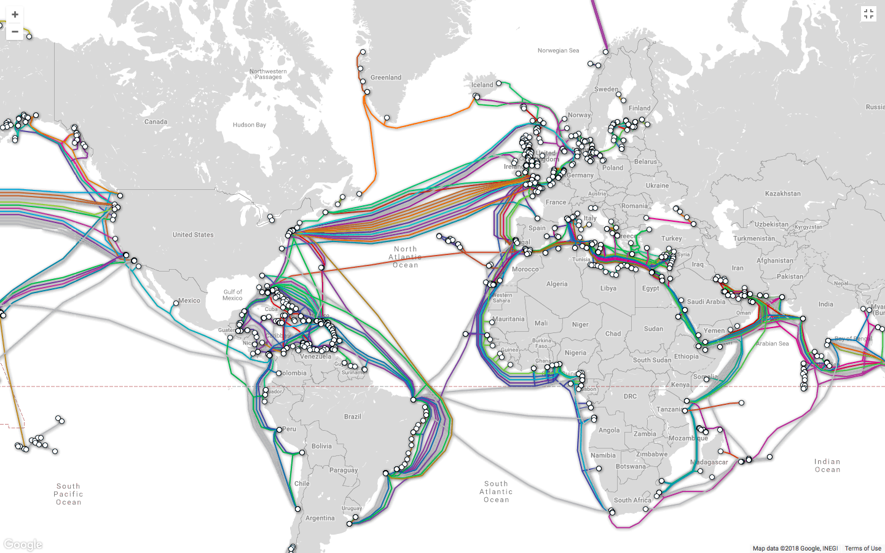

# Undersea cables

The physical internet is a series of cables that connect the different continents so that a packet can route around the Earth. This allows, for example, a person in Dubai to reach a server in Frankfurt. At the time of writing (April 2018), there are 393 cables that connect the planet. You can see them all at [submarinecablemap.com](http://submarinecablemap.com).

Each undersea cable has 4-6 fibers inside it, and to help communications make their way across the cable, the cables have a repeater every 400 kilometers. Telcos will cover the initial cost of the cable, and other transit providers pay them for sending communications across the cables.

Countries with more cables have better resiliency. For example, there is one cable that connects the country of Greenland ([The Greenland Connect](https://www.submarinecablemap.com/#/submarine-cable/greenland-connect)) so if a [ship’s anchor cuts off the cable](https://en.wikipedia.org/wiki/2008_submarine_cable_disruption), Greenland will temporarily lose their fiber internet access and have to revert to satellite internet.

The cables are actually put underneath the ocean floor. A machine blasts air at high pressure at the ocean floor to make a hole for the cable.

These cables also determine the route a packet can take across the internet. For example, if a packet needs to go from Johannesburg to NYC, it can’t travel directly because there’s no direct cable, it first needs to go from Johannesburg to Penmarch, France (over the [SAT-3/WASC cable](https://www.submarinecablemap.com/#/submarine-cable/sat-3wasc)), and from Penmarch to NYC.

While 393 cables exist, not all 393 cables are used because some cables are more expensive and networks use cost to determine routing.
