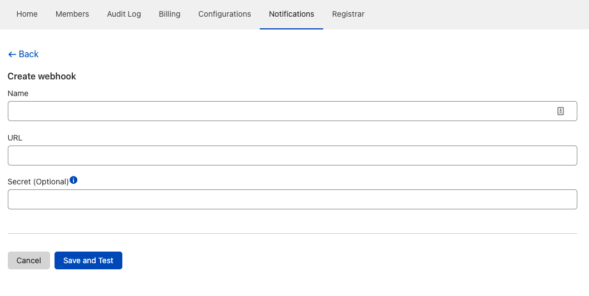

# Create a Notification

1. Sign in to your [Cloudflare dashboard](https://dash.cloudflare.com/login).
1. Go to **Notifications**.
1. Click **Add**.
1. Click **Select** on the Notification you want to enable. The list of Notifications available depends on the [type of account you have](/notifications/notification-available).
1. Give the Notification a name to identify it. 
1. Add a way to be notified, like an email address. Professional and Business plans will have access to other options such as configuring PagerDuty or accessing webhooks.
1. Click **Create**.

This will take you back to your list of Notifications, where the new Notification will appear as **Enabled**.

## PagerDuty

Professional plans or higher can configure PagerDuty to receive notifications about their Cloudflare account. If you do not have a PagerDuty account, see [how to create an account](https://support.pagerduty.com/docs/quick-start-guide) in PagerDuty's documentation.

1. Sign in to your [Cloudflare dashboard](https://dash.cloudflare.com/login).
1. Go to **Notifications**.
1. Click **Destinations** on the left side of your dashboard.
1. In the **Connected notification services** card, click **Connect**.
1. Log in to your PagerDuty account to connect it to your Cloudflare account.
1. Select the services you want to use and click **Connect**.
1. The browser will navigate back to your Cloudflare dashboard. Click **Continue**.

Your new connected PagerDuty will appear in the **Connected notification services** card.

## Webhooks to external services

There are a variety of services you can connect to Cloudflare using webhooks to receive Notifications from your Cloudflare account. Here are some of the most popular services you can connect to your Cloudflare account:

* [Jira](https://developer.atlassian.com/server/jira/platform/webhooks/) 
* [Slack](https://api.slack.com/messaging/webhooks)
* [Google Chat](https://developers.google.com/chat/how-tos/webhooks)
* [DataDog](https://docs.datadoghq.com/developers/guide/calling-on-datadog-s-api-with-the-webhooks-integration/)
* [OpsGenie](https://docs.opsgenie.com/docs/integration-api)

After configuring the external service you want to connect to, set up webhooks in your Cloudflare dashboard:

1. Sign in to your [Cloudflare dashboard](https://dash.cloudflare.com/login).
1. Go to **Notifications**. 
1. Click **Destinations** on the left side of your dashboard.
1. In the **Webhooks** card, click **Create**.
1. Give your webhook a name so you can identify it later.
1. In the **URL** field, enter the URL of the third-party service you set up above and want to connect to your Cloudflare account.
1. If needed, insert the **Secret**. Secrets are how webhooks are encrypted and vary according to the service you are connecting to Cloudflare.

  

1. Click **Save and Test** to finish setting up your webhook.

The new webhook will appear in the **Webhooks** card.