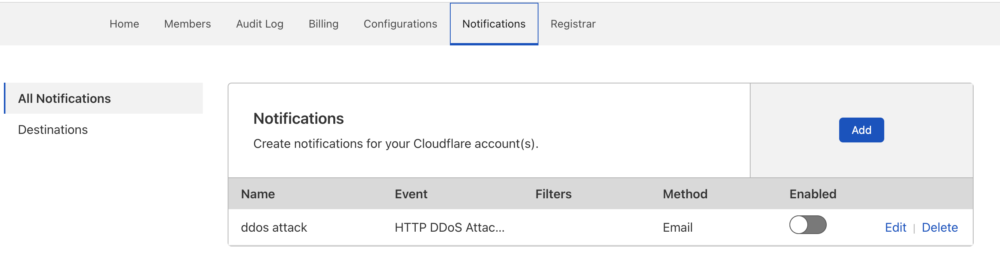

<ContentColumn>

# Cloudflare Notifications

Cloudflare Notifications help you stay up to date with your Cloudflare account. Manage your Notifications to define what you want to be warned about and how, be it a denial-of-service attack or an issue with your server. 

The available Notification features vary according to your plan:
* Free plans can set up email-based Notifications. 
* Business and higher plans can also [access PagerDuty](/notifications/create-notifications/create-pagerduty). 
* Professional and higher plans can also [use webhooks](/notifications/create-notifications/configure-webhooks).

## Where to find the Notifications section

Notifications are available in your [Cloudflare dashboard](https://dash.cloudflare.com/login). After logging in to your account, click **Notifications** on the top right of the menu in your account home page. Here you can create notifications for different scenarios, edit notifications previously set up, and enable or disable notifications.

## What to do when receiving Notifications

Go to our [Types of Notifications](notification-available/) section to know more about what each Notification does and what do to when receiving one.

</ContentColumn>
