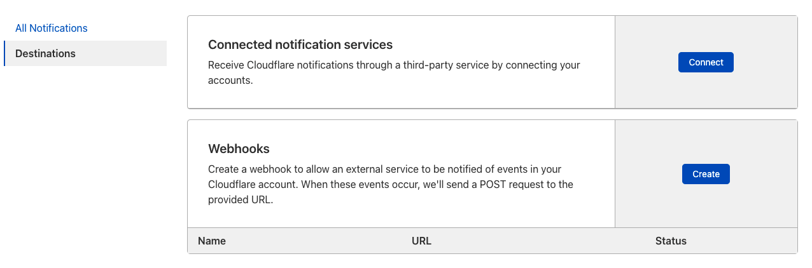

# Cloudflare Notifications

<ContentColumn>

Cloudflare Notifications help you to always be up to date with your Cloudflare account, be it a denial-of-service attack or something gone wrong with your server. You decide on what you want to be warned about and how. 

Notifications are available to anyone with a Cloudflare account. Free plans can set up email-based Notifications. Professional and higher plans can also access PagerDuty. Business and higher plans can also use webhooks.

## Where to find the Notifications section

Notifications are available in your [Cloudflare dashboard](https://dash.cloudflare.com/login). After logging into your account, click **Notifications** on the top right of the menu in your account home page. Here you can create notifications for different scenarios, edit notifications you have already set up and enable or disable notifications.

If you are on a Professional and higher plan, you will also see **Destinations**, on the top left of the screen, which lets you connect a PagerDuty instance to send your alerts to. 

If you are on a Business and higher plan, you can also create webhooks to connect your Cloudflare account to external services such as Google Chat, Slack and many others. 

</ContentColumn>