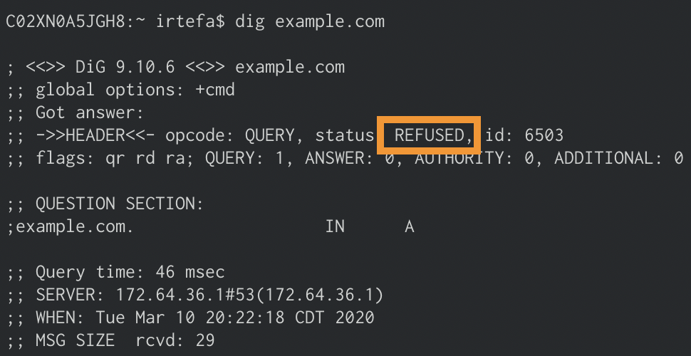
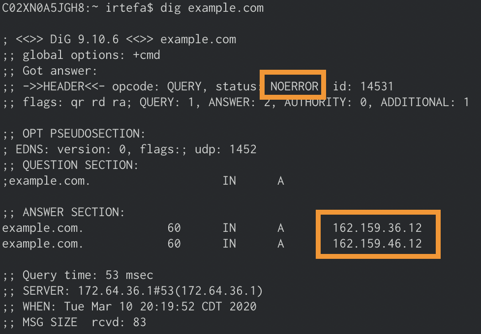

### How can I check if Gateway is blocking a domain?
After you blocked a domain using a policy, you can use either `dig` or `nslookup` to see if it's working. 

Before you test if the domain is blocked, please make sure that you are connected to a network that is associated with the location where the policy is applied.

If you are using a policy to block `example.com`, you can do the following to see if Gateway is blocking `example.com`:

1. Open your terminal

2. Type `dig example.com` (`nslookup example.com`) if you are using Windows) and press enter

3. If the Block page is **disabled** for the policy, then you should see `REFUSED` in the answer section like below

If the Block page is **enabled** for the policy, then you should see `NOERROR` in the answer section and **162.159.36.12** and **162.159.46.12** as the answers when the domain is successfully blocked.

### If I add a policy, how long does it take to propagate or take effect?
It takes about 60 seconds for the policy to be updated across all of our data centers around the world.

If you are still seeing responses from the DNS queries for a domain that you blocked. The answers may be cached by your browser from anywhere between 5 minutes to a few hours. 

### Will I see the private IP addresses in the activity log?
No. The IP addresses are NAT-ed behind a public IP address. Activity log will only show the public Source IP address.

### What is the difference between Cloudflare Gateway and 1.1.1.1?
The primary difference between 1.1.1.1 and Cloudflare Gateway is that 1.1.1.1 does not block any DNS query. When a browser requests for example.com, 1.1.1.1 simply looks up the answer either in cache or by performing a full recursive DNS query.

Cloudflare Gateway's DNS resolver adds an additional step to introduce security into this flow. Instead of allowing all DNS queries, Gateway first checks the hostname being queried against the intelligence Cloudflare has about threats on the Internet. If that query matches a known threat, or is requesting a blocked domain configured by an administrator as part of a Gateway policy, Gateway stops it before the site could load for the user - and potentially execute code or phish that team member.

For example, if you are using Cloudflare Gateway, and send a DNS query to example.com, Gateway checks if the DNS query matches with any of the policies you set up earlier to block domains. The policy could be a domain that you are manually blocking or it could be part of a broader security category that you enabled. If the domain matches one of those cases, Gateway will return REFUSED. The browser will think this website does not exist. As a result, it will not take the customer to the blocked website.

### Can I use a wildcard operator to block domains?
You don’t need to use a wildcard operator to block domains. For example, if you want to block all the subdomains for `example.com` then you only have to block `example.com`. It will not only block dns requests to `example.com` but also all subdomains for `example.com`. You can read more about it on our [policies page](/gateway/reference-new/policy).

### Can I block a URL using Gateway?
Not yet. Today, Gateway only sees domain names and not the full URL. So it can only block domains.

### Does Cloudflare Gateway support IPv6 networks?
Yes. Each location has a unique IPv6 address. You can use that IPv6 address to send DNS queries to Cloudflare Gateway. 

### Can you use Gateway’s premium features if you are a customer of Cloudflare Pro or Biz plan?
No. Gateway’s premium features are not included in Cloudflare Pro and Biz plan. If you are an enterprise customer and want to use Cloudflare Gateway’s premium features, please contact your Customer Success Manager.

### What happens when I have multiple policies assigned to the same location?
If you have multiple policies and both policies are applied to a single location, Gateway will arbitrarily choose one of the policies and apply them to the location.

### What happens when there is no policy assigned to a location?
Assuming the location is configured correctly, Gateway will log the DNS queries and show them in the analytics dashboard. As there are no policies assigned to the location, Gateway will not block any DNS queries.

### Why can't I enable/disable the 'Advertisements' category?
Your Ad-Blocker is hiding the checkbox for the 'Advertisements' category. To view the checkbox and enable the content category, please disable your Ad-Blocker when you are visiting dash.teams.cloudflare.com

### How can I test if SafeSearch is working?
Visit the [SafeSearch page](/gateway/getting-started-new/configuring-policies/safesearch) to see how you can test if SafeSearch is working.

### In what order does Gateway apply the rules inside a policy?
Visit the [Policies page](/gateway/reference-new/policy) to see in what order Gateway applies its rules inside a policy.
