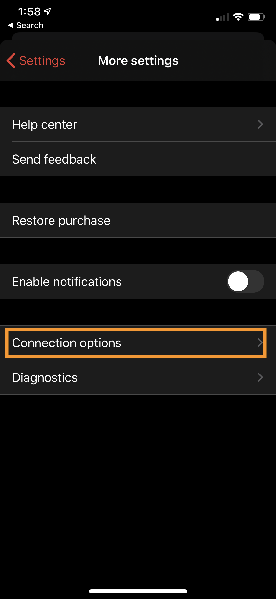
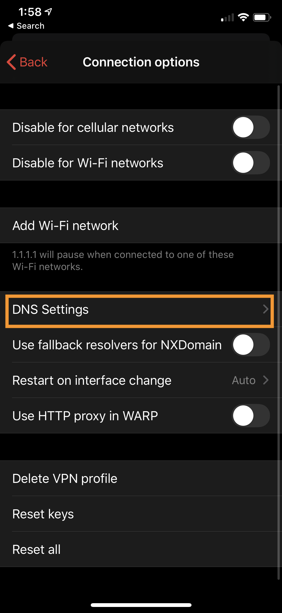
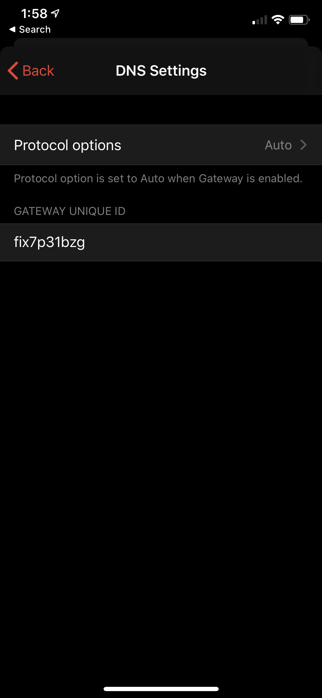

## <a name="before-you-start"></a> Before you start

Before you configure Cloudflare Gateway on a mobile device, install the latest version of the 1.1.1.1 app, and take note of your location's unique ID.

#### Download the 1.1.1.1 app
Make sure you have the 1.1.1.1 app installed. If you don't, you can get it from the [App Store](https://itunes.apple.com/us/app/1-1-1-1-faster-internet/id1423538627) for your iOS devices, and on the [Google Play Store](https://play.google.com/store/apps/details?id=com.cloudflare.onedotonedotonedotone) for your Android devices. 

If you already have the app installed, make sure it is updated to the latest version.

import {Notice} from 'cf-gatsby-theme'

<Notice>

Note that if you were using 1.1.1.1 for Families in the mobile app, you will at first need to disable 1.1.1.1 for Families. You can disable it by going to `Advanced -> Connection options -> DNS Settings -> 1.1.1.1 for Families -> And select 'None'`.
</Notice>

#### Find your location's unique ID

To install Cloudflare Gateway on any mobile device you will need your location's **unique ID**. Follow these instructions on how to retrieve it:

1. Visit your teams dashboard to fetch the unique id from your location.  


2. Navigate to the **Locations page** to visualize your location.   
If you have more than one location set up, you will see a list of all your locations.  


3. Expand the **location card** for the location you want to associate your mobile device with.   


4. Get the subdomain of the DNS over HTTPS hostname. This is your **unique ID**. In the example below, the ID is: `fix7p31bzg`.  


5. Take note of the **unique ID**.

## Setting up Gateway

To setup Cloudflare Gateway for your personal iOS device, follow the instructions for [Manual Setup](#ios-manual).   

To deploy Gateway to your fleet of corporate iOS devices using your preferred MDM tool, follow the instructions for [MDM Setup](#ios-mdm).

### <a name="ios-manual"></a> Manual Setup  
  
1. Open the 1.1.1.1 app.

2. Tap the **Menu** button on the top right corner.  


3. Tap **Advanced**.  


4. Tap **Connection options** at the bottom of the screen.  



5. Tap **DNS Settings**.  
This will take you to the screen where you can configure Gateway for your 1.1.1.1 mobile app.  



6. Enter the **unique ID** from Gateway.   
You will now need to enter your location's **unique ID** from Gateway.   
The unique ID is the subdomain of the location you created for your mobile phone. 

You are now connected to Cloudflare Gateway. 

### <a name="ios-mdm"></a> MDM Setup

1. Open the 1.1.1.1 app.

2. Go to **Menu** > **Advanced** > **Comnmection options** > **DNS Settings**.
3. Enter your **unique ID**.  

 

4. **Modify the configuration file**.  
Download the configuration file from <a href="./cfteams.mobileconfig" download>here</a>. The contents of the file will look like below:

```xml
<?xml version="1.0" encoding="UTF-8"?>
<!DOCTYPE plist PUBLIC "-//Apple//DTD PLIST 1.0//EN" "http://www.apple.com/DTDs/PropertyList-1.0.dtd">
<plist version="1.0">
<dict>
	<key>PayloadContent</key>
	<array>
		<dict>
			<key>IPv4</key>
			<dict>
				<key>OverridePrimary</key>
				<integer>0</integer>
			</dict>
			<key>PayloadDescription</key>
			<string>Configures VPN settings</string>
			<key>PayloadDisplayName</key>
			<string>VPN</string>
			<key>PayloadIdentifier</key>
			<string>com.apple.vpn.managed.0C1AE427-5904-41EB-BC46-2CA460B7F683</string>
			<key>PayloadType</key>
			<string>com.apple.vpn.managed</string>
			<key>PayloadUUID</key>
			<string>0C1AE427-5904-41EB-BC46-2CA460B7F683</string>
			<key>PayloadVersion</key>
			<integer>1</integer>
			<key>Proxies</key>
			<dict>
				<key>HTTPEnable</key>
				<integer>0</integer>
				<key>HTTPSEnable</key>
				<integer>0</integer>
			</dict>
			<key>UserDefinedName</key>
			<string>1.1.1.1</string>
			<key>VPN</key>
			<dict>
				<key>AuthName</key>
				<string>na</string>
				<key>AuthenticationMethod</key>
				<string>Password</string>
				<key>RemoteAddress</key>
				<string>1.1.1.1</string>
			</dict>
			<key>VPNSubType</key>
			<string>com.cloudflare.1dot1dot1dot1</string>
			<key>VPNType</key>
			<string>VPN</string>
			<key>VendorConfig</key>
			<dict>
				<key>admin_installed</key>
				<true/>
				<key>gateway_unique_id</key>
				<string>bt2y71kv3e</string>
			</dict>
		</dict>
	</array>
	<key>PayloadDisplayName</key>
	<string>1.1.1.1</string>
	<key>PayloadIdentifier</key>
	<string>C02V5189HTDD.20DD5FEA-78C3-4E2B-BE41-A96091A734B0</string>
	<key>PayloadRemovalDisallowed</key>
	<false/>
	<key>PayloadType</key>
	<string>Configuration</string>
	<key>PayloadUUID</key>
	<string>8D0811D8-0CCA-4162-AC6F-DA2808A942A2</string>
	<key>PayloadVersion</key>
	<integer>1</integer>
</dict>
</plist>
```

5. Use a text editor to replace the string `gateway_unique_id` with your unique ID. Please make sure that you don't change any other parts of the file. 

6. After you save the file, use your preferred MDM tool to deploy the configuration change to your fleet of corporate mobile devices.

You are now connected to Cloudflare Gateway. 