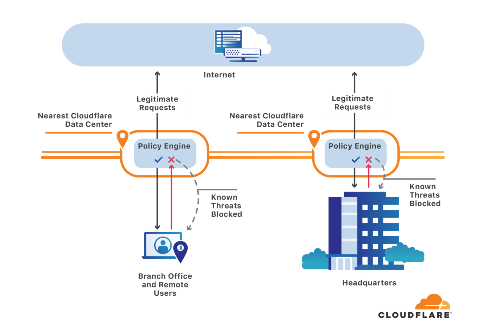
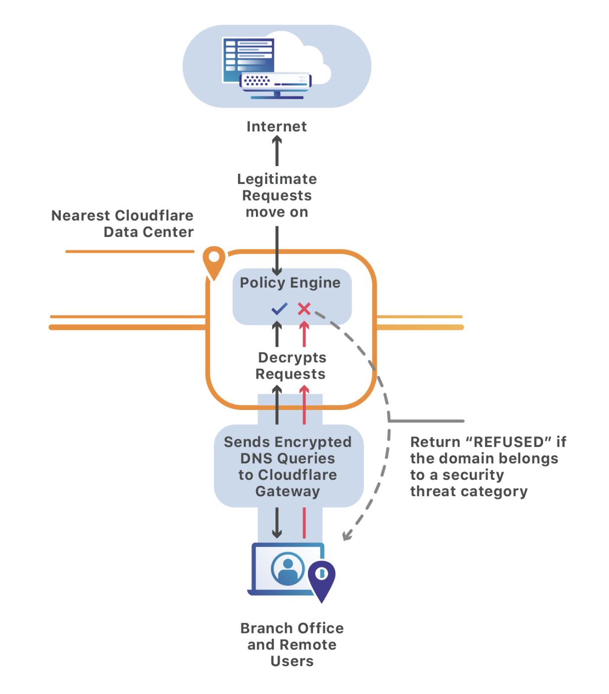

# How Cloudflare Gateway Works

## Secure DNS

Cloudflare Gateway's secure DNS filtering service sits between a device and the Internet and filters traffic at the DNS layer.

The primary difference between 1.1.1.1 and Gateway’s secure DNS filtering is that 1.1.1.1 does not block any DNS queries. When a browser performs a DNS query for a domain, the 1.1.1.1 public DNS resolver simply looks up the answer for the DNS query either in cache or by performing a full recursive query.

Cloudflare Gateway's DNS resolver adds an additional step to introduce security into this flow. Instead of allowing all DNS queries, Gateway first checks the hostname being queried against the intelligence Cloudflare has about threats on the Internet. If that query matches a known threat or a blocked content category configured by an administrator, Gateway stops it before the site loads for the user - and potentially executes code or phishes that team member.

For example, if you are using Cloudflare Gateway, and send a DNS query to `example.com`:
1. Gateway checks if the DNS query is coming from your location.
2. If it is coming from your location, Gateway checks if `example.com` matches any of the policies you have set up. The policy could consist of domains that you are blocking with a custom list imported to Cloudflare Gateway in addition to broader security or content categories that you enabled.
3. If `example.com` matches a policy configuration, Cloudflare Gateway will block access to the domain.

### DNS over HTTPS

Gateway currently supports DNS over HTTPS (DoH), and will also support DNS over TLS in the future. You can use **cloudflared** to setup your device and start sending DNS queries to Gateway in an encrypted fashion. It will also support other DNS over HTTPS clients, as long as you can change the hostname in your preferred DNS over HTTPS client. Here’s how DNS over HTTPS for Cloudflare Gateway works:

The DNS over HTTPS client encrypts the DNS request and sends it to the closest Cloudflare’s data center. Upon receiving the encrypted DNS request, it will decrypt it and send it to Cloudflare Gateway. Cloudflare Gateway will log the request, apply the required security policies, and return the response to our edge. Our edge will encrypt the response and send it back to the DNS over HTTPS client.

By encrypting your DNS queries you will make sure that ISPs cannot snoop on your DNS queries, and at the same time you will be able to filter DNS requests that are malicious.

## L7 Cloud Firewall

Cloudflare Gateway includes a Layer 7 (L7) firewall that allows our customers to apply security and content policies to HTTP traffic. Users connect to Gateway with the Cloudflare for Teams client, which sends all internet-bound traffic from a user’s device to the Cloudflare Gateway. Administrators configure both DNS and HTTP policies--DNS policies are enforced at the Gateway DNS filtering service within the recursive resolver, and HTTP policies are enforced at the L7 firewall within the HTTP forward proxy.

This provides administrators the ability to enforce policies across all applications at the DNS layer but also at a more granular level within HTTP sessions. It also gives our administrators greater control over where their data resides. By building policies, customers can specify whether to allow or block a request based on file type, on whether the request was to upload or download a file, or on whether the destination is an approved cloud storage provider for the organization.

Enterprises protect their users’ internet traffic wherever they are by connecting to Cloudflare with the Cloudflare for Teams client. This client uses the same WARP application under the hood, and by enrolling a user and device in a Gateway organization, administrators can both protect users wherever they are and receive visibility into each user’s DNS and HTTP activity captured in Gateway logs.

In addition to DNS filtering, Cloudflare Gateway now supports HTTP traffic filtering based on a variety of criteria including:

| Criteria                          | Example
| -------------                     |:-------------:
| URL, path, and/or query string    | https://www.myurl.com/path?query
| HTTP method                       | GET, POST, etc.
| HTTP response code                | 500
| File type and file name           | myfilename.zip
| MIME type                         | application/zip
| URL security or content category  | Malware, phishing, adult themes

For more information on types, see the [references section.](/reference/)
