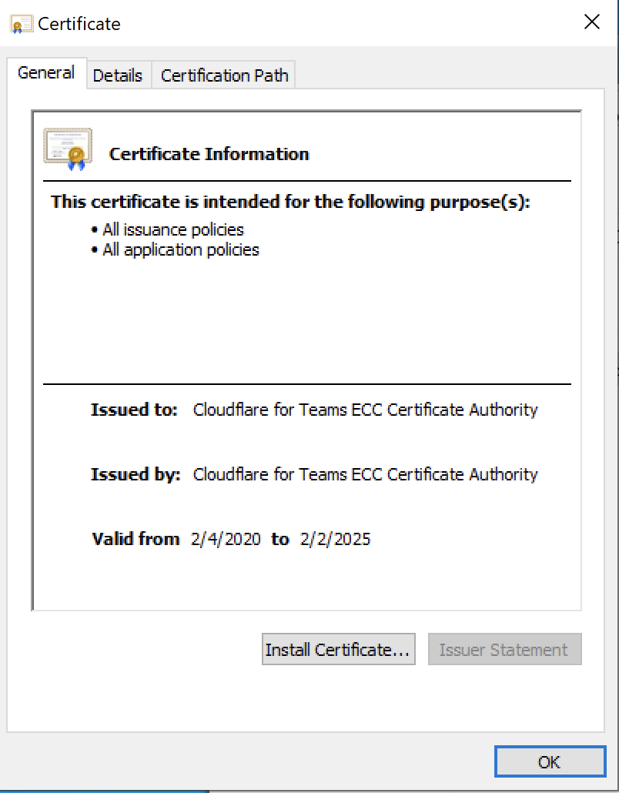
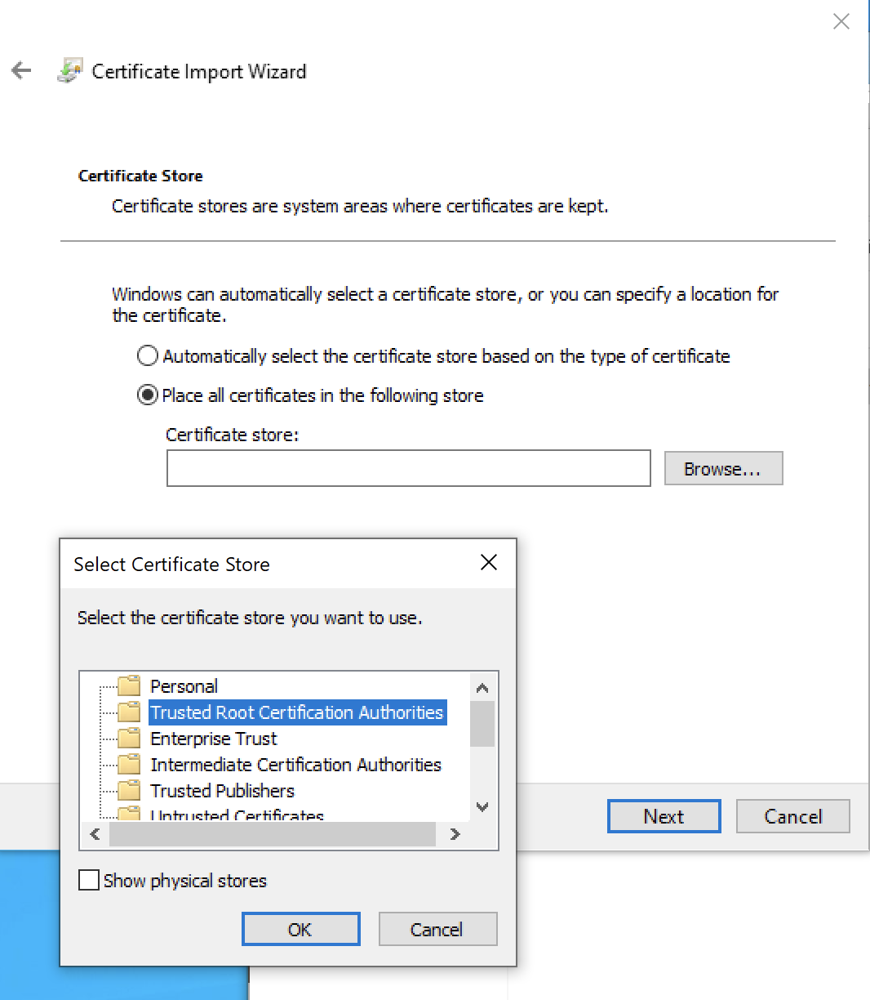
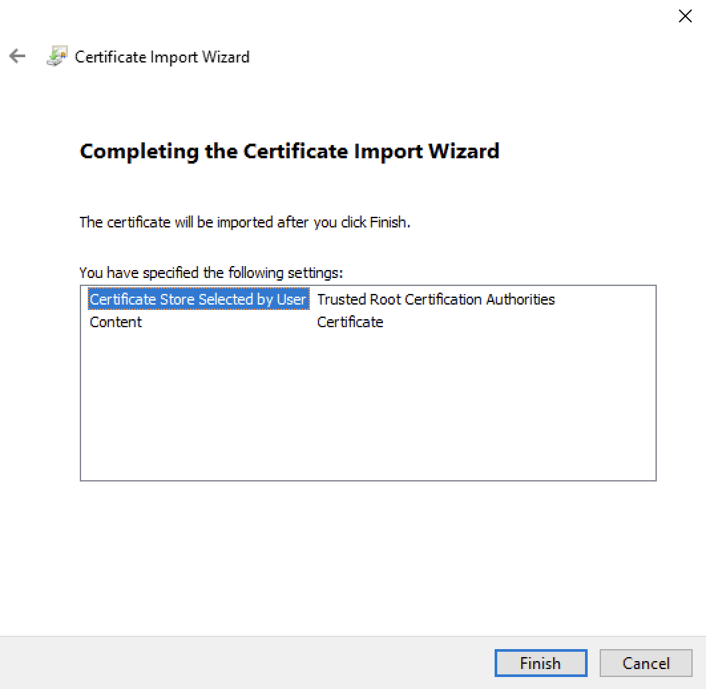
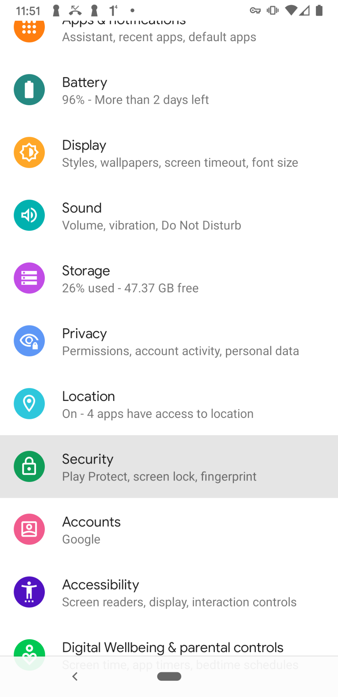
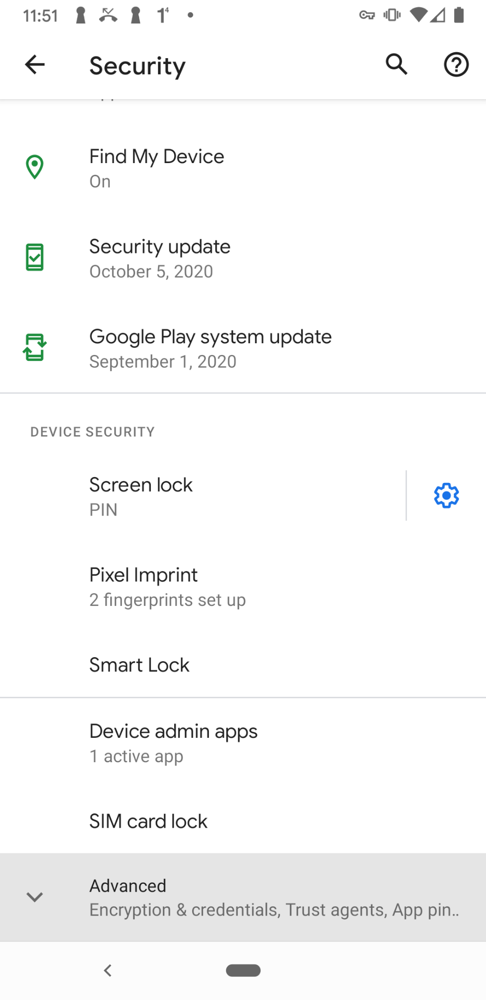
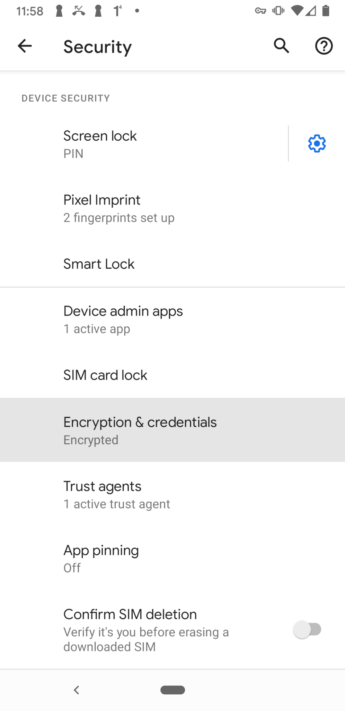
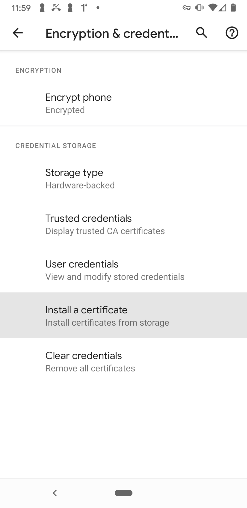
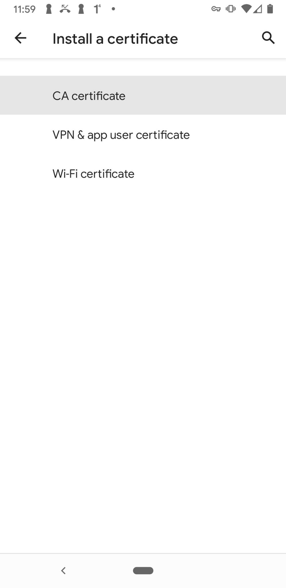
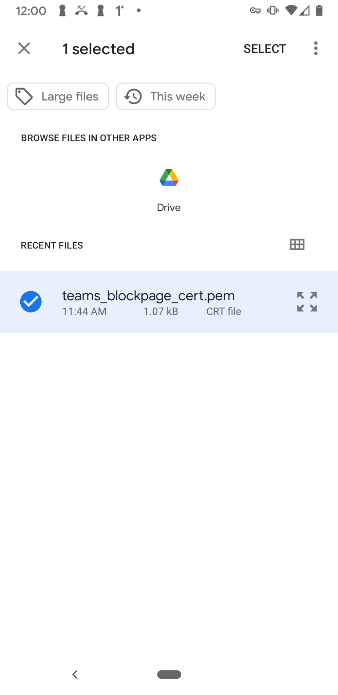

# Install the Cloudflare Root Certificate

<Aside type='warning' header='⚠️ THIS PAGE IS OUTDATED'>

We're no longer maintaining this page. **It will be deleted on Feb 8, 2021**. Please visit the new [Cloudflare for Teams documentation](https://developers.cloudflare.com/cloudflare-one/teams-docs-changes) instead.

</Aside>

Advanced security features including HTTPS traffic inspection require users to install and trust the Cloudflare root certificate on their machine or device. If you are installing certificates manually on all of your devices, these steps will need to be performed on each new device that is to be subject to HTTP Filtering.

## Download the Cloudflare root certificate
The Cloudflare certificate can be downloaded [from this location](../static/Cloudflare_CA.crt)

### Verify the certificate fingerprint

To verify your download, check that the certificates thumbprint matches:

#### SHA1
`BB:2D:B6:3D:6B:DE:DA:06:4E:CA:CB:40:F6:F2:61:40:B7:10:F0:6C`

#### SHA256
`F5:E1:56:C4:89:78:77:AD:79:3A:1E:83:FA:77:83:F1:9C:B0:C6:1B:58:2C:2F:50:11:B3:37:72:7C:62:3D:EF`

## Add certificate to your system

### MacOS

#### Before starting
Installing a certificate in Keychain in macOS requires consideration of which users to affect. macOS offers three options to install the certificate in Keychain with each having a different impact on which users are impacted by trusting the root certificate.

| Key Chain   | Impact                  |
|-------------|-------------------------|
| Login       | The logged on user      |
| Local Items | Cached iCloud passwords |
| System      | All users on the system |

Installing the certificate in Login will result in only the logged in user trusting the Cloudflare certificate. Installing in System affects all users who use that machine.

1. Download the Cloudflare certificate [at this location](../static/Cloudflare_CA.crt)

2. **Double-click** on the .crt file.

3. The certificate is now listed in the **Keychain Access** application.

4. **Double-click**  on the certificate and then click on **Trust**.

\

5. Select **Always Trust** from the drop-down menu for **When using this certificate**.\

6. Close the menu.

### iOS

1. Download the Cloudflare certificate [at this location](../static/Cloudflare_CA.crt)

The device will show a message: "This website is trying to open Settings to how you a configuration profile. Do you want to allow this?"

2. Tap **Allow**

3. Navigate to Settings > General > Profile and find the "Cloudflare for Teams ECC Certificate Authority" profile.

4. Tap Install

5. If the iOS device has a passcode set, the device will prompt you to enter it. Enter the passcode.

6. A certificate warning will be displayed. Tap Install. If a second prompt is displayed, tap Install again.

6. The Profile Installed screen is displayed. Tap Done.

Before the certificate can be used as intended, it must be trusted by the device.

7. On the device, go to Settings > General > About > Certificate Trust Settings.

The installed Root Certificates will be displayed in a section entitled "Enable Full Trust for Root Certificates."

There is a slide button next to each certificate.

Tap the slide button next to the Cloudflare certificate you just installed. A confirmation dialogue will be displayed.

8. Tap Continue.

### Windows

#### Before starting
Installing a certificate in Windows requires consideration of which users to affect. Windows offers two options to install the certificate with each having a different impact on which users are impacted by trusting the root certificate.

| Store Location      | Impact                  |
|---------------------|-------------------------|
| Current User Store  | The logged on user      |
| Local Machine Store | All users on the system |

1. Download the Cloudflare certificate [at this location](../static/Cloudflare_CA.crt)

2. Right-click on the certificate file, and choose Open. You may see a Security Warning window. If so, choose Open.

3. The Certificate window will appear. Click Install Certificate

4. Choose a Store Location and click Next.

5. On the next screen, click Browse. Choose the Trusted Root Certification Authorities store. Click OK.

6. Click Finish.

### Android

1. Download the Cloudflare certificate [at this location](../static/Cloudflare_CA.crt)

2. Navigate to the Settings menu.

3. Select Security.

4. Click Advanced and then Click Encryption & Credentials

\

\

5. Click Install Certificate

6. Click CA certificate

7. Click "Install Anyway"

8. Verify it is you w/ Fingerprint or Pin

9. Choose the certificate you want to install. I have our default filename in the pictures, I can take this again if you want to call it something else.

10. You have completed the Android certificate installation.