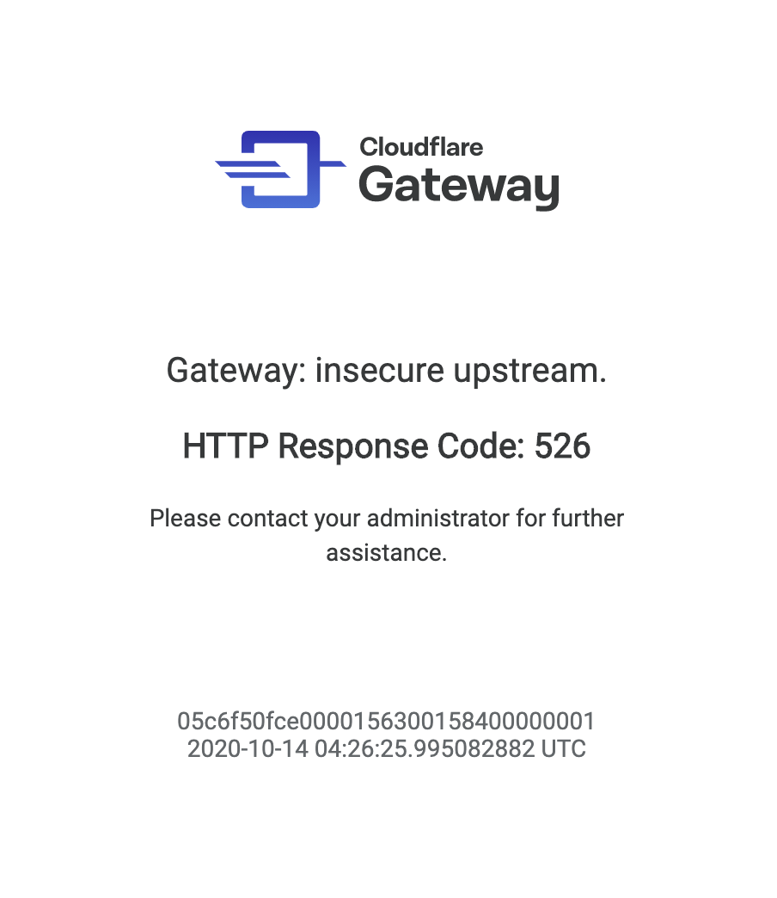

# Troubleshooting

### I receive an untrusted certificate warnings for every page and I am unable to browse the internet.

Advanced security features including HTTPS traffic inspection require users to install and trust the Cloudflare root certificate on their machine or device. If you are installing certificates manually on all of your devices, these steps will need to be performed on each new device that is to be subject to HTTP Filtering.

To install the Cloudflare root certificate, follow the steps [found here](/connecting-to-gateway/install-cloudflare-cert).

### Even though I installed the Cloudflare certificate on my system, mobile applications warn of an invalid certificate.

The mobile application may leverage certificate pinning. This is a security mechanism used to prevent man-in-the-middle (MITM) attacks on the internet by hardcoding information about the certificate that the application expects to receive. If the wrong certificate is received, even if it's trusted by the system, the application will refuse to connect.

Cloudflare Gateway dynamically generates a certificate for all encrypted connections in order to inspect the content of HTTP traffic. This certificate will not match the expected certificate by applications that use certificate pinning.

To allow these applications to function normally, administrators can configure bypass rules to exempt traffic to hosts associated with the application from being intercepted and inspected.

### I browsed to a website and received a Cloudflare Gateway error page, not a block page.



Cloudflare Gateway is designed to protect users by default. In the event this page is received, providing as much information as possible to the local IT administrator will be helpful as we troubleshoot with them such as:

* Operating System (Windows 10, macOS 10.x, iOS 14.x)
* Web browser (Chrome, Firefox, Safari, Edge)
* URL of the request
* Screenshot or copy/paste of the content from the error page

We present an HTTP error page in the following cases:

#### An untrusted certificate is presented from the origin to Gateway.

Gateway will consider a certificate is untrusted if any of these three conditions are true:

* The server certificate issuer is unknown or is not trusted by the service.
* The server certificate is revoked and fails a CRL check (OSCP checking coming soon)
* There is at least one expired certificate in the certificate chain for the server certificate

#### Common certificate errors

For example in the event of a certificate common name mismatch.

#### Insecure cipher suite

When the connection from Cloudflare Gateway to an upstream server is insecure (e.g, uses an insecure cipher such as rc4, rc4-md5, 3des, etc.)

We do support upstream connections that require a connection over TLS that is prior to TLS 1.3. We will support the ability for an administrator to configure whether to trust insecure connections in the very near future.

#### I created a bypass rule or disabled TLS interception completely and inspection seems to still be occurring.

Disabling TLS interception for a previously inspected hostname requires the HTTP connection to be restarted (i.e., closing the browser) for the bypass to take effect.

### Does Cloudflare have a global policy to allow, block, or bypass anything in addition to what I've configured?

Cloudflare provides organizations the tools to protect themselves from advanced threats in the simplest way possible. However, we won't configure any rules without the knowledge of our customers--we'd rather make it easy for you to do so. A customer's rules are always evaluated first (and exclusively) with one exception: We have a single global rule to ensure that the Cloudflare WARP client can connect to the Cloudflare edge even in the event that the Cloudflare root certificate was not installed:

```
Selector: hostname
Operator: is
Value: cloudflareclient.com
Action: bypass
```

This allows the WARP client to connect to Cloudflare and determine if the Cloudflare certificate is not present and trusted on the local device; and if not, then the client will alert the user.

### I'm using a common application and it seems unable to connect when I inspect HTTP traffic or presents an untrusted certificate error.

The application may use certificate pinning. This is a process used by applications to verify that the TLS certificate presented from the origin server matches a known, specified list of certificates hardcoded in the application. This is a countermeasure to man-in-the-middle attacks where an attacker presents a trusted, but false, certificate on behalf of the origin in oder to decrypt the traffic. Unfortunately, this is exactly what TLS interception in a Secure Web Gateway does although for the purposes of securing a user's web traffic.

In order to accommodate applications that take advantage of certificate pinning, a bypass for the hostnames associated with the application must be configured in the Gateway L7 firewall. In the future, Gateway will provide the ability for organizations to simply select the name or type of application in order to configure rules.

Some common applications that make use of certificate pinning include:

<TableWrap>

| Application     | FQDN               | Bypass Rules                                                                           |
|-----------------|--------------------|----------------------------------------------------------------------------------------|
| Signal          | whispersystems.org | ***Selector:*** hostname ***Operator:*** matches regex ***Value:*** .*whispersystems\.org ***Action:*** bypass |
| Signal          | signal.org         | ***Selector:*** hostname ***Operator:*** matches regex ***Value:*** .*signal\.org ***Action:*** bypass         |
| Zoom            | zoom.us            | ***Selector:*** hostname ***Operator:*** matches regex ***Value:*** .*zoom\.us ***Action:*** bypass            |
| Zoom            | zoomgov.com        | ***Selector:*** hostname ***Operator:*** matches regex ***Value:*** .*zoomgov\.com ***Action:*** bypass        |
| Wells Fargo App | wellsfargo.com     | ***Selector:*** hostname ***Operator:*** matches regex ***Value:*** .*wellsfargo\.com ***Action:*** bypass     |
| USAA Mobile App | usaa.com           | ***Selector:*** hostname ***Operator:*** matches regex ***Value:*** .*usaa\.com ***Action:*** bypass           |
| Apple/iCloud    | apple.com          | ***Selector:*** hostname ***Operator:*** matches regex ***Value:*** .*apple\.com ***Action:*** bypass           |
| Apple/iCloud    | icloud.com         | ***Selector:*** hostname ***Operator:*** matches regex ***Value:*** .*icloud\.com ***Action:*** bypass           |

</TableWrap>
