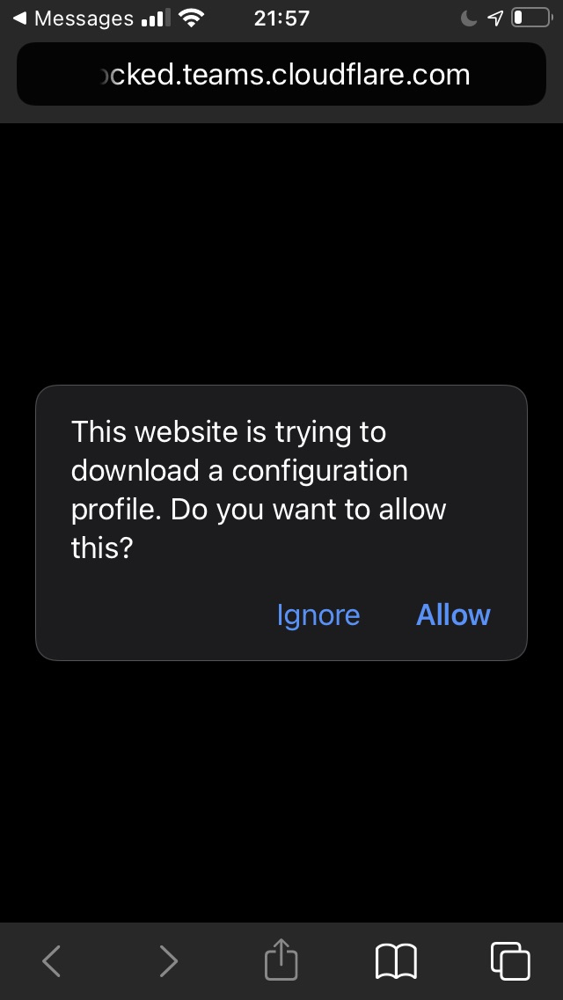
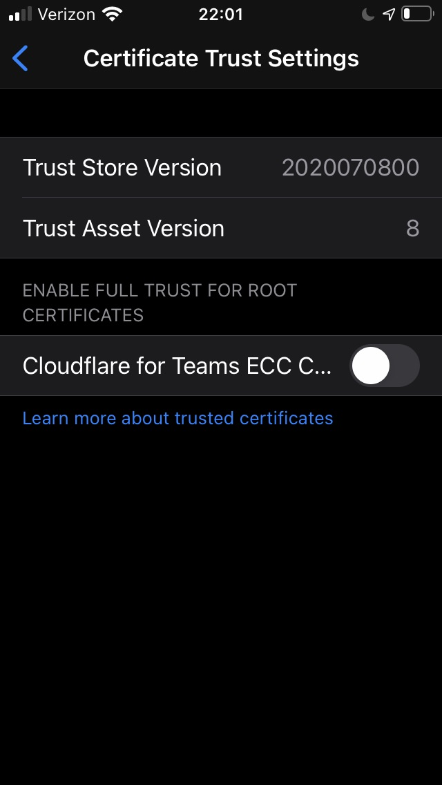
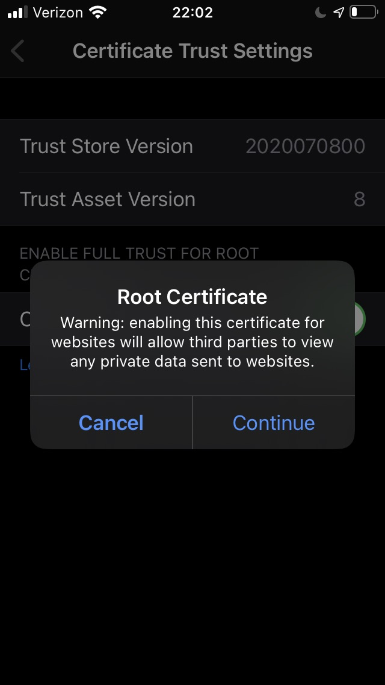

# Install the Cloudflare root certificate

<Aside type='warning' header='⚠️ THIS PAGE IS OUTDATED'>

We're no longer maintaining this page. **It will be deleted on Feb 8, 2021**. Please visit the new [Cloudflare for Teams documentation](https://developers.cloudflare.com/cloudflare-one/teams-docs-changes) instead.

</Aside>

Advanced security features including HTTPS traffic inspection require users to install and trust the Cloudflare root certificate on their machine or device. If you are installing certificates manually on all of your devices, these steps will need to be performed on each new device that is to be subject to HTTP Filtering.

## Download the Cloudflare root certificate
First, download the Cloudflare certificate [from this location](../static/Cloudflare_CA.crt).

### Verify the certificate fingerprint

To verify your download, check that the certificate's thumbprint matches:

#### SHA1
```txt
BB:2D:B6:3D:6B:DE:DA:06:4E:CA:CB:40:F6:F2:61:40:B7:10:F0:6C
```

#### SHA256
```txt
F5:E1:56:C4:89:78:77:AD:79:3A:1E:83:FA:77:83:F1:9C:B0:C6:1B:58:2C:2F:50:11:B3:37:72:7C:62:3D:EF
```

## Add the certificate to your system

### MacOS

#### Before you start
You will need to install the root certificate in the Keychain Access application. In the application, you can choose the keychain in which you want to install the certificate. macOS offers three options, each having a different impact on which users will be affected by trusting the root certificate.

| Keychain   | Impact                  |
|-------------|-------------------------|
| login       | The logged in user      |
| Local Items | Cached iCloud passwords |
| System      | All users on the system |

Installing the certificate in the Login keychain will result in only the logged in user trusting the Cloudflare certificate. Installing it in the System keychain affects all users who have access to that machine.

To install the certificate in Keychain Access:

1. Download the Cloudflare certificate [here](../static/Cloudflare_CA.crt).

2. Double-click on the `.crt` file.

  The certificate is now listed in the **Keychain Access** application, under the **login** keychain. If you want to install it in the **System** keychain instead, drag and drop the certificate from the login keychain onto the System keychain section on the left.


3. Double-click on the certificate.

4. Click **Trust**.


5. From the **When using this certificate** drop-down menu, select **Always Trust**.


6. Close the menu.

The root certificate is now installed and ready to be used.

### iOS

1. Download the Cloudflare certificate [here](../static/Cloudflare_CA.crt).

 The device will show a message: *This website is trying to open Settings to how you a configuration profile. Do you want to allow this?*



2. Tap **Allow**.

3. Navigate to **Settings** > **General** > **Profile** and find the **Cloudflare for Teams ECC Certificate Authority** profile.


4. Tap **Install**. If the iOS device is passcode-protected, you will be prompted to enter the passcode.

5. Next, a certificate warning will appear. Tap **Install**.

 If a second prompt is displayed, tap **Install** again.

6. Next, the **Profile Installed** screen will appear. Tap **Done**.

 The certificate is now installed. However, before it can be used, it must be trusted by the device.

7. On the device, go to **Settings** > **General** > **About** > **Certificate Trust Settings**.

 The installed root certificates will be displayed in the *Enable full trust for root certificates* section.

 

8. Tap the slide button next to the Cloudflare certificate you just installed.

9. A confirmation dialogue will appear. Tap **Continue**.

 

The root certificate is now installed and ready to be used.

### Windows

#### Before you start
Windows offers two options to install the certificate, each having a different impact on which users will be affected by trusting the root certificate.

| Store Location      | Impact                  |
|---------------------|-------------------------|
| Current User Store  | The logged in user      |
| Local Machine Store | All users on the system |

1. Download the Cloudflare certificate [here](../static/Cloudflare_CA.crt).

2. Right-click on the certificate file.
3. Click **Open**.  
 If you see a Security Warning window, click **Open**.

4. The **Certificate** window will appear. Click **Install Certificate**.


5. Now choose a Store Location.

6. Click **Next**.

7. On the next screen, click **Browse**.

8. Choose the **Trusted Root Certification Authorities** store.

9. Click **OK**.


10. Click **Finish**.


The root certificate is now installed and ready to be used.

### Android

1. Download the Cloudflare certificate [here](../static/Cloudflare_CA.crt).

2. Navigate to the **Settings** menu.

3. Select **Security**.


4. Tap **Advanced** > **Encryption & Credentials**.


5. Tap **Install a certificate**.


6. Tap **CA certificate**.


7. Tap **Install Anyway**.


8. Verify your identity through the fingerprint, or by inserting the pin code.

9. Select the certificate you want to install.


The root certificate is now installed and ready to be used.