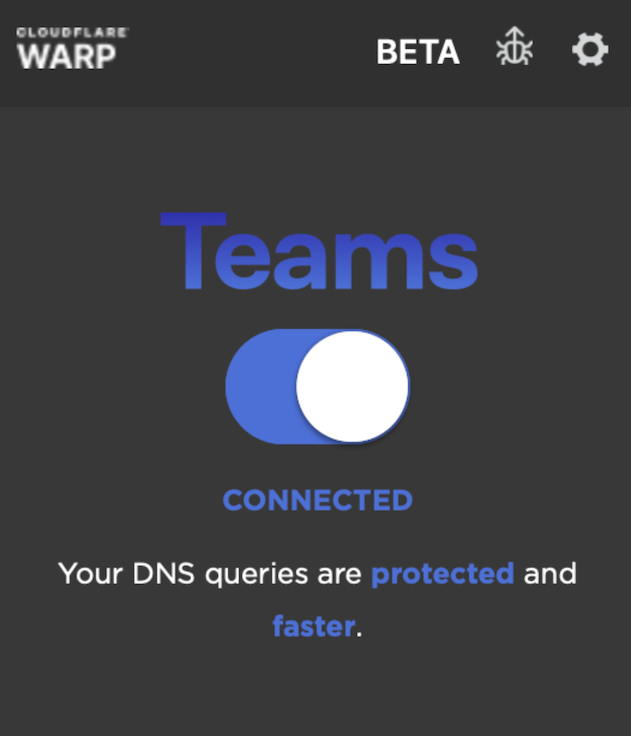

# Configure DNS

<Aside type='warning' header='⚠️ THIS PAGE IS OUTDATED'>

We're no longer maintaining this page. **It will be deleted on Feb 8, 2021**. Please visit the new [Cloudflare for Teams documentation](https://developers.cloudflare.com/cloudflare-one/teams-docs-changes) instead.

</Aside>

Organizations can enforce DNS content and security policies for roaming users by sending DNS queries from the WARP client over DoH in DNS-filtering only mode. This service allows organizations to apply DNS policies by selecting a DoH subdomain from aligned to an existing location and configuring WARP clients to use this DoH subdomain.

The DNS filtering policy configured for that location will be applied to WARP client DNS traffic. When the client connection toggle is enabled, only DNS traffic is sent to Cloudflare Gateway for policy enforcement--all non-DNS traffic is sent directly to the internet.

When DNS filtering is enabled, all other traffic will be sent directly to the Internet. Entering a DoH subdomain for an organization triggers WARP into Teams mode

Learn more about configuring the DoH subdomain within the WARP client for your operating system [here](https://developers.cloudflare.com/warp-client/teams).