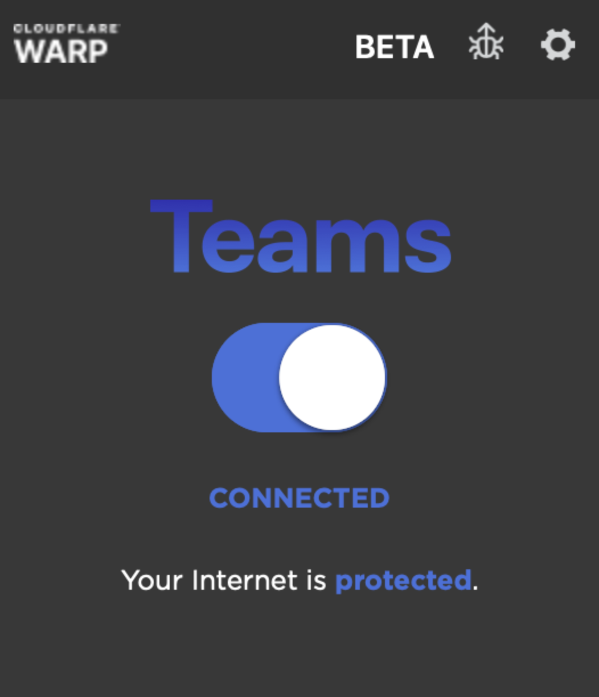

# Connect to the L7 Firewall

<Aside type='warning' header='⚠️ THIS PAGE IS OUTDATED'>

We're no longer maintaining this page. **It will be deleted on Feb 8, 2021**. Please visit the new [Cloudflare for Teams documentation](https://developers.cloudflare.com/cloudflare-one/teams-docs-changes) instead.

</Aside>

Organizations can enforce both DNS and HTTP content and security policies for roaming users by enrolling users in a Gateway organization. Teams Gateway, Teams Standard, and Teams Enterprise customers will have the ability to login with Cloudflare for Teams through the WARP client.

In L7 firewall model, all traffic leaving a user's device connects to Cloudflare through the WARP connection where Gateway can apply filters. DNS Queries are sent to the DoH address for that organization.

Learn more about configuring the WARP client for your operating system [here](https://developers.cloudflare.com/warp-client/teams).