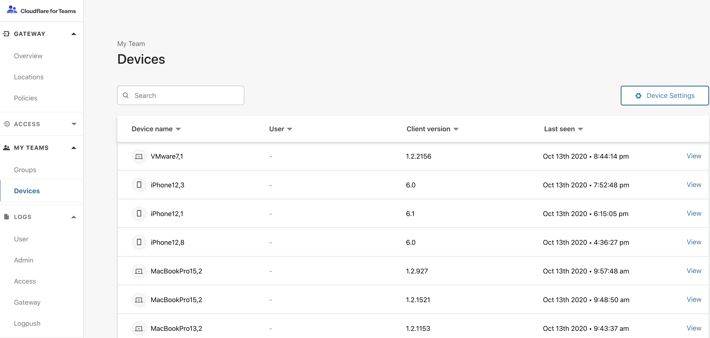
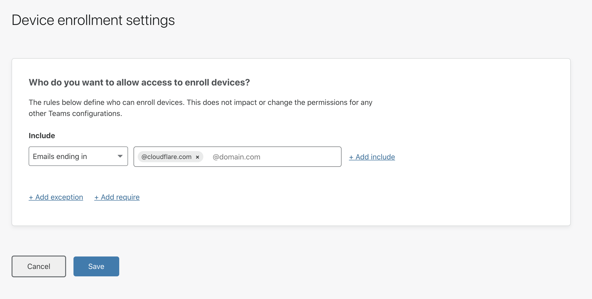
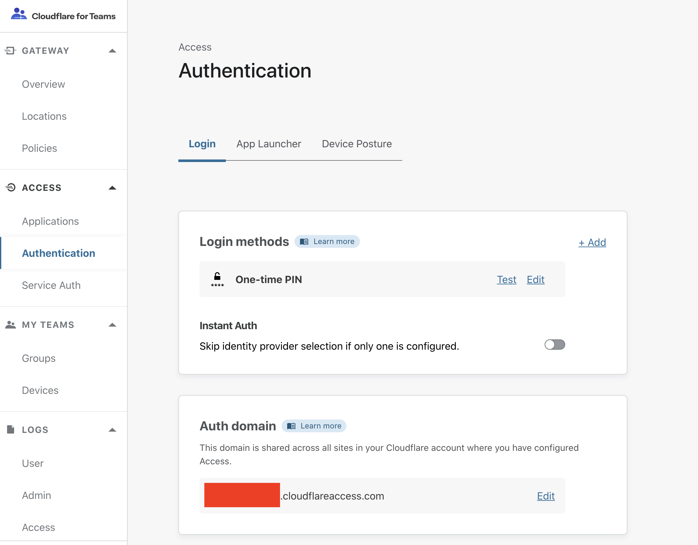

# WARP Client

<Aside type='warning' header='⚠️ THIS PAGE IS OUTDATED'>

We're no longer maintaining this page. **It will be deleted on Feb 8, 2021**. Please visit the new [Cloudflare for Teams documentation](https://developers.cloudflare.com/cloudflare-one/teams-docs-changes) instead.

</Aside>

## Getting Started
The Cloudflare WARP client supports manual installs, deployment scripts, or advanced enterprise management tools, such as Microsoft Intune or Jamf.

To start using Cloudflare for Teams, ensure you perform the following steps prior to configuring the WARP client to connect to your Teams organization:

### Configure a device enrollment policy to allow devices to enroll in your organization

1. Visit your Teams dashboard and navigate to the **Devices** page to find the Device Settings button.

2. Click the **Device Settings** button.

3. Configure a rule to defines who should be allowed to enroll in your Gateway organization. In this example, only users with cloudflare.com email addresses who successfully authenticate during device enrollment through the WARP client will be able to enroll in the organization. This rule prevents outsider users from sending traffic through your account and will give your organization the ability to capture user profile logs and apply profile-specific rules.

### Choose a location's DoH subdomain for DNS policy enforcement via the WARP client

1. Your organization has a DoH subdomain for the entire account. You can create additional subdomains for specific locations or groups, if needed.

[Obtain a location DoH subdomain (previously known as a unique id)](/getting-started/troubleshooting-policies/#find-a-location-doh-subdomain)

### Obtain your Cloudflare for Teams auth domain

1. Visit your Teams dashboard and navigate to the **Authentication** page under **Access** to find the Auth Domain configuration section.

2. Configure a unique Auth Domain for your account. This domain will be used as your Gateway organization name in the WARP client during user and device enrollment. The Auth Domain represents your organization's Teams account and is used across both Access and Gateway.

## Download the Cloudflare root certificate and install it on the device

If your organization plans to inspect HTTP traffic, you must download the Cloudflare for Teams certificate on any device being enrolled.

To install the Cloudflare root certificate, follow the steps [found here](/connecting-to-gateway/install-cloudflare-cert).

### Install the WARP client and log in with Cloudflare for Teams

1. Follow [these instructions](https://developers.cloudflare.com/warp-client/teams) to install and configure the Cloudflare WARP client.

### Configure clients to protect DNS and HTTP traffic

Cloudflare for Teams has three available modes that can be used with the client.

|Mode|Description|DNS Filtering|HTTP Filtering|
|---|---|---|---|
|DNS only|DoH-based filtering|Yes|No|
|DNS with WARP+|DoH-based filtering with encrypted WARP+ traffic|Yes|No|
|HTTP filtering|DoH-based filtering, HTTP filtering, and encrypted WARP+ traffic|Yes|Yes|

[Configure DNS in the client](/connecting-to-gateway/with-client/DNS)

[Configure clients to send HTTP traffic to Gateway](/connecting-to-gateway/with-client/HTTP):
