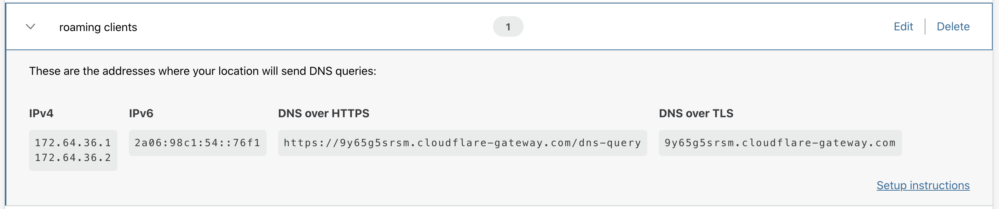
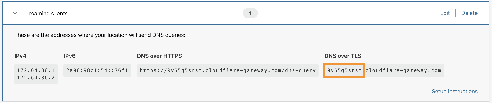

# DNS over TLS

By default, DNS is sent over a plaintext connection. DNS over TLS is one way to send DNS queries over an encrypted connection. Cloudflare supports DNS over TLS (DoT) on standard port 853 and is compliant with [RFC7858](https://tools.ietf.org/html/rfc7858).

## Configuration

### Obtain your DoT hostname

DoT hostnames are aligned to locations. Locations and corresponding DoT hostnames have policies associated with them.

1. Visit your Teams dashboard to fetch the **DoT hostname** from your location.
Navigate to the **Locations** page to visualize your location.


2. If you have more than one location set up, you will see a list of all your locations.


3. Expand the location card for the location which you'd like to retrieve the corresponding DoT hostname.



4. Get the DoT hostname for the location. In the example below, the ID is: `9y65g5srsm.cloudflare-gateway.com`.

5. Take note of the **DoT hostname**.



### Configure your DoT client

There are a variety of standalone DoT clients depending on your operating system, or some stub resolvers (e.g., BIND) support DoT natively. Use the following IP address and hostname:

```text
Hostname: DoT hostname for a chosen location (above this is 9y65g5srsm.cloudflare-gateway.com)
IP address: 162.159.36.5
```

## Supported TLS versions

Cloudflare's DNS over TLS supports TLS 1.3 and TLS 1.2.
