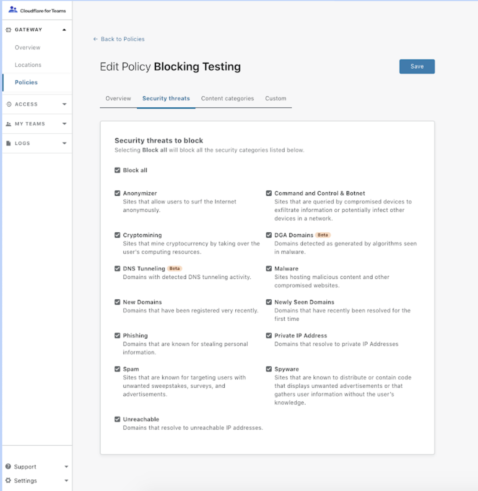
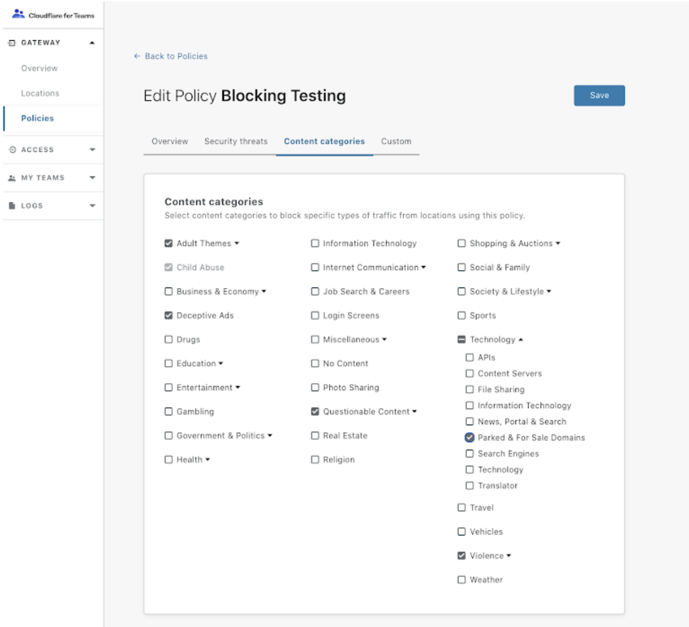

# Blocking categories

Cloudflare Gateway’s DNS filtering capabilities allow you to block known and potential security threats on the public internet, as well as specific categories of content. To give you more granular control over how to secure your network, Gateway also provides you with categorized security threats and content categories.

You can block security threats and content categories by creating Gateway policies. Once you have configured your policies, you will be able to inspect network activity and the associated categories in your Gateway logs. 

To know more about security threats and content categories, read our [Categories learning page](/reference/categories).

<Aside>

If you wish to block a hostname or URL that belongs to a security threat category, you need to block that category. If the security threat category is not configured as blocked, requests to that hostname or URL will appear in your Gateway logs as allowed requests.

</Aside>

## Block security threat categories

1. Navigate to the **Policies** tab in the [Teams dashboard](https://dash.teams.cloudflare.com/).
2. [Create a new policy](/getting-started/configuring-dns-policy), or edit an existing one.
3. Navigate to the **Security threats** tab.



4. Select all the security threats categories you want your policy to block.
5. Click **Save** to finalize your changes.

## Block content categories

1. Navigate to the **Policies** tab in the [Teams dashboard](https://dash.teams.cloudflare.com/).
2. [Create a new policy](/getting-started/configuring-dns-policy), or edit an existing one.
3. Navigate to the **Content categories** tab.



4. Select all the content categories you want your policy to block.
5. Click **Save** to finalize your changes.

## Test a policy

If you are blocking a security threat or content category, you can test that the policy is working by using the **test domain** associated with each category.

Once you have configured your Gateway policy to block the category, the test domain will show a block page when you attempt to visit the domain in your browser, or will return `REFUSED` when you perform `dig` using the command-line interface.

### Test domains

#### One-word categories
Test domains use the following format for categories with one-word names:

```NAME_OF_CATEGORY.testcategory.com```

| Category | Test domain |
| -------- | ----------- |
| *Malware* | `malware.testcategory.com` |
| *Phishing* | `phishing.testcategory.com` |
| *Cryptomining* | `cryptomining.testcategory.com` |

#### Multi-word categories
If the category has multiple words in the name (e.g. *Parked & For Sale Domains*) then the test domain uses the following format:

* Remove any spaces between the words
* Replace `&` with `and`
* All letters are lowercase

| Category | Test domain |
| -------- | ----------- |
| *Parked & For Sale Domains* | `parkedandforsaledomains.testcategory.com` |
| *Private IP Address* | `privateipaddress.testcategory.com` |
| *Command and Control & Botnet* | `commandandcontrolandbotnet.testcategory.com` |

#### Common test domains

| Category | Test domain |
| -------- | ----------- |
| *Anonymizer* | `anonymizer.testcategory.com` |
| *Command and Control & Botnet* | `commandandcontrolandbotnet.testcategory.com` |
| *Cryptomining* | `cryptomining.testcategory.com` |
| *Malware* | `malware.testcategory.com` |
| *New Domains* | `newdomains.testcategory.com` |
| *Parked & For Sale Domains* | `parkedandforsaledomains.testcategory.com` |
| *Phishing* | `phishing.testcategory.com` |
| *Private IP Address* | `privateipaddress.testcategory.com` |
| *Spam* | `spam.testcategory.com` |
| *Spyware* | `spyware.testcategory.com` |
| *Unreachable* | `unreachable.testcategory.com` |
