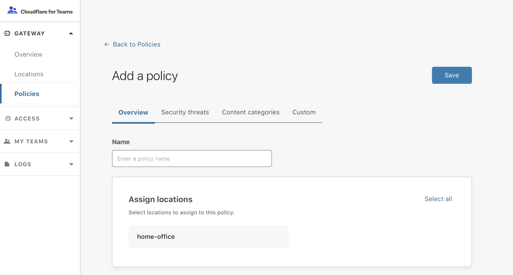

# Configure a DNS policy

## Setup your first policy

1. On the Teams dashboard, navigate to the **Policies** tab.
2. Click on **Create a policy**.

 

3. Add a **policy name**.

 

4. In the **Assign Locations** card, specify the location(s) for which you want to enable the policy. To enable it for all your locations, click **Select all** on the top right corner of the card.  

5. Navigate to **Security Threats** to choose which security categories you want to block. Click on **Block all** if you want to select all categories.

6. Navigate to **Content Categories** to choose which content categories you want to block.

7. Navigate to **Custom** to allow, block, or override domains. The ability to override lists of URLs and IP addresses will be released in the future.

  * Click on **Add a destination**.

  * From the drop-down menu, choose a **Destination Type**.

    

  * Choose whether you want to allow, block, or override the destination.

  * Click on **Add to policy**.

8. Click on **Save** to add the policy to your dashboard.

 