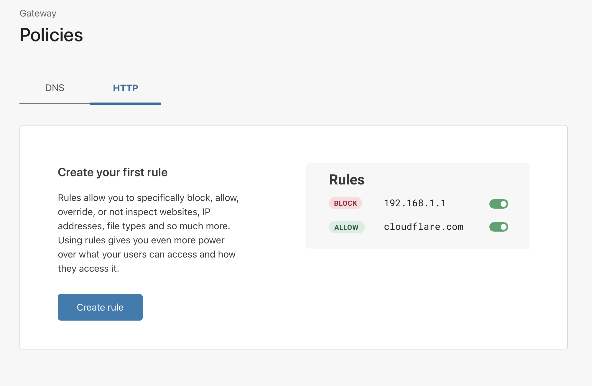
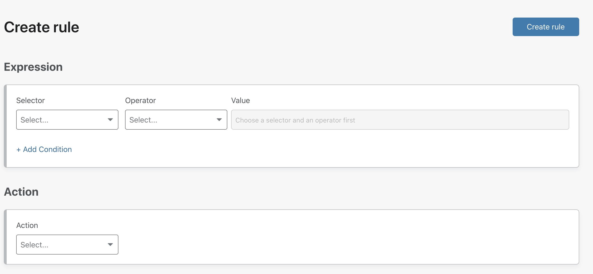

# Configure an HTTP policy

<Aside>

This feature is only available on the **Teams Enterprise plan**. For more information, see the Cloudflare for Teams [pricing page](https://www.cloudflare.com/teams-pricing/).

</Aside>

## Before you start

The Cloudflare Gateway L7 firewall will intercept and inspect all HTTP and HTTPS traffic over ports 80 and 443. The inspection of HTTPS traffic requires breaking the TLS connection between the user and the origin server. Cloudflare Gateway presents a certificate to the user and securely connects to the origin on their behalf; however, this requires the Cloudflare certificate to be installed and trusted on each user's device.

## Setup your first HTTP policy

1. On the Teams dashboard, navigate to the **Policies** tab.

2. Select the **HTTP tab**.

3. Select **Add a Rule**.

4. Configure the **Selector**, **Operator**, and **Value(s)** to match against.
5. Select an **Action** to perform if the expression matches HTTP traffic.
6. Select **Create Rule**.

The rule is inserted at the bottom of the list of rules when more than one rule is present. Rules are enabled by default and take effect as soon as the rule is created.

Administrators are able to create up to 50 rules in their HTTP policy.

Check out the [L7 firewall reference section](/reference/policy/#l7-firewall) for more information about configuring rules and supported filtering criteria.

## Enable L7 filtering

At the bottom of the `HTTP` policies page, click the toggle to enable filtering once clients have been deployed and certificates installed. If you do not enable filtering, your rules will not apply.

Do not enable filtering without first [configuring certificates](https://developers.cloudflare.com/gateway/policies/configure-block-page/#add-certificate-to-your-system) on the devices enrolled, otherwise you will prevent those devices from connecting to the Internet.
