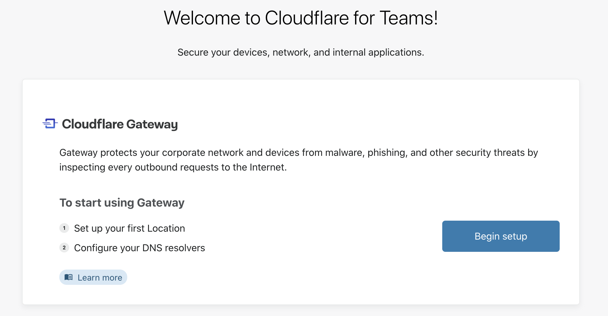

# Gateway Setup

To start using Gateway, set up your first **location** and your DNS resolvers.

1. Click on **Begin setup**.

2. Click on **Next**.

3. You can now input a name for your first location.

4. Click on **Next**.

5. Follow the instructions on how to setup your DNS resolvers.

6. Click on **Finish setup**. This will take you to your [Teams dashboard](https://dash.teams.cloudflare.com).

