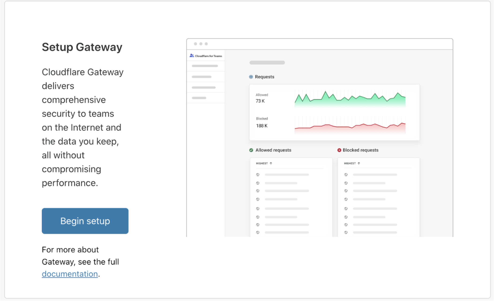
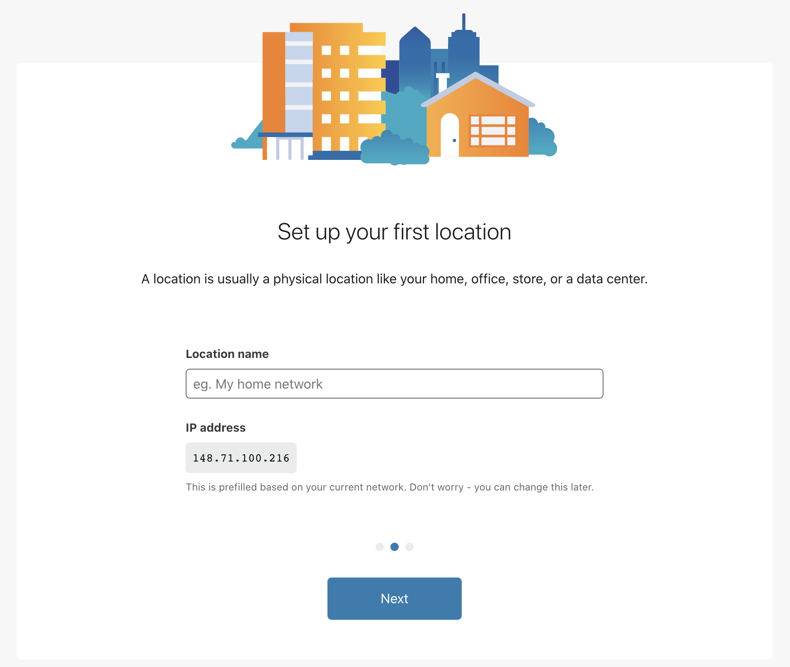

# Set up Gateway

To start using Gateway, set up your first **location** and your DNS resolvers.

1. Navigate to the [Cloudflare for Teams](https://www.cloudflare.com/teams) website.

2. Click **Get Started**.

3. Sign up for Cloudflare for Teams and click  **Create Account**.
  If you already have a Cloudflare Account, click *Already have an account? Log in*.

  You'll be redirected to the [Cloudflare for Teams dashboard](https://dash.teams.cloudflare.com/).

4. Click on **Gateway** > **Begin setup**.

5. Click **Next**.

6. You can now input a name for your first location. You will be able to change this name at any time.

7. Click **Next**.

8. Follow the instructions on how to setup your DNS resolvers.

9. Click **Finish setup**.

  This will take you to the [Teams dashboard](https://dash.teams.cloudflare.com), where you can start customizing your location, or you can add your first [DNS](https://developers.cloudflare.com/gateway/getting-started/configuring-dns-policy) or [HTTP policy](https://developers.cloudflare.com/gateway/getting-started/configuring-http-policy).
