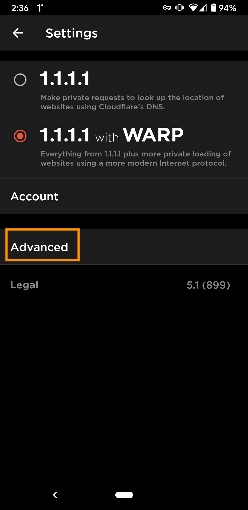
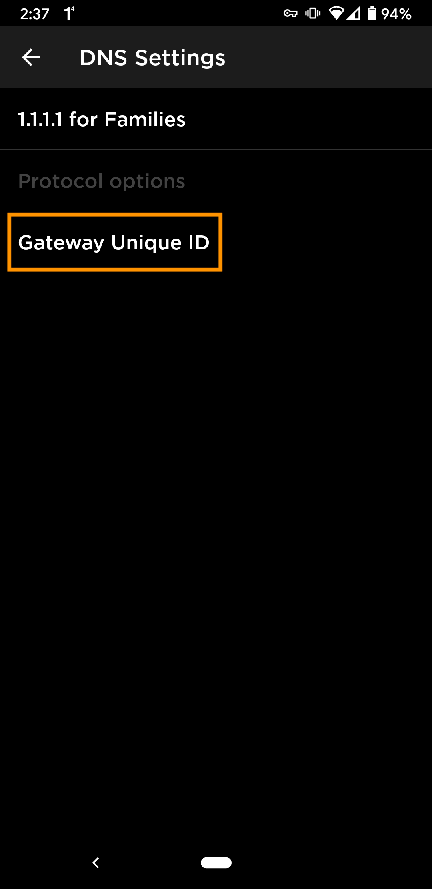
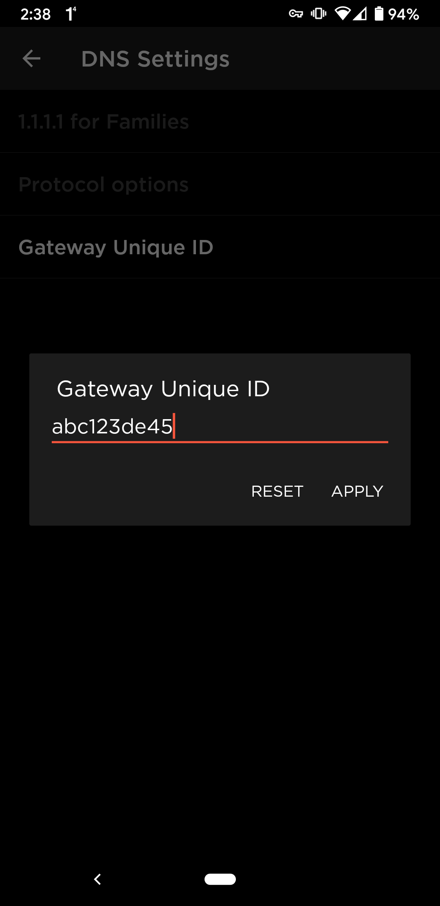

# Android Setup Instructions (Manual)

<Aside>

Note that if you were using 1.1.1.1 for Families in the mobile app, you will at first need to disable 1.1.1.1 for Families. You can disable it by going to `Advanced -> Connection options -> DNS Settings -> 1.1.1.1 for Families -> And select 'None'`.
</Aside>

## Install the 1.1.1.1 mobile app
Install the 1.1.1.1 mobile app by visiting the [play store](https://play.google.com/store/apps/details?id=com.cloudflare.onedotonedotonedotone) on your Android device.

If you already have the app on your phone, make sure you have the latest version of the app and then skip to the next step.

## Click on the menu button
After you open the 1.1.1.1 mobile app, visit settings.

## Click on Advanced
Click on 'Advanced' which is located under the 'Account' button.

## Click on Connection options
Click on 'Connection options' which is located at the bottom of the screen right above 'Diagnostics'.

## Click on DNS Settings
Click on 'DNS Settings'. This will take you to the screen where you can configure Gateway for your 1.1.1.1 mobile app.

## Enter unique id from Gateway
When you are on this screen on your phone, you will need to enter the unique subdomain of the location you created for your mobile phone.

1. Visit your teams dashboard to fetch the unique id from your location.

2. Go to locations page to see the list of locations.

3. Expand the location card for the location you want to associate your mobile device with. If you have only one location, expand that location card.

4. Get the subdomain of the DNS over HTTPS hostname. This is your unique id. In the example below, this id is: fix7p31bzg.

5. Click on 'Gateway Unique ID'.

6. Enter the subdomain inside the field.

If 1.1.1.1 DNS, WARP or WARP+ was already enabled, the 1.1.1.1 app should be using Gateway now.