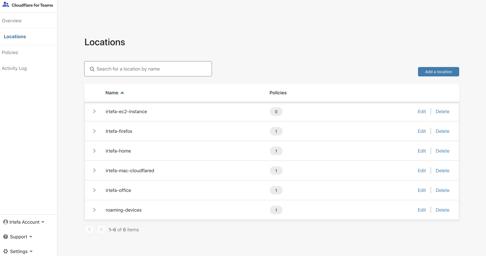
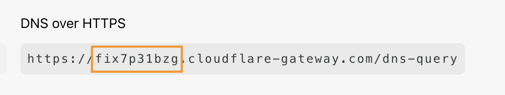

# iOS Setup Instructions (MDM)

<Aside type='warning' header='⚠️ THIS PAGE IS OUTDATED'>

We're no longer maintaining this page. **It will be deleted on Feb 8, 2021**. Please visit the new [Cloudflare for Teams documentation](https://developers.cloudflare.com/cloudflare-one/teams-docs-changes) instead.

</Aside>

<Aside>

Note that if you were using 1.1.1.1 for Families in the mobile app, you will at first need to disable 1.1.1.1 for Families.

You can disable it by going to `Advanced -> Connection options -> DNS Settings -> 1.1.1.1 for Families -> And select 'None'`.
</Aside>

You can deploy Gateway to your corporate iOS devices in bulk. Use an MDM solution to deploy your Gateway configuration to all corporate devices. If you want to learn how to use Gateway on your personal iOS device please use the setup instructions from [this page](/locations/setup-instructions/ios/manual/) instead.

## Unique Gateway Id
When you are on this screen on your phone, you will need to enter the unique subdomain of the location you created for your mobile phone.

1. Visit your teams dashboard to fetch the unique id from your location.


2. Go to locations page to see the list of locations


3. Expand the location card for the location you want to associate your mobile device with. If you have only one location, expand that location card.


4. Get the subdomain of the DNS over HTTPS hostname. This is your unique id. In the example below, this id is: fix7p31bzg.


## Modify configuration file

Download the configuration file from <a href="./cfteams.mobileconfig" download>here</a>

The contents of the file will look like below:
```xml
<?xml version="1.0" encoding="UTF-8"?>
<!DOCTYPE plist PUBLIC "-//Apple//DTD PLIST 1.0//EN" "http://www.apple.com/DTDs/PropertyList-1.0.dtd">
<plist version="1.0">
<dict>
	<key>PayloadContent</key>
	<array>
		<dict>
			<key>IPv4</key>
			<dict>
				<key>OverridePrimary</key>
				<integer>0</integer>
			</dict>
			<key>PayloadDescription</key>
			<string>Configures VPN settings</string>
			<key>PayloadDisplayName</key>
			<string>VPN</string>
			<key>PayloadIdentifier</key>
			<string>com.apple.vpn.managed.0C1AE427-5904-41EB-BC46-2CA460B7F683</string>
			<key>PayloadType</key>
			<string>com.apple.vpn.managed</string>
			<key>PayloadUUID</key>
			<string>0C1AE427-5904-41EB-BC46-2CA460B7F683</string>
			<key>PayloadVersion</key>
			<integer>1</integer>
			<key>Proxies</key>
			<dict>
				<key>HTTPEnable</key>
				<integer>0</integer>
				<key>HTTPSEnable</key>
				<integer>0</integer>
			</dict>
			<key>UserDefinedName</key>
			<string>1.1.1.1</string>
			<key>VPN</key>
			<dict>
				<key>AuthName</key>
				<string>na</string>
				<key>AuthenticationMethod</key>
				<string>Password</string>
				<key>RemoteAddress</key>
				<string>1.1.1.1</string>
			</dict>
			<key>VPNSubType</key>
			<string>com.cloudflare.1dot1dot1dot1</string>
			<key>VPNType</key>
			<string>VPN</string>
			<key>VendorConfig</key>
			<dict>
				<key>admin_installed</key>
				<true/>
				<key>gateway_unique_id</key>
				<string>bt2y71kv3e</string>
			</dict>
		</dict>
	</array>
	<key>PayloadDisplayName</key>
	<string>1.1.1.1</string>
	<key>PayloadIdentifier</key>
	<string>C02V5189HTDD.20DD5FEA-78C3-4E2B-BE41-A96091A734B0</string>
	<key>PayloadRemovalDisallowed</key>
	<false/>
	<key>PayloadType</key>
	<string>Configuration</string>
	<key>PayloadUUID</key>
	<string>8D0811D8-0CCA-4162-AC6F-DA2808A942A2</string>
	<key>PayloadVersion</key>
	<integer>1</integer>
</dict>
</plist>
```

Use a texteditor to replace the string `gateway_unique_id` with the 10 character unique subdomain from the DNS over HTTPS hostname for your location that you got from the previous section. Please make sure that you don't change any other parts of the file.

After you save the file, use your preferred MDM tool to deploy the configuration change to your fleet of corporate mobile devices.

If 1.1.1.1 DNS, WARP or WARP+ was already enabled, the 1.1.1.1 app should be using Gateway now.
