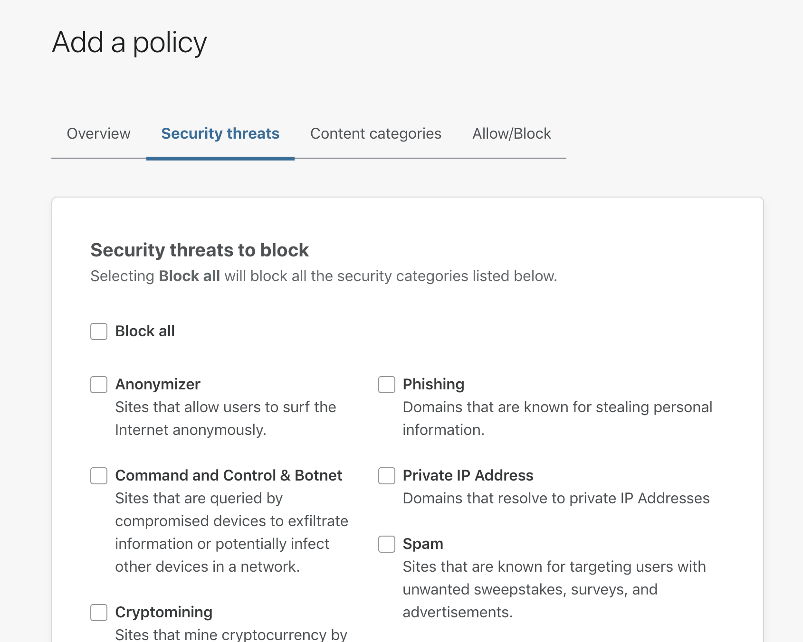

# Blocking Domains by Category

You can block domains by selecting a category or multiple categories. When the requested domain mathces the category you are blocking, Gateway will block that domain. 

You can block a category of domains by:

1. Going to ‘Policies’

2. Clicking on either 'Security threats’ or 'Content categories'

3. Select a category e.g. 'Phishing' (you can also select multiple categories)

4. Click on the 'Add policy' button to add the policy