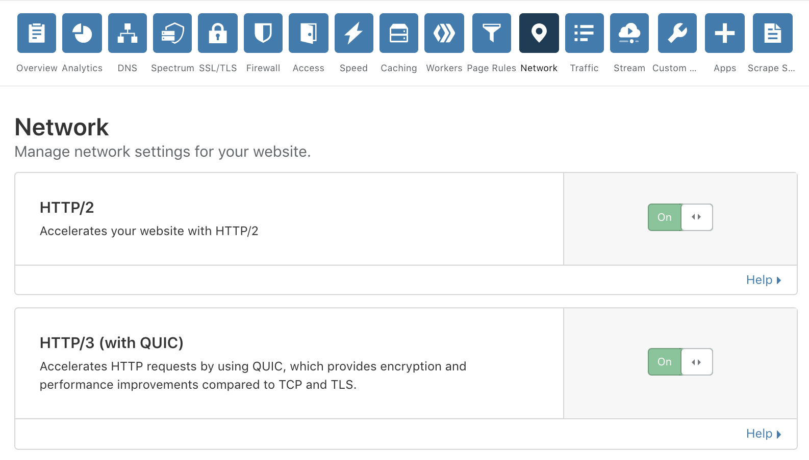

# Cloudflare HTTP/3 docs

The Hypertext Transfer Protocol (HTTP) is used by clients such as web browsers to talk to servers in order to load websites. The performance of HTTP is an important factor when it comes to loading web pages quickly and efficiently.

HTTP is a well established protocol that has several versions, and each version
adds features that improve performance over the older one. HTTP/1.1 and HTTP/2 are
widely deployed on the Internet today and rely on TCP and optionally TLS.

[HTTP/3](https://blog.cloudflare.com/http3-the-past-present-and-future/) is the
latest version that runs over the new transport protocol
[QUIC](https://blog.cloudflare.com/the-road-to-quic/). [QUIC version 1](https://blog.cloudflare.com/quic-version-1-is-live-on-cloudflare/)
is published as RFC 9000 and is supported by Cloudflare. HTTP/3 connections using
this version are identified with the label "h3".

Prior to RFC publication, the [standardization activity](https://blog.cloudflare.com/http-3-from-root-to-tip/)
released incremental draft versions of specifications which clients and servers were
encouraged to actively experiment with. For example, HTTP/3 draft 29 relies on
QUIC draft 29 and is identified using the label "h3-29".

Cloudflare supports HTTP/3. If you would like to try out HTTP/3 on your website, you will need to do two things:

- Enable HTTP/3 on your Cloudflare zone.
- Use a client (browser) that supports it.

## Enabling HTTP/3 on a Cloudflare zone

HTTP/3 can easily be turned on for a zone on the dashboard. On the Network tab, turn on the toggle labeled __HTTP/3 (with QUIC)__:

Enabling the toggle allows compatible clients to connect to it using HTTP/3. It does not affect existing clients that connect using HTTP/1.1 or HTTP/2.

## Supported clients

The following clients support HTTP/3:

- [Google Chrome](https://www.google.com/chrome/canary/) - [Instructions](/chrome)
- [Microsoft Edge](https://www.microsoftedgeinsider.com/en-us/) - [Instructions](/edge)
- [Mozilla Firefox](https://www.mozilla.org/firefox/channel/desktop/#nightly) - [Instructions](/firefox)
- [cURL](https://curl.haxx.se) + quiche - [Instructions](/curl-brew)
- [Cloudflare quiche-client](https://github.com/cloudflare/quiche) - [Instructions](/quiche-http3-client)

<Aside>

__Note:__ Cloudflare supports multiple draft versions of HTTP/3 and QUIC. When using a client, verify that it supports one of the versions listed in the [release notes](/release).

</Aside>
