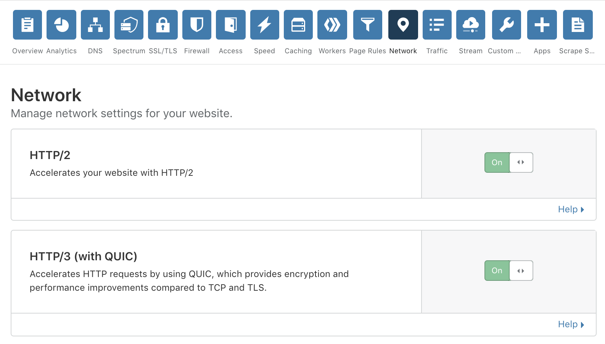

The Hypertext Transfer Protocol (HTTP) is used by clients (web browsers) to talk to web servers in order to load websites. The performance of HTTP is an important factor in it comes to loading web pages quickly and efficiently.

There are several versions of HTTP in use on the Internet today, with each new version improving performance over the older one. HTTP/1.1 and HTTP/2 are widely deployed today, while HTTP/3 is in the final stages of standardisation in the Internet Engineering Task Force (IETF). This means that most browsers and web servers do not currently offer official support but they are actively experimenting, and that includes Cloudflare.

Cloudflare currently offers support for HTTP/3 and will follow drafts as they come out. If you would like to try out HTTP/3 on your website, you will need to do two things:

 - enable HTTP/3 on your Cloudflare zone
 - use a client (browser) that supports it

## Enabling HTTP/3 on a Cloudflare zone

HTTP/3 can easily be turned on for a zone on the dashboard. On the Network tab, turn on the toggle labeled _"HTTP/3 (with QUIC)"_:

Enabling the toggle allows compatible clients to connect to it using HTTP/3. It does not affect existing clients that connect using HTTP/1.1 or HTTP/2.

## Supported clients

The following clients support HTTP/3 through feature flags:

 - [Google Chrome](https://www.google.com/chrome/canary/) - [Instructions](/http3/intro/chrome)
 - [Microsoft Edge Insider](https://www.microsoftedgeinsider.com/en-us/) - [Instructions](/http3/intro/edge)
 - [Mozilla Firefox Nightly](https://www.mozilla.org/firefox/channel/desktop/#nightly) - [Instructions](/http3/intro/firefox)
 - [cURL](https://curl.haxx.se) + quiche - [Instructions](/http3/intro/curl-brew)
 - [Cloudflare http3-client](https://github.com/cloudflare/quiche) - [Instructions](/http3/intro/http3-client)

Note: The HTTP/3 specification has not been finalized yet. In order to successfully use a client, make sure the client supports a draft version as mentioned in the [release notes](/http3/intro/release).
