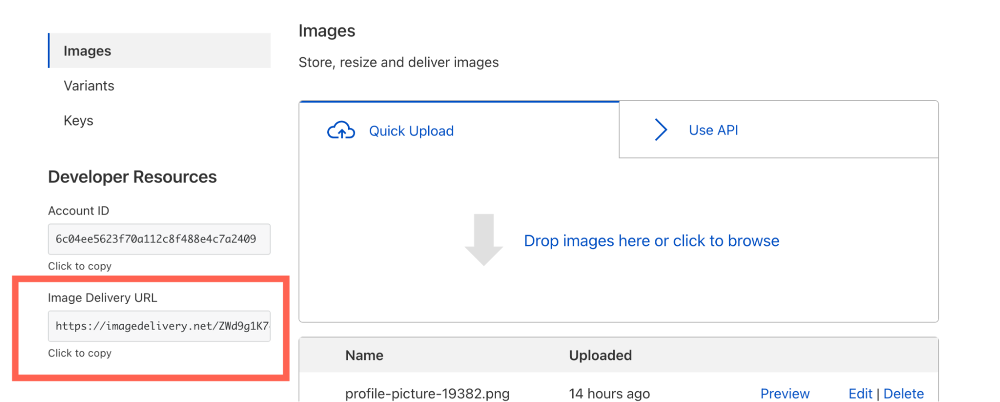

# Serve images

To serve images uploaded to Cloudflare Images, you need three pieces of information:

* Your Images account hash.
* Image ID.
* Variant name.

Assuming you have at least one image uploaded to Images, you will find the basic URL format on your Images Dashboard:



A typical Image Delivery URL looks like this:

```txt
https://imagedelivery.net/ZWd9g1K7eljCn_KDTu_OWA/:image_id/:variant_name
```

In this example, `ZWd9g1K7eljCn_KDTu_OWA` is your Images account hash. You simply need to replace `:image_id` and `:variant_name` to begin serving images. To find this information, click the **Preview** button next to the image you want to serve. This will open a preview of the image with an **Image URL** you can copy. This link will have a fully formed Images URL. Here is an example of what that looks like:

```txt
https://imagedelivery.net/ZWd9g1K7eljCn_KDTu_MWA/083eb7b2-5392-4565-b69e-aff66acddd00/public
```

In this example:

- `ZWd9g1K7eljCn_KDTu_MWA` is the Images account hash.
- `083eb7b2-5392-4565-b69e-aff66acddd00` is the image id.
- `public` is the variant name.

When a client requests an image, Cloudflare Images will pick the optimal format between WebP, PNG, JPEG and GIF. The format Cloudflare serves to the user is determined by client headers and the image type.

## Serving images from custom domains

Image delivery is supported from all customer domains under the same Cloudflare account. To serve images through custom domains, an image URL should be adjusted to the following format:

```txt
https://somecustomdomain.com/cdn-cgi/imagedelivery/:images_account_hash/:image_id/:variant_name
```

Example with a custom domain:

```txt
https://somecustomdomain.com/cdn-cgi/imagedelivery/ZWd9g1K7eljCn_KDTu_MWA/083eb7b2-5392-4565-b69e-aff66acddd00/public
```

In this example, `:images_account_hash`, `:image_id` and `:variant_name` are the same, but the hostname and prefix path is different: 

- `somecustomdomain.com`: Cloudflare proxied domain under the same account as the Cloudflare Images.
- `/cdn-cgi/imagedelivery`: Path to trigger cdn-cgi image proxy.
- `ZWd9g1K7eljCn_KDTu_MWA`: The Images account hash.
- `083eb7b2-5392-4565-b69e-aff66acddd00`: The image id.
- `public`: The variant name.