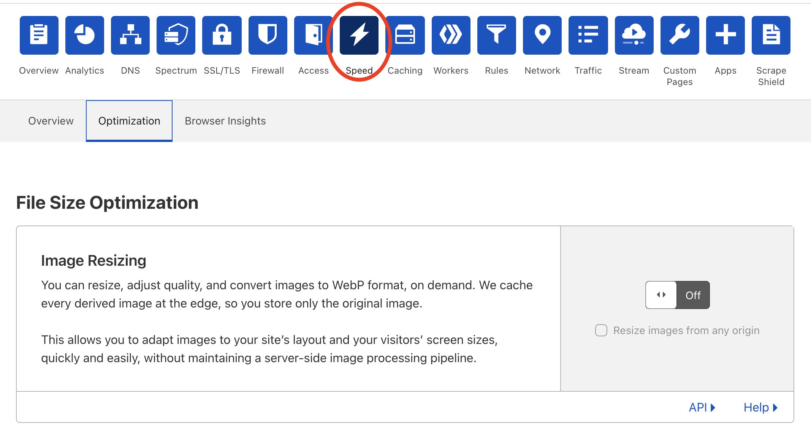

# Enable Image Resizing

To use Image Resizing you first need to enable it via the Speed app of your Cloudflare dashboard:

1. Log in to the [Cloudflare dashboard](https://dash.cloudflare.com/).
1. Click the **account** for the domain you want to use with Image Resizing.
1. Select the **domain** where you will be using Image Resizing.
1. Click on the **Speed** app.

  

  

  

1. Click the **Optimization** tab.
1. Under **File Size Optimization**, locate Image Resizing and toggle the switch to **On**.
1. If you don't want to resize images from any origin, uncheck **Resize images from any origin**.

<Aside type="note" header="Note:">

Image Resizing defaults to resizing images from **any domain**. If you want to prevent third parties from resizing any image at any origin, uncheck **Resize images from any origin**. When unchecked, Image Resizing will only resize images that are in the enabled zone. 

This restriction does not apply to image resizing requests coming from Cloudflare Workers. If you are using Image Resizing in a Worker, you need to include the appropriate logic in your Worker code.

</Aside>