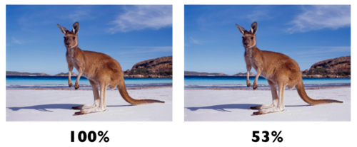

# Cloudflare Polish

Cloudflare Polish is a one-click image optimization product that automatically optimizes images in your site. Polish strips metadata from images and reduces image size through lossy or lossless compression to accelerate the speed of image downloads.

When an image is fetched from your origin, our systems automatically optimize it in Cloudflare's cache. Subsequent requests for the same image will get the smaller, faster, optimized version of the image, improving the speed of your website.



## Polish compression options

<Aside type="warning" header="Warning">

Polish will not be applied to origin responses that contain a `Vary` header. The only accepted `Vary` header is `Vary: Accept-Encoding`.

</Aside>

### Lossless 

Lossless attempts to strip most metadata, like EXIF data, but does not change the image detail. Effectively, when uncompressed, a lossless image is identical to the original. On average, Lossless compression reduces file size by 21 percent.

### Lossy

Lossy attempts to strip most metadata and compresses images by approximately 15 percent. When uncompressed, some of the redundant information from the original image is lost. On average, using Lossy mode reduces file size by 48 percent. Lossy has the same effect as Lossless when applied to PNG.

<Aside type="note">

With Lossless and Lossy modes, Cloudflare attempts to strip as much metadata as possible. However, Cloudflare cannot guarantee stripping all metadata because other factors, such as caching status, might affect which metadata is finally sent in the response.

</Aside>

### WebP

WebP is a modern image format providing superior lossless and lossy compression for images. WebP lossless images are approximately 26 percent smaller than PNGs, while lossy images are 25 to 34 percent smaller than JPEGs. Currently, WebP is only supported in Firefox, Google Chrome, and Opera. You can learn more in our [blog post](https://blog.cloudflare.com/a-very-webp-new-year-from-cloudflare/).

Polish creates and caches a WebP version of the image and delivers it to the browser if the `Accept` header from the browser includes WebP, and the compressed image is significantly smaller than the lossy or lossless compression:

```txt
Accept: image/avif,image/webp,image/*,*/*;q=0.8
```