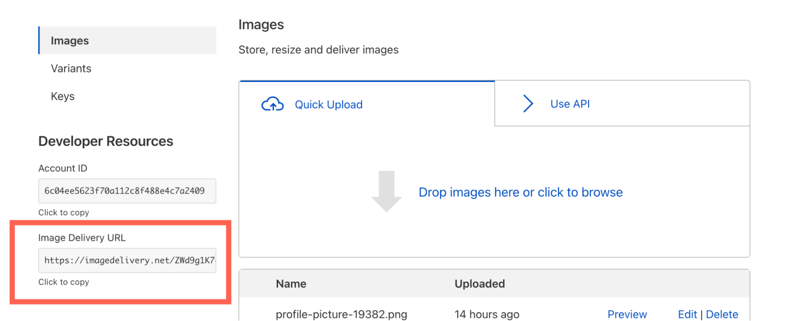

# Serving Images

To serve images uploaded to Cloudflare Images, you need three pieces of information:

1. Your Images account hash
1. Image ID
1. Variant name

Assuming you have at least one image uploaded to Images, you will find the basic URL format on your Images Dashboard:



A typical Image Delivery URL looks like this:

```txt
https://imagedelivery.net/ZWd9g1K7eljCn_KDTu_OWA/:image_id/:variant_name
```

In this example, `ZWd9g1K7eljCn_KDTu_OWA` is your Images account hash. You simply need to replace `:image_id` and `:variant_name` to begin serving images. Here is an example of a fully formed Images URL look:

```txt
https://imagedelivery.net/ZWd9g1K7eljCn_KDTu_MWA/083eb7b2-5392-4565-b69e-aff66acddd00/public
```

- `ZWd9g1K7eljCn_KDTu_MWA` is the Images account hash
- `083eb7b2-5392-4565-b69e-aff66acddd00` is the image id
- `public` is the variant name

When a client requests an image, Cloudflare Images will pick the optimal format between WebP, PNG, JPEG and GIF. The format served to the eyeball is determined by client headers and the image type.
