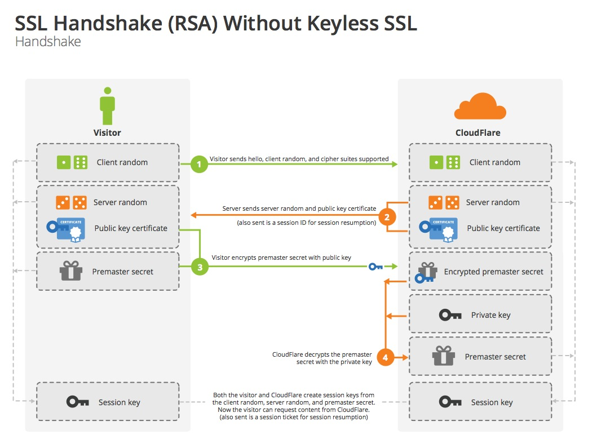

# TLS

This description of TLS is pulled from [Nick's](https://twitter.com/grittygrease?lang=en) blog post, [Keyless SSL: The Nitty Gritty Technical Details](https://blog.cloudflare.com/keyless-ssl-the-nitty-gritty-technical-details/).

Transport Layer Security (TLS) is the workhorse of web security. It lets websites prove their identity to web browsers, and protects all information exchanged from prying eyes using encryption. The TLS protocol has been around for years, but it’s still mysterious to even hardcore tech enthusiasts. Understanding the fundamentals of TLS is the key to understanding Keyless SSL.

TLS has two main goals: confidentiality and authentication. Both are critically important to securely communicating on the Internet.

Communication is considered confidential when two parties are confident that nobody else can understand their conversation. Confidentiality can be achieved using symmetric encryption: use a key known only to the two parties involved to encrypt messages before sending them. In TLS, this symmetric encryption is typically done using a strong block cipher like [AES](http://en.wikipedia.org/wiki/Advanced_Encryption_Standard). Older browsers and platforms might use a cipher like [Triple DES](http://en.wikipedia.org/wiki/Triple_DES) or the stream cipher [RC4](http://en.wikipedia.org/wiki/RC4), [which is now considered insecure](http://blog.cloudflare.com/killing-rc4-the-long-goodbye/).

The other crucial goal of TLS is authentication. Authentication is a way to ensure the person on the other end is who they say they are. This is accomplished with public keys. Websites use certificates and public key cryptography to prove their identity to web browsers. And browsers need two things to trust a certificate: proof that the other party is the owner of the certificate, and proof that the certificate is trusted.

A website certificate contains a public key, and if the website can prove that it controls the associated private key, that’s proof that they are the owner of the certificate. A browser considers a certificate trusted if the certificate was granted by a trusted certificate authority, and contains the site’s domain name.

In the context of the web, confidentiality and authentication are achieved through the process of establishing a shared key and proving ownership of a certificate. TLS does this through a series of messages called a “handshake”.

## What’s in a handshake?

The TLS protocol evolved from the Secure Sockets Layer (SSL) protocol which was developed by Netscape in the mid-1990s. In 1999, the Internet Engineering Task Force (IETF) standardized a new protocol called TLS, which is an updated version of SSL. In fact, TLS is so similar to SSL that TLS 1.0 uses the SSL protocol version number 3.1. This may seem confusing at first, but makes sense since TLS is just a minor update to SSL 3.0. Subsequent versions of TLS have followed this pattern. Since TLS is an evolution of the SSL protocol, people still use the terms TLS and SSL somewhat interchangeably.

There are two main types of handshakes in TLS: one based on [RSA](http://en.wikipedia.org/wiki/RSA_(cryptosystem)), and one based on [Diffie-Hellman](http://en.wikipedia.org/wiki/Diffie%E2%80%93Hellman_key_exchange). RSA and Diffie-Hellman were the two algorithms which ushered in the era of modern cryptography, and brought cryptography to the masses. These two handshakes differ only in how the two goals of key establishment and authentication are achieved:

The RSA and DH handshakes both have their advantages and disadvantages. The RSA handshake only uses one public key algorithm operation, RSA. A DH handshake with an RSA certificate requires the same RSA operation, but with an additional DH operation. Given that the certificate is RSA, the RSA handshake is faster to compute. Public key algorithms like RSA and DH use a lot of CPU and are the slowest part of the TLS handshake. A laptop can only perform a couple hundred RSA encryptions a second versus around ten million per second of the symmetric cipher AES.

The DH handshake requires two algorithms to run, but the advantage it brings is that it allows key establishment to happen independently of the server’s private key. This gives the connection [forward secrecy](http://blog.cloudflare.com/staying-on-top-of-tls-attacks/), a useful property that protects conversations from being decrypted after the fact if the private key is somehow exposed. The DH version of the handshake also opens up the possibility of using non-RSA certificates that can improve performance, including [ECDSA keys](http://blog.cloudflare.com/ecdsa-the-digital-signature-algorithm-of-a-better-internet/). Elliptic curves provide the same security with less computational overhead. A DH handshake with and elliptic curve DSA certificate and elliptic curve Diffie-Hellman key agreement can be faster than a one-operation RSA handshake.

## TLS Glossary

### 1. Session key

This is the end result of a handshake. It’s a key for a symmetric cipher, and allows the client and server to encrypt messages to each other.

### 2. Client random

This is a sequence of 32 bytes created by the client. It’s unique for each connection, and is supposed to contain a four-byte timestamp followed by 28 random bytes. Recently, Google Chrome switched to using 32 bytes of random in order to prevent client fingerprinting. These random values are often called a [nonce](http://en.wikipedia.org/wiki/Cryptographic_nonce).

### 3. Server random

A server random is the same as the client random except generated by the server.

### 4. Pre-master secret

This is a 48-byte blob of data. It can be combined with both the client random and the server random to create the session key using a “pseudorandom function” (PRF).

### 5. Cipher suite

This is a unique identifier for combining algorithms making up a TLS connection. It defines one algorithm for each of the following:

  * key establishment (typically a Diffie-Hellman variant or RSA)
  * authentication (the certificate type)
  * confidentiality (a symmetric cipher)
  * integrity (a hash function)

For example “AES128-SHA” defines a session that uses

  * RSA for key establishment (implied)
  * RSA for authentication (implied)
  * 128-bit Advanced Encryption Standard in Cipher Block Chaining (CBC) mode for confidentiality
  * 160-bit Secure Hashing Algorithm (SHA) for integrity

A more daunting, but valid cipher suite is “ECDHE-ECDSA-AES256-GCM-SHA384” which defines a session that uses:

  * Elliptic Curve Diffie-Hellman Ephemeral (ECDHE) key exchange for key establishment
  * Elliptic Curve Digital Signature Algorithms (ECDSA) for authentication
  * 256-bit Advanced Encryption Standard in Galois/Counter mode (GCM) for confidentiality
  * 384-bit Secure Hashing Algorithm for integrity

With these definitions in hand, let’s walk through an RSA handshake.

## RSA handshake

Note that none of the messages in the handshake are encrypted with a session key; they are all sent in the clear.

### Message 1: “Client Hello”

The client hello contains the protocol version that the client wants to use, and some other information to get the handshake started including the client random and a list of cipher suites. Modern browsers also include the hostname they are looking for, called the Server Name Indication (SNI). SNI lets the web server host multiple domains on the same IP address.

### Message 2: “Server Hello”

After receiving the client hello, the server picks the parameters for the handshake going forward. The choice of cipher suite determines what type of handshake is performed. The server “hello” message contains the server random, the server’s chosen cipher suite, and the server’s certificate. The certificate contains the server’s public key and domain name.

### Message 3: “Client Key Exchange”

After validating that the certificate is trusted and belongs to the site they are trying to reach, the client creates a random pre-master secret. This secret is encrypted with the public key from the certificate, and sent to the server.

Upon receiving this message, the server uses its private key to decrypt this pre-master secret. Now that both sides have the pre-master secret, and both client and server randoms, they can both derive the same session key. Then they exchange a short message to indicate that the next message they send will be encrypted.

The handshake is officially complete when the client and server exchange “Finished” messages. The actual text is literally: “client finished” or “server finished” encrypted with the session key. Any subsequent communication between the two parties are encrypted with the session key.

This handshake is elegant because it combines key exchange and authentication in one step. The logic is that if the server can correctly derive the session key, then they must have access to the private key, and, therefore, be the owner of the certificate.

The downside of this handshake is that the messages secured by it are only as safe as the private key. Suppose a third party has recorded the handshake and the subsequent communication. If that party gets access to the private key in the future, they will be able to decrypt the premaster secret and derive the session key. With that they can decrypt the entire message. This is true even if the certificate is expired or revoked. This leads us to another form of handshake that can provide confidentiality even if the private key is compromised.

## Ephemeral Diffie-Hellman handshake

The ephemeral Diffie-Hellman handshake is an alternative form of the TLS handshake. It uses two different mechanisms: one for establishing a shared pre-master secret, and one for authenticating the server. The key feature that this relies on is the Diffie-Hellman key agreement algorithm.

In Diffie-Hellman, two parties with different secrets exchange messages to obtain a shared secret. This handshake relies on the simple fact that exponents are commutative. Specifically that taking a number to the power of a, and the result to the power of b, is the same as taking the same number to the power of b, and the result to the power of a.

The algorithm works like this:

  * person a has secret a, sends ga to person b
  * person b has secret b, sends gb to person a
  * person a computes (gb)a
  * person b computes (ga)b
  * Both person a and b end up with gab, which is their shared secret

This doesn't work well with regular numbers because gab can get really large, and there are efficient ways to take the nth root of a number. However, we can change the problem space and make it work. This is done by restricting the computation to numbers of a fixed size by always dividing the result of a computation by big prime number and taking the remainder. This is called modular arithmetic. Taking an nth root in modular arithmetic is called the discrete logarithm problem and is considered a hard problem.

Now let’s go through a Diffie-Hellman handshake:

### Message 1: “Client Hello”

Just like in the RSA case, the client hello contains the protocol version, the client random, a list of cipher suites, and, optionally, the SNI extension. If the client speaks ECDHE, they include the list of curves they support. If this is omitted, or there is a mismatch, it can be tricky to debug.

### Message 2: “Server Hello”

After receiving the client hello, the server picks the parameters for the handshake going forward, including the curve for ECDHE. The server “hello” message contains the server random, the server’s chosen cipher suite, and the server’s certificate.

The RSA and Diffie-Hellman handshakes start to differ at this point with a new message type.

### Message 3: “Server Key Exchange”

In order to start the Diffie-Hellman key exchange, the server needs to pick some starting parameters and send them to the client---this corresponds to the ga we described above. The server also needs a way to prove that it has control of the private key, so the server computes a digital signature of all the messages up to this point. Both the Diffie-Hellman parameters and the signature are sent in this message.

### Message 4: “Client Key Exchange”

After validating that the certificate is trusted, and belongs to the site they are trying to reach, the client validates the digital signature sent from the server. They also send the client half of the Diffie-Hellman handshake (corresponding to gb above).

At this point, both sides can compute the pre-master secret from the Diffie-Hellman parameters (corresponding to gab above). With the pre-master secret and both client and server randoms, they can derive the same session key. They then exchange a short message to indicate that they the next message they send will be encrypted.

Just like in the RSA handshake, this handshake is officially complete when the client and server exchange “Finished” messages. Any subsequent communication between the two parties are encrypted with the session key.
