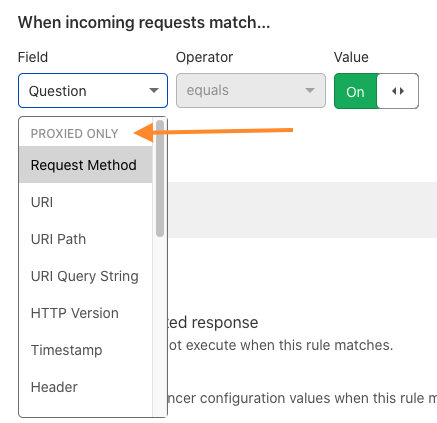

# Supported fields and operators

The fields available for load balancing rules depend on whether Cloudflare proxies the traffic going through your load balancer. 

If you use the wrong type of fields, you might see unexpected behavior from load balancing rules. For best results, always use the fields associated with your traffic's proxy status.

## Fields supported regardless of proxy

Regardless of whether your traffic is proxied, you have access to the following fields:
<table style="width:100%">
  <thead>
    <tr>
      <th style="width:20%">Name in Expression Builder</th>
      <th style="width:40%">Field</th>
      <th>Description</th>
    </tr>
  </thead>
  <tbody>
   <tr>
      <td>IP address</td>
      <td valign="top"><code>ip.src</code> <Type>IP&nbsp;address</Type></td>
      <td>
         
The client TCP IP address, which may be adjusted to reflect the actual address of the client by using HTTP headers such as
         <code class="InlineCode">X-Forwarded-For</code> or <code class="InlineCode">X-Real-IP</code>.
         

         
Example value:
          <code class="InlineCode">192.0.2.1</code>
         

      </td>
    </tr>
    <tr>
      <td>Load Balancer Region</td>
      <td valign="top"><code>cf.load_balancer.region</code> <Type>bytes</Type></td>
      <td>
        
The <a href="/understand-basics/traffic-steering#geo-steering">region name</a> of the data center processing the request.

      </td>
    </tr>
    <tr>
      <td>Load Balancer Name</td>
      <td valign="top"><code>cf.load_balancer.name</code> <Type>bytes</Type></td>
      <td>
        
The name of the load balancer executing these rules.

        
Example value:
          <code class="InlineCode">lb.example.com</code>
         

      </td>
    </tr>
  </tbody>
</table>

## Proxied traffic

If your traffic is proxied, you have access to all the fields listed under **Proxied Only** and [**Both**](#fields-supported-regardless-of-proxy), such as:
- `Request Method`
- `URI`
- `Timestamp`
- `Header`

For the most up to date list of these fields, [create a load balancing rule](../create-rules) in the UI.

For more details about the field type or properties, refer to our [Firewall rules documentation](https://developers.cloudflare.com/firewall/cf-firewall-language/fields).

## Unproxied traffic

If your traffic is not proxied through Cloudflare, you have access to all the fields listed under **Unproxied only** and [**Both**](#fields-supported-regardless-of-proxy).

Cloudflare Load Balancers support the following unproxied fields:
<table style="width:100%">
  <thead>
    <tr>
      <th style="width:20%">Name in Expression Builder</th>
      <th style="width:40%">Field</th>
      <th>Description</th>
    </tr>
  </thead>
  <tbody>
    <tr>
      <td>Query Type</td>
      <td valign="top"><code>dns.qry.type</code> <Type>Int</Type></td>
      <td>
        
The numeric value of the <a href= "https://en.wikipedia.org/wiki/List_of_DNS_record_types">DNS query type</a>
        

        
Example Values:

          <ul>
              <li><code class="InlineCode">1 (A record)</code></li>
              <li><code class="InlineCode">28 (AAAA record)</code></li>
          </ul>
      </td>
    </tr>
      <tr>
      <td>Question</td>
      <td valign="top"><code>dns.qry.typ</code> <Type>boolean</Type></td>
      <td>
        
A boolean indicating that the received DNS message was a question

      </td>
    </tr>
    <tr>
      <td>Query Name</td>
      <td valign="top"><code>dns.qry.name</code> <Type>Bytes</Type></td>
      <td>
        
The byte of the query name asked, such as <code>example.com</code> 

      </td>
    </tr>
    <tr>
      <td>Query Name Length</td>
      <td valign="top"><code class>dns.qry.name.len</code> <Type>Int</Type></td>
      <td>
        
The length in bytes of the query name.
        

      </td>
    </tr>  
  </tbody>
</table>

---

## Operators and grouping symbols

- **Comparison operators** specify how values defined in an expression must relate to the actual HTTP request value for the expression to return true.

- **Logical operators** combine two expressions to form a compound expression and use order of precedence to determine how an expression is evaluated.

- **Grouping symbols** allow you to organize expressions, enforce operator precedence, and nest expressions. 

For examples and usage, refer to [Operators and grouping symbols](https://developers.cloudflare.com/firewall/cf-firewall-language/operators) in the Firewall Rules documentation.